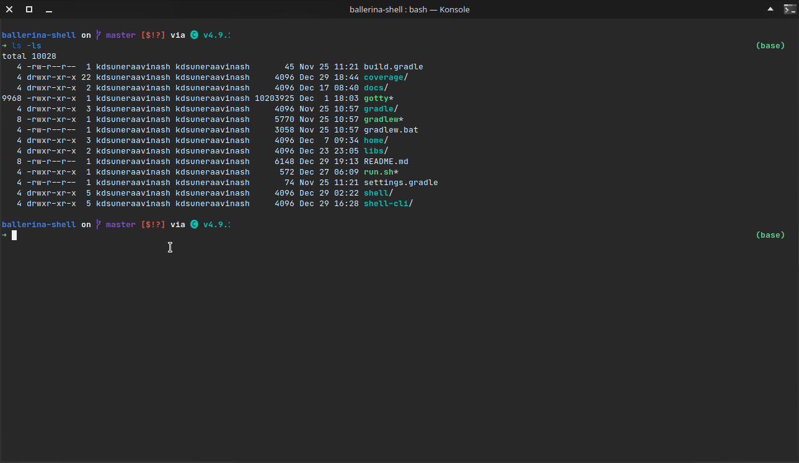

# Ballerina Shell

A REPL program for the [ballerina language](https://github.com/ballerina-platform/ballerina-lang). Ballerina is an open source programming language and platform for cloud-era application programmers to easily write software that just works.

The Ballerina-shell tool is an interactive tool for learning the Ballerina programming language and prototyping Ballerina code. Ballerina-shell is a Read-Evaluate-Print Loop (REPL), which evaluates declarations, statements, and expressions as they are entered and immediately shows the results. Currently, the tool is run via the command line. Using Ballerina-shell, you can enter program statements one at a time and immediately see the result.

## Demo



## Modules

The project is implemented in three base modules.

- **shell-rt** - Module including runtime dependencies for ballerina programs generated. You may find the source code for this
  module [here](shell-rt).
- **shell-core** - Module including all the base evaluation classes. This has all the base components to evaluate and run a
  string. All other components are built on top of this module. You may find the source code for this
  module [here](shell-core).
- **shell-cli** - A command-line interface built on top of shell. Includes multi-line inputs, color-coded outputs,
  keyword-based auto-completion, etc... You may find the source code for this module [here](shell-cli).

## Known Issues

- **Assignments to global variables in closures or class methods will not work** - Assignments done to global variables
  in closures will not be reflected after the execution. The changes will be visible only for the scope belonging to the
  snippet where the closure was defined.
  [#28036](https://github.com/ballerina-platform/ballerina-lang/issues/28036)

  ```ballerina
  int x = 10
  var f = function () { x = 12; }
  f()
  x   // <- this should output 12 but will output 10 instead
  ```

- **Enum definition with explicit expression is not fully supported** - Enum declarations with explicit expressions are
  not supported fully. Some functionalities may not work properly. Following is an example.
  [#28037](https://github.com/ballerina-platform/ballerina-lang/issues/28037)

  ```ballerina
  // This will not work due to type EN converting to english
  enum Language {EN="english", TA="tamil", SI="sinhala"}
  EN variable = "english"  // <- Error
  ```

- **Support with external libraries not tested completely** - Even though it is possible to run this against external libraries, 
  this is not fully tested. Some issues, especially relating to types that are not visible outside the library, may occur. 
  For an example following is a possible problematic scenario.
  [#28038](https://github.com/ballerina-platform/ballerina-lang/issues/28038)
  
  ```ballerina
  import abc/pqr
  // If pqr:call() returns a value of which the type is not public, following will fail.
  var r = pqr:call()
  ```

### Related Issues

- **Enum type signature should be the type symbol name** - If an enum is defined with expression values, enum elements'
  type signature would be the expression. However, this should instead be the original enum name.
  [#28039](https://github.com/ballerina-platform/ballerina-lang/issues/28039)

  ```ballerina
  enum Language {EN="english", TA="tamil", SI="sinhala"}
  // Type signature of variable would be `english` but should instead be `EN`.
  EN variable = "english" 
  ```

- **Type signature of arrays with a fixed length should reflect the length** - Any array definition with a fixed length
  should have the type signature that reflects the length. But this is not the case, as a result, array bindings are not
  possible.
  [#28042](https://github.com/ballerina-platform/ballerina-lang/issues/28042)

  ```ballerina
  int[3] variable = [1, 2, 3]
  // Type signature of variable would be `int[]` but should instead be `int[3]`.
  // As a result following is not possible.
  [int, int, int] [a, b, c] = variable
  ```

### Notes

- **The parser is imperfect** - Current parser is imperfect and is sometimes unable to detect the type of statement.
  Please file an issue if you come across any wrong categorization of a snippet. The parser is also relatively slow
  compared to the compilation phase, acting as a bottle-neck. So a timeout is employed to stop invalid statement parsing
  from taking too much time. However, this might cause issues in some old hardware where the execution might be slower
  than expected (where even valid executions might exceed the timeout). You can use `--time-out` parameter while running
  the shell to set the timeout manually. (currently set to 100ms by default)

- **Type guards for global variables do not work** - Since all the variables defined in REPL top level act as global
  variables, type guards won't work. To remedy this you can explicitly cast the variable to the required type. However,
  note that this is the expected behavior and not a bug.

- **Cyclic dependencies of module level types not possible** - Obviously, because a REPL is run line by line, you may
  not use a type that would be defined later. As a result, cyclic dependencies nt possible in module level declarations.

- **Named worker declarations not supported as shell statements** - Named worker declarations are not supported as
  statements. You can still define them in other functions, but they cannot be used as a statement directly.

## Implementation

For implementation details please refer [this](shell-core/README.md).

## Building

> **Linux** - Simply clone the repository and run `run.sh`. It should launch the REPL.

Run following commands in order.

```batch
gradlew.bat fatJar
java -jar -Dballerina.home=home shell-cli/build/libs/shell-cli-1.0-SNAPSHOT.jar
```

**To run with an installed ballerina distribution,** (This will enable stdlib imports)
In the following script, `$BALLERINA_HOME` refers to the ballerina distribution directory. However, note that this
should be run with a compatible ballerina distribution.

```bash
java -jar -Dballerina.home=$BALLERINA_HOME shell-cli/build/libs/shell-cli-1.0-SNAPSHOT.jar
# eg: java -jar -Dballerina.home=/usr/lib/ballerina/distributions/ballerina-slp8 shell-cli/build/libs/shell-cli-1.0-SNAPSHOT.jar
```

## References

[reple: "Replay-Based" REPLs for Compiled Languages](https://people.eecs.berkeley.edu/~brock/blog/reple.php) - A blog
post on reple: "Replay-Based" REPLs for Compiled Languages and limitations/fixes possible.

[RCRL](https://github.com/onqtam/rcrl) - Read-Compile-Run-Loop: tiny and powerful interactive C++ compiler (REPL)

[JShell](https://docs.oracle.com/javase/9/jshell/introduction-jshell.htm#JSHEL-GUID-630F27C8-1195-4989-9F6B-2C51D46F52C8) - A REPL for Java programming language.

