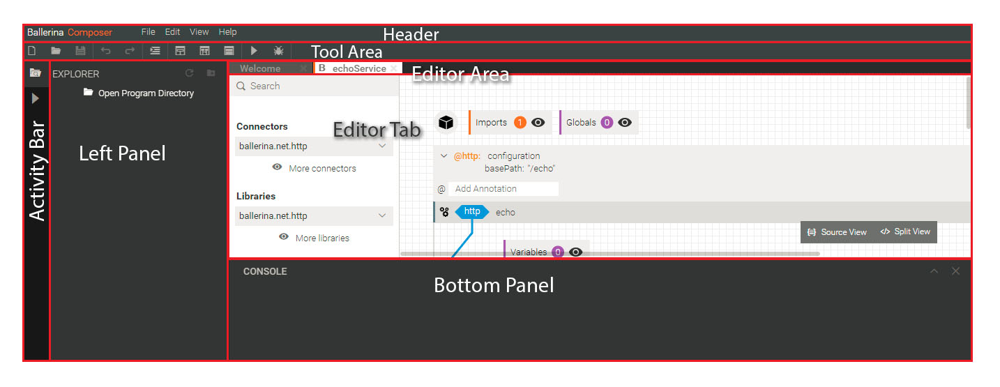

<!-- toc -->

- [Writing plugins for Ballerina Composer](#writing-plugins-for-ballerina-composer)
  * [Plugin Life-Cycle](#plugin-life-cycle)
    + [Plugin Init](#plugin-init)
      - [Plugin Context](#plugin-context)
    + [Plugin Activate](#plugin-activate)
      - [App Context](#app-context)
    + [After Initial Render](#after-initial-render)
- [Core plugins and their APIs](#core-plugins-and-their-apis)
- [Available extension points](#available-extension-points)
  * [command](#command)
  * [handlers](#handlers)
  * [menus](#menus)
  * [tools](#tools)
  * [dialogs](#dialogs)
  * [views](#views)
    + [Contributing a View to Left Panel](#contributing-a-view-to-left-panel)
    + [Contributing a View to Bottom Panel](#contributing-a-view-to-bottom-panel)
    + [Contributing a View as a Custom Editor Tab](#contributing-a-view-as-a-custom-editor-tab)
  * [editors](#editors)
    + [Contributing an editor for a file type](#contributing-an-editor-for-a-file-type)
- [APIs available to React Components via React Context](#apis-available-to-react-components-via-react-context)
- [Reusable Components](#reusable-components)
  * [Context Menu Trigger](#context-menu-trigger)
  * [Scrollbars with a helper API](#scrollbars-with-a-helper-api)

<!-- tocstop -->

# Writing plugins for Ballerina Composer

A Componser front-end plugin is a javascript class which is extended from [Plugin](./../../modules/web/src/core/plugin/plugin.js) class and it should provide a no arg constructor. Each plugin should also provide a unique ID via `getID()` method. A plugin can contribute to various [extension points available](#available-extension-points) in composer front-end by
providing contributions via `getContributions()` method.

Main components of Composer front-end are also developed as plugins. However, comapared to other plugins, they are treated differently while initializing. They are the first set of plugins to be initialized and their startup order is enforced by Composer.

```javascript
// bare minimum code required for a plugin

import Plugin from 'core/plugin/plugin';

class SamplePlugin extends Plugin {
     /**
     * @inheritdoc
     */
    getID() {
        return 'ballerina.composer.plugin.sampleplugin';
    }
}

```

To add a plugin to composer, in composer [config.js](./../../modules/web/src/config.js#L32), under plugins
section, add the plugin class. (Note: This will be improved in future to allow more flexibility.)

```javascript
//config.js 

...
import TryItPlugin from 'plugins/try-it/plugin';
...

export default {
    app: {
        ...
        plugins: [
            ...,
            TryItPlugin,
            ...,
        ]
        ...
    }
}

```


## Plugin Life-Cycle

1. [init - `init(config)`](#plugin-init)
2. [activate - `activate(appContext)`](#plugin-activate)
3. [onAfterInitialRender](#after-initial-render)

### Plugin Init

Signature of the method : `init(config)`

After constructing the plugin instance, this will be the very first method that will be invoked by composer. This will receive the plugin config as the argument. This is where you should do initial setting up tasks.

It is possible to pass specific configurations to each plugin by putting it under `pluginConfig.pluginID` (the pluginID is what you return in `getID` method) path in composer config object or providing it under the same path from composer config backend service.


If you do not override this method, the default implementation will assign the 
config object to `this.config` in plugin instance.

To validate the config at runtime, you can use PluginClass.configTypes object with [proptypes](https://www.npmjs.com/package/prop-types) library.  Error logs will be printed for configs that fail the validations. 

[Here's how](./../../modules/web/src/core/layout/plugin.js#L138) layout manager validates its configs.

```javascript 
//...
import PropTypes from 'prop-types';
import Plugin from './../plugin/plugin';

class LayoutPlugin extends Plugin {
    //...
}

LayoutPlugin.configTypes = {
    layout: PropTypes.object,
    container: PropTypes.string.isRequired,
};

export default LayoutPlugin;
```

#### Plugin Context

Plugin context is the object which is returned from [`init`](#plugin-init) method. This is considered as the public API of a plugin which is visible to other plugins.

[Here](./../../modules/web/src/core/workspace/plugin.js#L226) is how workspace plugin exposes its public api.

```javascript

//..
class WorkspacePlugin extends Plugin {
     /**
     * @inheritdoc
     */
    init(config) {
        super.init(config);
        return {
            openFile: this.openFile.bind(this),
            openFolder: this.openFolder.bind(this),
            closeFile: this.closeFile.bind(this),
            removeFolder: this.removeFolder.bind(this),
            goToFileInExplorer: this.goToFileInExplorer.bind(this),
        };
    }

}

```

### Plugin Activate

Signature of the method : `activate(appContext)`

After calling init of each plugin, composer now has the APIs from all the plugins ready. The activate method is the next method that composer will invoke through the plugin lifecycle. It receives [appContext](#app-context) as the argument and here you can do the setting up stuff that needs access to other plugin APIs.


If you do not override this method, the default implementation will assign the 
appContext object to `this.appContext` in plugin instance.

#### App Context

To access the API of another plugin, use appContext.pluginContext[pluginID]. To make life easy, we have exposed [APIs of core plugins](#core-plugins-and-their-apis) via shorter namespaces in appContext object (such as appContext.command, appContext.pref, appContext.workspace, etc.)

[Here](./../../modules/web/src/core/workspace/plugin.js#L238) is how workspace plugin loads opened files from history
upon plugin activate.

```javascript

//..
class WorkspacePlugin extends Plugin {
      /**
     * @inheritdoc
     */
    activate(appContext) {
        super.activate(appContext);
        //  reopen files from last session
        const { pref: { history } } = appContext;
        this.openedFolders = history.get(HISTORY.OPENED_FOLDERS) || [];
        // make File objects for each serialized file
        const serializedFiles = history.get(HISTORY.OPENED_FILES) || [];
        this.openedFiles = serializedFiles.map((serializedFile) => {
            return Object.assign(new File({}), serializedFile);
        });
    }

}

```

### After Initial Render

This is the life cycle hook for post initial render completion. This method of each plugin, will be invoked by composer after layout manager completes rendering the application. This gurantees that all the active views, contributed by all the plugins, are now completely rendered.

Signature of the method : `onAfterInitialRender()`

Inside this method, you can execute logic which needs above mentioned gurantee. 

[Here's how](./../../modules/web/src/plugins/welcome-tab/plugin.js#L72) welcome-page plugin uses this hook to open welcome page if there are no active editors (from history) upon composer open.

```javascript

//..
class WelcomeTabPlugin extends Plugin {
     /**
     * @inheritdoc
     */
    onAfterInitialRender() {
        const { editor, command: { dispatch } } = this.appContext;
        const activeEditor = editor.getActiveEditor();
        if (_.isNil(activeEditor)) {
            dispatch(COMMAND_IDS.SHOW_WELCOME, {});
        }
    }

}
```


# Core plugins and their APIs

Below are the APIs from core plugins which are available through appContext.

- alert
    - showInfo(msg) : Displays a info alert on top right 
    - showSuccess(msg) : Displays a success alert on top right 
    - showWarning(msg) : Displays a waring alert on top right
    - showError(msg)  : Displays an error alert on top right
- command
    - off(cmdId, handler) : Unregister a command handler 
    - on(cmdId, handler) : Register a command handler 
    - dispatch(cmdId, argsObj) : Dispatch a command
    - getCommands()  : Returns all registered commands
    - findCommand(cmdId) : Find a command
- editor
    - open(file, activate) : Open the given file in editor
    - getActiveEditor() : Returns active editor instance
    - getEditorByID(editorId||filePath) : Get editor instance by id/file path
    - isFileOpenedInEditor(filePath)  : Returns true if the given file is opened in editor
    - setActiveEditor(editorInstance) : Sets the given editor as the active editor
    - closeEditor(editorInstance) : Close the given editor instance
- pref
    - put(key, value) : put a value to prefs
    - get(key) : get a value from prefs
    - history
        - put(key, value) : put a value to history
        - get(key) : get a value from history
- workspace
    - openFile(filePath) : Open File in workspace in editor tabs (maintains history)
    - openFolder(filePath) : Open Folder in explorer
    - closeFile(filePath)
    - closeFolder(filePath)
    - goToFileInExplorer(filePath) : Scroll to given file in explorer - if a matching parent folder is opened already
    - isFilePathOpenedInExplorer(filePath) : Returns true if a parent folder containing given path is opened in explorer
    - refreshPathInExplorer(filePath) : Refresh the explorer item for given path if a parent folder of it is already opened

# Available extension points

> Please note that, as of now, these extension points only allow contributing to higher level components of the Composer. In future we are planning to improve plugins to accept contributions from other plugins. For example, contributing to ballerina tool pallete will become possible after making plugins capable of defining their own extension points. As a first step, we have made basic components of the Composer front end pluggable and we will keep on improving it to allow more flexibility. 

A plugin can provide contributions to any of below extension points via `getContributions()` method. [Here's how](./../../modules/web/src/plugins/welcome-tab/plugin.js#L89) welocme-page plugin contributes a [view](#views) to editor area.


```javascript
import Plugin from 'core/plugin/plugin';
import { CONTRIBUTIONS } from 'core/plugin/constants';

//..

class WelcomeTabPlugin extends Plugin {
    /**
     * @inheritdoc
     */
    getContributions() {
        const { VIEWS } = CONTRIBUTIONS;
        return {
            [VIEWS]: [
                {
                    id: WELCOME_TAB_VIEWS.WELCOME_TAB_VIEW_ID,
                    component: WelcomeTab,
                    propsProvider: () => {
                        const { command } = this.appContext;
                        return {
                            createNew: this.createNewHandler.bind(this),
                            openFile: this.openFileHandler.bind(this),
                            openDirectory: this.openDirectoryHandler.bind(this),
                            userGuide: this.config.userGuide,
                            balHome: this.config.balHome,
                            samples: this.config.samples,
                            commandManager: command,
                        };
                    },
                    region: REGIONS.EDITOR_TABS,
                    // region specific options for editor-tabs views
                    regionOptions: {
                        tabTitle: LABELS.WELCOME,
                        customTitleClass: 'welcome-page-tab-title',
                    },
                },
            ],
        };
    }
}
```

- [commands](#command)
- [handlers](#handlers)
- [menus](#menus)
- [tools](#tools)
- [dialogs](#dialogs)
- [views](#views)
- [editors](#editors)

Please note that contribution schemas are defined using syntax of  [proptypes](https://www.npmjs.com/package/prop-types) library. If you are familiar with react prop types validations, well this is the same syntax.

## command

Commands allow plugins to define an executable action identified by a unique ID. It allows shortcut keys to be binded to dispatch that action. Or to dispatch the command programatically you can use `appContext.command.dispatch(cmdId, argObject)` method.

In a command definition, provide argTypes object to validate commands arguments at dispatch time using [proptypes](https://www.npmjs.com/package/prop-types) library.

[Handlers](#handlers) can be registered against command IDs, to execute some logic upon command dispatch.


```javascript
// command definition schema
{ 
    "id": PropTypes.string.isRequired,
    "shortcut": PropTypes.shape({
        "default": PropTypes.string.isRequired,
        "mac": PropTypes.string,
    }),
    "argTypes": PropTypes.shape({
        "arg1": ... //PropType Validations
        ...
    }),
}

// examples

// Toggle Bottom Panel Command
{
    "id": COMMANDS.TOGGLE_BOTTOM_PANEL,
    "shortcut": {
        "default": "ctrl+`",
    },
}

// Show View Command
{
    "id": COMMANDS.SHOW_VIEW,
    "argTypes": {
        "id": PropTypes.string.isRequired,
        "additionalProps": PropTypes.objectOf(Object),
        "options": PropTypes.objectOf(Object),
    },
},
```

## handlers
Handlers allow plugins to register a piece of code which will be executed upon a particular [command](#command) dispatch - either by shortcut keypress or programmatically.


```javascript
// handler definition schema
{ 
    "cmdID": PropTypes.string.isRequired,
    "handler": PropTypes.func.isRequired,
}

// examples

// Report Issue Command Handler
{
    "cmdID": COMMANDS.REPORT_ISSUE,
    "handler": () => {
        window.open(plugin.config.issue_tracker_url);
    },
},

// Show About Dialog Handler
{
    "cmdID": COMMANDS.SHOW_ABOUT,
    "handler": () => {
        const id = DIALOG.ABOUT;
        plugin.appContext.command
         .dispatch(LAYOUT_COMMANDS.POPUP_DIALOG,{id});
    },
},
```
## menus

Menus allow plugins to contribute menu items for top menu. New menu items can be added to existing menus or new root menus can be added. 

There are three diffrent menu types possible.

- ROOT : A root menu means an isolated drop down menu such as file/view etc.
- GROUP : A sub menu which opens a new drop down to right side
- ITEM : A leaf menu with a icon and target command

A leaf menu can be associated with a command which will be dispatched upon click.

`order` integer can be used to enforce order within same parent.

`isActive` function can be used to enable/disable a menu according to current state of workspace.

```javascript
// menu definition schema
 {
    "id": PropTypes.string.isRequired,
    "parent": PropTypes.string, // can be a root or a group id
    "label": PropTypes.string.isRequired,
    "isActive": PropTypes.func.isRequired,
    "order": PropTypes.number,
    "command": PropTypes.string.isRequired,
    "icon": PropTypes.string, // class name from fon
    "type": PropTypes.string.isRequired,
    "divider": PropTypes.shape({
        "before": PropTypes.bool,
        "after": PropTypes.bool,
    }),
},

// examples

// file root menu
{
    id: MENUS.FILE_MENU,
    label: LABELS.FILE,
    isActive: () => {
        return true;
    },
    icon: '',
    order: 0,
    type: MENU_DEF_TYPES.ROOT,
},
// new file menu
{
    id: MENUS.NEW_FILE,
    parent: MENUS.FILE_MENU,
    label: LABELS.NEW_FILE,
    isActive: () => {
        return true;
    },
    command: COMMANDS.CREATE_NEW_FILE,
    icon: 'add',
    type: MENU_DEF_TYPES.ITEM,
    divider: {
        after: true,
    },
},
// Save file menu
{
    id: MENUS.SAVE_FILE,
    parent: MENUS.FILE_MENU,
    label: LABELS.SAVE,
    isActive: () => {
        // enable only if current active file is dirty
        const { editor } = workspaceManager.appContext;
        const activeTab = editor.getActiveEditor();
        return activeTab && activeTab.isDirty ? activeTab.isDirty : false;
    },
    command: COMMANDS.SAVE_FILE,
    icon: 'save',
    type: MENU_DEF_TYPES.ITEM,
},
```
## tools

A plugin can add tools to tool bar via TOOLS contributions. 
Tools can be grouped together using `group` property.

In contrast to menus, tools have two call backs for controlling its state.

`isVisible` and `isActive` are the two functions that composer will invoke to decide whether to render the tool and to enable it. Tools will be re-rendered upon various events such as tab change, file dirty state change, debugger state change, etc.

```javascript
// tool definition schema
{
    "id": PropTypes.string.isRequired,
    "group": PropTypes.string.isRequired,
    "icon": PropTypes.string.isRequired,
    "commandID":PropTypes.string.isRequired,
    "isActive": PropTypes.func,
    "isVisible": PropTypes.func,
    "description": PropTypes.string,
}

// examples

// Run Tool
{
    id: TOOL_IDS.RUN,
    group: TOOL_IDS.GROUP,
    icon: 'start',
    commandID: COMMAND_IDS.RUN,
    isActive: () => {
        const activeEditor = this.appContext.editor.getActiveEditor();
        return activeEditor && activeEditor.definition &&
            activeEditor.definition.id === 'composer.editor.ballerina' && !LaunchManager.active;
    },
    isVisible: () => {
        return !LaunchManager.active;
    },
    description: 'Run',
}

// Stop Tool
{
    id: TOOL_IDS.STOP,
    group: TOOL_IDS.GROUP,
    icon: 'stop',
    commandID: COMMAND_IDS.STOP,
    isVisible: () => {
        if (DebugManager.active) {
            return false;
        }
        return LaunchManager.active;
    },
    description: 'Stop',
}

// Debug Tool
{
    id: TOOL_IDS.DEBUG,
    group: TOOL_IDS.GROUP,
    icon: 'bug',
    commandID: COMMAND_IDS.RUN_WITH_DEBUG,
    isVisible: () => {
        if (LaunchManager.active || DebugManager.active) {
            return false;
        }
        return true;
    },
    isActive: () => {
        const activeEditor = this.appContext.editor.getActiveEditor();
        return activeEditor && activeEditor.definition &&
            activeEditor.definition.id === 'composer.editor.ballerina' && !DebugManager.active;
    },
    description: 'Run With Debug',
}

```
## dialogs

Dialogs are rendered as modals on top of composer, blocking user actions in the background.

A Dialog is a react component identified by a unique id and is composed using the [Dialog](./../../modules/web/src/core/view/Dialog.jsx) component as the base.  [Dialog](./../../modules/web/src/core/view/Dialog.jsx) takes a boolean prop called `show` to decide whether to show the modal or not. In addition to that, it supports several other props such as `title`, `actions`, `error`, 
`closeAction` and `onHide`, etc.    

To contribute a dialog, a plugin should provide a unique ID, a react component and a prop provider function for the react component.

```javascript

// dialog definition schema
{
    "id": PropTypes.string.isRequired,
    "component": PropTypes.node.isRequired,
    "propsProvider": PropTypes.func.isRequired,
}

```

Step 1 : Create the Dialog Component - [Example](./../../modules/web/src/core/workspace/dialogs/FileOpenDialog.jsx)

```javascript
import React from 'react';
// ...
import Dialog from './../../view/Dialog';

/**
 * File Open Wizard Dialog
 * @extends React.Component
 */
class FileOpenDialog extends React.Component {

    /**
     * Called when user hides the dialog
     */
    onDialogHide() {
        this.setState({
            error: '',
            showDialog: false,
        });
    }

    /**
     * @inheritdoc
     */
    render() {
        return (
            <Dialog
                show={this.state.showDialog}
                title="Open File"
                actions={
                    <Button
                        primary
                        onClick={this.onFileOpen}
                        disabled={this.state.filePath === ''}
                    >
                        Open
                    </Button>
                }
                onHide={this.onDialogHide}
                error={this.state.error}
            >
            {/* Body Components */}
            </Dialog>
        );
    }
}
```

Step 2: Contribute it via plugin - [Example](./../../modules/web/src/core/workspace/plugin.js#L317)
```javascript

// Open File Dialog Definition
{
    id: DIALOG_IDS.OPEN_FILE,
    component: FileOpenDialog,
    propsProvider: () => {
        return {
            // these props will be available
            // to component via this.props
            workspaceManager: this,
        };
    },
}

```

Step 3: To open it, dispatch Layout Command `POPUP_DIALOG` - [Example](./../../modules/web/src/core/workspace/handlers.js#L93)
```javascript

// Open File Open Dialog
const { command: { dispatch } } = workspaceManager.appContext;
const id = DIALOGS.OPEN_FILE;
const additionalProps = {}; // use this to pass dispatch time props
dispatch(LAYOUT_COMMANDS.POPUP_DIALOG, { id, additionalProps });

```

## views

Similar to [Dialogs](#dialogs), a view is also a react component identified by a unique ID and it takes a prop provider function to create props for the react component at render time.

However, not like [Dialogs](#dialogs), Views can be rendered in one of several available regions within composer layout.

From the several regions available in layout, apart from the regions meant for internal components (header, toolbar, activity bar & editor area), views contributed via other plugins can be rendered in left panel, bottom panel or custom editor tabs regions.

- left panel: This is the region where project explorer is rendered.
- bottom panel: This is the region where the run console is rendered.
- custom editor tabs: This is the region where welcome page/ try it is rendered. Unlike other two, contributed custom editor tab views will be rendered among file editing tabs opened in editor area.

Dependening on the target region, a view should/may provide region specific options. For example, left panel views should provide an icon for activity bar and may also provide panel actions to be rendered in top right (Eg: refresh, add folder actions of explorer)

All the components contributed as views will receive two implicit props called `width` and `height`, which contains the number of pixels the view will consume in screen.




```javascript

// view definition schema
{
    "id": PropTypes.string.isRequired,
    "component": PropTypes.node.isRequired,
    "propsProvider": PropTypes.func.isRequired,
    "region":PropTypes.string.isRequired,
    "regionOptions": PropTypes.object,
}

```

### Contributing a View to Left Panel

[Example Explorer View](./../../modules/web/src/core/workspace/plugin.js#L273)

```javascript

{
    id: VIEW_IDS.EXPLORER,
    component: WorkspaceExplorer,
    propsProvider: () => {
        return {
            workspaceManager: this,
        };
    },
    region: REGIONS.LEFT_PANEL,
    // region specific options for left-panel views
    regionOptions: {
        activityBarIcon: 'file-browse',
        panelTitle: 'Explorer',
        panelActions: [
            {
                icon: 'refresh2',
                isActive: () => {
                    return true;
                },
                handleAction: () => {
                    const { command: { dispatch } } = this.appContext;
                    dispatch(COMMAND_IDS.REFRESH_EXPLORER, {});
                },
                description: 'Refresh',
            },
            {
                icon: 'add-folder',
                isActive: () => {
                    return true;
                },
                handleAction: () => {
                    const { command: { dispatch } } = this.appContext;
                    dispatch(COMMAND_IDS.SHOW_FOLDER_OPEN_WIZARD, {});
                },
                description: 'Open Folder',
            },
        ],
    },
},

```

### Contributing a View to Bottom Panel

[Example Run Console](./../../modules/web/src/plugins/debugger/plugin.js#L136)

```javascript
{
    id: VIEW_IDS.DEBUGGER_CONSOLE,
    component: DebuggerConsole,
    propsProvider: () => {
        LaunchManager.init(this.appContext.services.launcher.endpoint);
        return {
            debuggerPlugin: this,
            LaunchManager,
        };
    },
    region: REGIONS.BOTTOM_PANEL,
    // region specific options for bottom panel views
    regionOptions: {
        panelTitle: 'Console',
        panelActions: [
        ],
    },
},
```
### Contributing a View as a Custom Editor Tab

[Example Welome Page](./../../modules/web/src/plugins/welcome-tab/plugin.js#L90)

```javascript
{
    id: WELCOME_TAB_VIEWS.WELCOME_TAB_VIEW_ID,
    component: WelcomeTab,
    propsProvider: () => {
        const { command } = this.appContext;
        return {
            createNew: this.createNewHandler.bind(this),
            openFile: this.openFileHandler.bind(this),
            openDirectory: this.openDirectoryHandler.bind(this),
            userGuide: this.config.userGuide,
            balHome: this.config.balHome,
            samples: this.config.samples,
            commandManager: command,
        };
    },
    region: REGIONS.EDITOR_TABS,
    // region specific options for custom editor tabs
    regionOptions: {
        tabTitle: LABELS.WELCOME,
        customTitleClass: 'welcome-page-tab-title',
    },
},
```
Unlike left or bottom panel views, cutom editor tab views are not rendered by default. To show them - or render them within editor tabs - you need to dispatach SHOW_VIEW command from layout manager. 

[Example Show Welome Page](./../../modules/web/src/plugins/welcome-tab/handlers.js#L34)

```javascript
const { command } = plugin.appContext;
command.dispatch(LAYOUT_COMMANDS.SHOW_VIEW, { id: VIEWS.WELCOME_TAB_VIEW_ID });
```
## editors

By contributing an editor for a certain file extension, plugins are able to control what to render in editor tab that is going to be rendered in editor area. ATM, only one editor is contributed via ballerina plugin which is responsible for retrieving bal file content and rendering design/source views in editor area.

In future, if we are going to support editing other file types with composer, we have provided the bare minimum capabilities to bind a custom editor to a file extension. There are plenty of improvements possible with regards to this.

The react component for editor area will implicitely receive below props from composer. Similar to dialogs/other views, they can have a custom prop provider too. 

```javascript

// Implicit props available to editor components
{
    "editorModel": PropTypes.objectOf(Editor),
    "isActive": PropTypes.bool,
    "file": PropTypes.objectOf(File),
    "isPreviewViewEnabled":PropTypes.bool,
    "panelResizeInProgress": PropTypes.object,
    "width":PropTypes.number,
    "height": PropTypes.number,
}

// editor definition schema
{
    "id": PropTypes.string.isRequired,
    "extension": PropTypes.string.isRequired,
    "component": PropTypes.node.isRequired,
    "customPropsProvider": PropTypes.func.isRequired,
    "previewView":PropTypes.shape({
         "component": PropTypes.node.isRequired,
         "customPropsProvider": PropTypes.func.isRequired,
    }),
    "tabTitleClass": PropTypes.string,
    "newFileContentProvider": PropTypes.func,
}


```

### Contributing an editor for a file type
If the editor supports split view preview, they can provide the component for preview view too. Both component will recevie sampe props.
It is possible to sync updated content via file instance passed in props.

[Example Ballerina File Editor](./../../modules/web/src/plugins/ballerina/plugin.js#L47)
```javascript

// Editor Definition for bal files
{
    id: EDITOR_ID,
    extension: 'bal',
    component: Editor,
    customPropsProvider: () => {
        return {
            ballerinaPlugin: this,
        };
    },
    previewView: {
        component: SourceEditor,
        customPropsProvider: () => {
            return {
                parseFailed: false,
            };
        },
    },
    tabTitleClass: CLASSES.TAB_TITLE.DESIGN_VIEW,
},

```

# APIs available to React Components via React Context

To all React components contributed via plugins, below APIs are available via react context implicitly.

```javascript
{
    "history": PropTypes.shape({
        put: PropTypes.func,
        get: PropTypes.func,
    }).isRequired,
    "command": PropTypes.shape({
        on: PropTypes.func,
        dispatch: PropTypes.func,
    }).isRequired,
    "alert": PropTypes.shape({
        showInfo: PropTypes.func,
        showSuccess: PropTypes.func,
        showWarning: PropTypes.func,
        showError: PropTypes.func,
    }).isRequired,
    "editor": PropTypes.shape({
        isFileOpenedInEditor: PropTypes.func,
        getEditorByID: PropTypes.func,
        setActiveEditor: PropTypes.func,
        getActiveEditor: PropTypes.func,
        closeEditor: PropTypes.func,
        getSupportedExtensions: PropTypes.func,
        getDefaultContent: PropTypes.func,
    }).isRequired,
}
```

# Reusable Components

There are several [view](./../../modules/web/src/core/view/) components which can be re-used.

## Context Menu Trigger

This can be used to enable a context menu for the wrapping components.

[ContextMenuTrigger](./../../modules/web/src/core/view/context-menu/ContextMenuTrigger.jsx) accepts following props.

```javascript

const MenuItem = PropTypes.shape({
    divider: PropTypes.bool,
    icon: PropTypes.string,
    label: PropTypes.string,
    handler: PropTypes.func,
    isActive: PropTypes.func,
    children: PropTypes.arrayOf(Object),
});

ContextMenuTrigger.propTypes = {
    id: PropTypes.string,
    children: PropTypes.node,
    menu: PropTypes.arrayOf(MenuItem),
    onShow: PropTypes.func,
    onHide: PropTypes.func,
};

```

Menu items can have a handler function which can be used to execute some logic upon click.

[example](./../../modules/web/src/core/workspace/components/ExplorerItem.jsx#L141) usage of context menu for explorer items.

## Scrollbars with a helper API

[ScrollBarsWithContextAPI](./../../modules/web/src/core/view/scroll-bars/ScrollBarsWithContextAPI.jsx) is a wrapper component for [react-custom-scrollbars](https://github.com/malte-wessel/react-custom-scrollbars) and it exposes several methods to work with scrollbar via React Context.

[Here](./../../modules/web/src/core/view/tree-view/TreeNode.jsx#L87) is how TreeNode uses these helper methods to scroll to a particular node programtically if it is not already visible.

Below is the complete list of available methods.

```javascript

scrollTop(top)
scrollLeft(left)
scrollToElement(element)
getScrollWidth()
getScrollHeight()
isTopVisible(top)
isLeftVisible(left)
isElementVisible(element)

```


