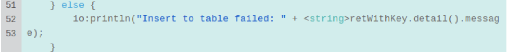
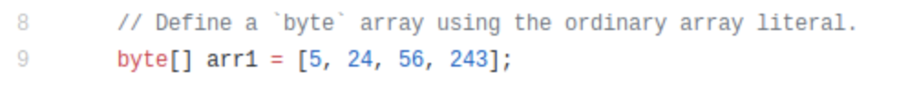
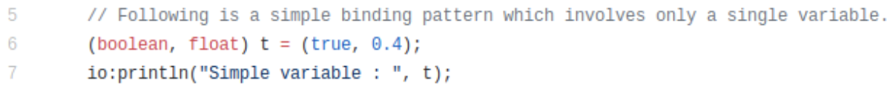
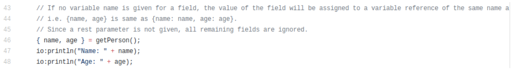
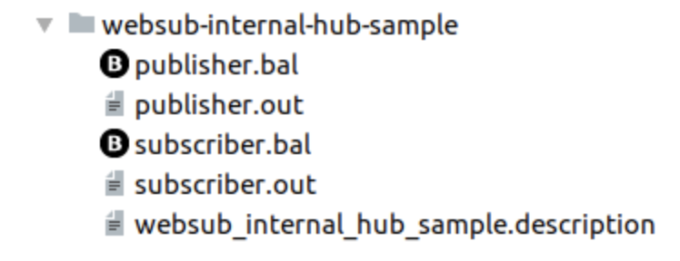

# Guidelines for Writing Ballerina Examples 

- [General best practices](#general-best-practices)
- [Practices related to the code comments](#practices-related-to-the-code-comments)
- [Practices related to the folder structure](#practices-related-to-the-folder-structure)

## General best practices

1. Format the Ballerina source using an IDE Plugin.

2. Always, think about the length of the example. A good example should be short.

3. Make the examples self-contained (i.e., avoid depending on concepts other than the one being illustrated) as much as possible.

4. As a practice, use `ballerina/io` methods in main examples and `ballerina/log` methods in services examples. E.g., Do not use both `io:println` and `log:printInfo` in the same example.

5. It is recommended to limit the maximum character count per line to 80 in `.bal` files. Otherwise, the lines get automatically wrapped in the [Ballerina By Example](https://ballerina.io/learn/by-example/) reducing the readability as shown below.

    Example;

    

6. All keywords and any other word, which needs to be highlighted should be added within backquotes (e.g., `xml`). Do not use a single quote as it will not get highlighted. 

    Example;

    - In the code:

        

    - In the Baleerina website:

        

    > **Note:** However, the context should be taken into account when formatting words/phrases with backquotes. For example, although the word "record" is a keyword of the language, it need not be highlighted if you are referring to the record construct of the language as shown below.

    ```ballerina
    // Defines an open record type named Student. The { and } delimiters indicate that
    // in addition to the defined fields, this record type allows additional fields with
    // pure-typed (i.e., anydata|error) values. The descriptor record { } is equivalent to 
    // record {| (anydata|error)...; |}.
    type Student record {
        string name;
        int age;
        Grades grades;
    };
    ```

7. Remove unused imports in `.bal` files.

8. If a new example is added or an existing one is deleted/renamed, update the [index.json](https://github.com/ballerina-platform/ballerina-lang/blob/master/examples/index.json) file as well.

## Practices related to the code comments

1. Add comments to the code blocks as much as possible by starting them with “//”. They will be moved to the right hand side boxes in the [Ballerina By Example](https://ballerina.io/learn/by-example/) as a mechanism to describe the code.

    Example;

    - In the code:

        

    - In the [Ballerina website](https://ballerina.io/):

        

2. Since comments are used to describe the code, they should be valid sentences (i.e., start with an upper case letter and end with a full stop etc.).

3. After a comment is strated, it will continue being applied to the subsequent lines in the file until another comment or an empty line is found. Therefore, use comments/new lines appropriately to ensure that they apply only to the relevant lines.

4. There is no restriction on the max number of characters that should be there in comment lines as they get wrapped automatically in the right hand side in the [Ballerina By Example](https://ballerina.io/learn/by-example/). However, since users can refer the same in the code in GitHub, it is better if we can have the same character limit as of a code line (i.e., 80) to increase readability.

    For example, it will not be readable if comments are significantly longer than the code line as shown below. 

    

## Practices related to the folder structure

1. Each BBE should be in a separate directory in the [ballerina-lang GitHub repository](https://github.com/ballerina-platform/ballerina-lang/tree/master/examples) named by the example (e.g., https://github.com/ballerina-platform/ballerina-lang/tree/master/examples/hello-world).

2. Directory name should be in all lowercase letters with words separated by “-” (e.g., abstract-objects).

3. Each example should contain at least the following files. 

    > **Tip:** File names should be the same as folder name, with the “-” being replaced with the underscore (e.g., abstract_objects).

    `.bal` - The code of the example to be displayed in the [Ballerina By Example](https://ballerina.io/learn/by-example/).

    `.description` - The description of the example displayed at the top of each example in the [Ballerina By Example](https://ballerina.io/learn/by-example/).

    `.out` - Output of the example displayed at the bottom black colour box in the [Ballerina By Example](https://ballerina.io/learn/by-example/).

    `<example_name>_test.bal` - Contains the tests to validate the output of the BBE during the build time. 

    

4. As a common pattern, use the following format for `.out` files and customize it only when required (e.g., to add more command line args etc.).

- For an example with main;

    ```
    # To run this sample, navigate to the directory that contains the
    # `.bal` file and execute the `ballerina run` command.
    $ ballerina run <sample_file_name>.bal
    ```
- For an example with a service;

    ```
    # To start the service, navigate to the directory that contains the
    # `.bal` file and execute the `ballerina run` command.
    $ ballerina run hello_world_service.bal
    ```


5. Service examples need two `.out` files. One (i.e., the `server.out` file) to display the server output and the other (i.e., the `client.out` file) to display the cURL command and the output.

    


6. Unless it is really required, it is not encouraged to have multiple `.bal` files in the same example. In case if multiple are needed, each `.bal` file can have its own name and the respective `.out` files should match the name of the respective `.bal` file. 



