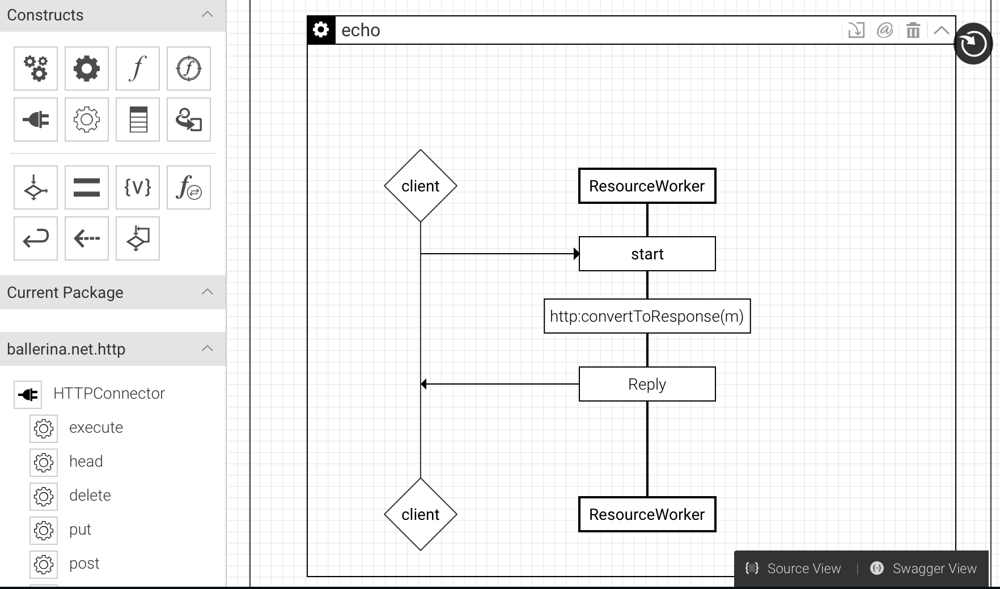
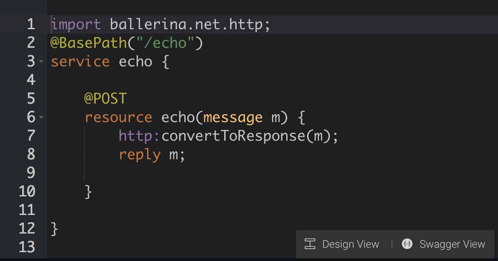
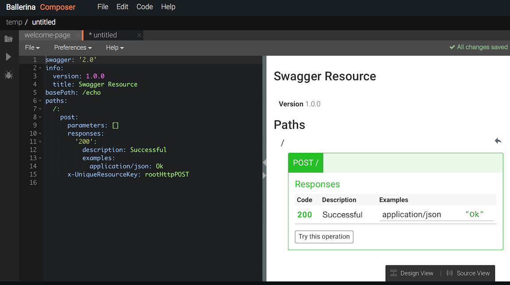

# Welcome to Ballerina!

Ballerina is the premier programming language designed for integration. It allows you to connect apps and services to handle all types of integration scenarios, such as collecting top tweets from a specific location and adding them to a Google spreadsheet, generating emails with real-time quotes pulled from a stock quote service, transforming and routing data based on advanced logic, and much more. 

Ballerina is:

* **Flexible**. You can build your integrations from sequence diagrams, or write code in Ballerina or Swagger. You can also use plug-ins to write Ballerina code in IntelliJ IDEA, Vim, and more. Ballerina is open source, so you can see exactly how it works and join the growing community of users contributing to its code base. And its API allows you to leverage its functionality from other programs.

* **Powerful**. The Ballerina language was designed from the ground up specifically for integration and can handle everything from a simple Hello World program to complex service chaining and content-based routing scenarios. It comes with native support for REST, Swagger, JSON, and XML, and it includes connectors for popular services like Twitter and Facebook. The runtime is lightweight and incredibly fast, and you can run it alone without the development tools in a production environment.  

* **Beautiful**. The Ballerina Composer allows you to easily draw your integration scenario and all the components that need to interact by dragging and dropping elements onto a canvas. As you create the diagram, the integration code is written for you, and at any time you can switch to the Source view to see and modify the code. The Ballerina language syntax was modeled after the best practices of popular languages, so it's intuitive and easy to work with.   

**You can create your integration in Design view:**

**And go to Source view to edit the code that's generated:**

**Or go to the Swagger view to define the service in Swagger:**

To get started, go to the [Quick Tour](quick-tour.md) and take Ballerina for a spin!
