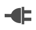

# Connectors

A connector represents a participant in the integration and is used to interact with an external system or a service you've defined in Ballerina. Ballerina includes a set of connectors under `org.wso2.ballerina.connectors.*` that allow you to connect to Twitter, Facebook, and more. It also includes built-in connectors for network protocols under `ballerina.net.*` that handle HTTP(S) 1 & 2, WebSockets, JMS, and FTP/FTPS/SFTP.

Each connector defines a set of [actions](actions.md) that can be used when interacting with the external system or service. For example, the Twitter connector includes actions such as `tweet`, `retweet`, and `destroyStatus`, which allow you to perform those actions in Twitter from your Ballerina program.

## Using a connector

The built-in connectors are listed in the tool palette in Ballerina Composer. Scroll down to the connector you want to use, and then drag the connector to the canvas if you want to create an endpoint connection to that service, or drag one of the connector's actions to the place in your integration flow where you want to invoke that action.

To use a third-party connector such as the Twitter connector, click the Import Packages button in the upper-right corner and enter the package path (such as `org.wso2.ballerina.connectors.twitter`). You can then use the actions in that connector. 

TODO: insert list of third-party connectors and point off to their docs. 

## Defining a new connector

You can define additional connectors within your Ballerina programs. To define a new connector, drag the Connector Definition icon  to the canvas. You then drag the Connector Action icon  to the canvas and define the actions in this connector. 

A connector is defined as follows:
```
[ConnectorAnnotations]
connector ConnectorName ([ConnectorParamAnnotations]TypeName VariableName[(, TypeName VariableName)*]) {
    ConnectorDeclaration;*
    VariableDeclaration;*
    ActionDefinition;+
}
```

The ConnectorAnnotations are designed to help the editor provide a better user experience for connector users.

Connectors are instantiated (by means of the `new` keyword) as follows:
```
[ConnectorPackageName:]ConnectorName ConnectorInstanceName = new [ConnectorPackageName:]ConnectorName (ValueList[, map]);
```
The newly created instance has the `ConnectorInstanceName` assigned.

Once a connector of name `ConnectorInstanceName` has been instantiated, actions can be invoked against that connector as follows:
```
[ConnectorPackageName:]ConnectorName.ActionName (ConnectorInstanceName, ValueList);
```
## Composing connectors  
It is very easy to use one connector to write another connector in Ballerina. For example, the HTTP Basic Auth connector embeds an instance of the HTTP Connector, adds the Basic Auth header, and delegates all work to the underlying connector. This is an excellent approach for writing new connectors, but note that the delegation requires a second function call, which affects performance slightly.

TODO: say more about how you do this

## Use of connector-scoped variables
In many cases, connectors must keep some state associated with the connection for as long as the connection is valid. Connector-scoped variables are available for this purpose. The “constructor arguments” given when creating a new connector are also with that same scope.

To define connector-scoped variables, click the Variables button in the upper-left corner of the connector on the canvas. To define constructor arguments, click the connector's Arguments button in the upper-right corner of the connector. 
