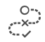

# Exception Handling

In any programming language, there are three ways to respond to an anomalous situation:
- Abort the current execution scope and inform the upstream caller about the problem that occurred.
- Attempt to correct the problem by doing something different.
- Ignore it. 

Java uses exceptions to handle all these cases. Go uses a combination of returnable first class errors and panic/recover (similar to exceptions) for this. C uses just out of range normal values to indicate error statuses.

The Ballerina approach is to introduce a first class error concept that can both be returned as yet another return value (and thereby processed by the caller as it deems fit) or be thrown. Thrown errors are just like exceptions and cause the call stack to be unwound until a matching catcher is found.

## Behavior

Ballerina errors are Ballerina structs, which are structurally equivalent to the ballerina.lang.errors:Error struct. The following is an error struct.

```
package ballerina.lang.errors;

struct Error {
	string msg;
	Error cause;
}
```

An error may be thrown by a native Ballerina function or any Ballerina construct using the `throw` statement. When thrown, the runtime searches for the nearest enclosing block containing a `try-catch` statement. If none is found in the current stack frame then execution of the function (or resource or action) stops and the frame is popped and the search continues until a `try-catch` statement is found. If none is found at the outermost level of the worker, then that worker thread dies in an abnormal state.

If the exception goes through the default worker of a `main` function without being caught then the entire program will stop executing. If the exception goes through a `resource` without being caught then that particular invocation of the service & resource will fail and the server connector will choose the appropriate behavior in that situation.

# The `try-catch` Statement

In Design View in the Composer, you can add a `try-catch` statement to your sequence diagram by dragging the following icon from the tool palette to the canvas:



The syntax of a `try-catch` is as follows:
```
try {
    Statement;+
} catch (ErrorTypeName e) {
    Statement;+
} catch (errors:Error e) {
    Statement;+
} finally {

}
```
If any exception occurs while executing the first block of statements, the exception is handled by the block after the `catch`.

# The `throw` Statement

You can add a `throw` statement to your diagram by dragging the folloiwng icon to the canvas:


The syntax of a `throw` statement is as follows:
```
throw ErrorVariableName;
```

The `throw` statement is used to throw an exception from the current location. An execution stack trace pointing to the current location will be automatically inserted into the exception before the runtime starts the exception handling process.

> NOTE: There will be more capabilities brought to exceptions in future.
