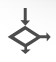

# Statements

A statement can be one of the following:

- assignment
- if
- iterate
- while
- break
- fork/join
- return
- reply
- worker initiation
- worker join
- action invocation
- comment

There are also exception-handling statements: try/catch and throw. For more information on these statements, see [Exception Handling](exceptions.md).

The rest of this page describes the statements you can use in your Ballerina program. 

## Assignment

An assignment statement allows you to assign a value to a variable accessor. In the Composer, you can drag the Assignment icon  from the tool palette to the canvas to add the statement to your program. 

An assignment statement is defined as follows:
```
VariableAccessor = Expression;
```
where a `VariableAccessor` is one of:
- VariableName
- VariableAccessor'['ArrayIndex']'
- VariableAccessor'['MapIndex']'
- VariableAccessor.FieldName

## If-else

An `if-else` statement provides a way to perform conditional execution. In the Composer, you can drag the If-Else icon  from the tool palette to the canvas to add the statement to your program. 

An if-else statement is defined as follows: 
```
if (BooleanExpression) {
    Statement;*
}
[else if (BooleanExpression) {
    Statement;*
}]* [else {
    Statement;*
}]
```

## Iterate

An `iterate` statement provides a way to iterate through an iterator.

```
iterate (VariableType VariableName : Iterator) {
  Statement;+
}
```

## While

A `while` statement provides a way to execute a series of statements as long as a Boolean expression is met. In the Composer, you can drag the While icon  from the tool palette to the canvas to add the statement to your program. 

```
while (BooleanExpression) {
    Statement;+
}
```

## Break

A `break` statement allows you to terminate the immediately enclosing loop. This is only allowed within the `iterate` or `while` constructs.

```
break;
```

## Fork/Join

A `fork` statement allows you to replicate a message to any number of parallel workers and have them independently operate on the copies of the message. The `join` part of the `fork` statement allows you to define how the caller of `fork` will wait for the parallel workers to complete. 

```
fork (MessageName) {
  worker WorkerName (message VariableName) {
    VariableDeclaration;*
    Statement;+
    [reply MessageName;]
  }+       
} [join (JoinCondition) (message[] VariableName) {
  Statement;*
} timeout (Expression) (message[] VariableName) {
  Statement;*  
}]
```
Note that if the `join` clause is missing, it is equivalent to waiting for all workers to complete and ignorning the results.

The `JoinCondition` is one of the following:
- `any IntegerValue [(WorkerNameList)]`: wait for any k (i.e., the IntegerValue) of the given workers or any of the workers
- `all [(WorkerNameList)]`: wait for all given workers or all of the workers

where `WorkerNameList` is a list of comma-separated names of workers.

When the `JoinCondition` has been satisfied, the corresponding slots of the message array will be filled with the returned messages from the workers in the workers' lexical order. If the condition asks for up to some number of results to be available to satisfy the condition, it may be the case that more than that number are available by the time the statements within the join condition are executed. If a particular worker has completed but not sent a response message, or not yet completed, the corresponding message slot will be null.

The `timeout` clause allows one to specify a maximum time (in milliseconds) within which the join condition must be satisfied.

## Return

The Return statement evaluates the expression, stops the current function, and returns the result of the expression to the caller. In the Composer, you can drag the Return icon  from the tool palette to the canvas to add the statement to your program. 

The syntax of a `return` statement is as follows:
```
return Expression*;
```

## Reply

The Reply statement sends the request message back to the client. In the Composer, you can drag the Reply icon  from the tool palette to the canvas to add the statement to your program. 

The syntax of a `reply` statement is as follows:
```
reply Message?;
```

Note that when you use Reply, the request message with its original HTTP headers is sent back to the client. These headers typically have information that is useful in the client -> server direction but not in the server -> client direction. If you want to strip those headers before sending the message back to the client, you can use the `convertToResponse` function from the `ballerina.net.http` package.

## Comment

Comments are quite different in Ballerina in comparison to other languages. Comments are only allowed as a statement, i.e., only inside a resource, action, or function.

Ballerina has designed structured mechanisms via annotations to document all outer-level Ballerina constructs (services, resources, etc.), and comments only play the role of providing a comment about the logic of a resource, action, or function.

Any statement that starts with the characters `//` is a comment.
