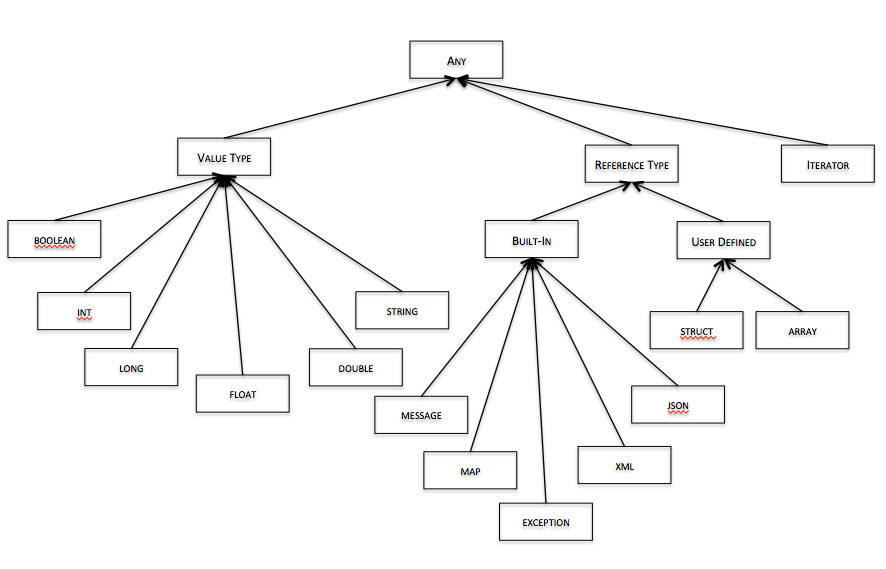

# Types and Variables

Ballerina has variables of various types. The type system includes built-in primitive or value types, a collection of built-in structured types, and array, record, and iterator type constructors. All variables of primitive types are allocated on the stack, while all non-primitive types are allocated on a heap using `new`.

The type system is illustrated in the following diagram:



## Declaring variables

A `VariableDeclaration` has the following structure:
```
TypeName VariableName;
```
A `TypeName` can be one of the following built-in primitive types:

* boolean
* int
* long
* float
* double
* string

Primitive types do not have to be dynamically allocated as they are always allocated on the stack.

A `TypeName` can also be one of the following built-in non-primitive types:

* message
* map
* exception

## Constructed types (user-defined types)
A `TypeName` can also be the name of a user-defined type.

### Structured types (records)

User-defined record types are defined using the struct keyword as follows:
```
[public] struct TypeName {
    TypeName VariableName;+
}
```
If a struct is marked public, it can be instantiated from another package.

### Arrays

Arrays are defined using the array constructor `[]` as follows:
```
TypeName[]
```
All arrays are unbounded in length and support 0 based indexing.

### Iterators

Iterators are defined using the iterator constructor `~` as follows:
```
TypeName~
```
Iterator typed values are navigated through using an iterate statement.

Iterators are currently only available for the built-in types `xml` and `json`. In the future we will allow developers to define their own iterators for their types.

## XML & JSON types

Ballerina has built-in support for XML elements, XML documents, and JSON values. `TypeName` can be any of the following:
```
json[<json_schema_name>]
xml[<{XSD_namespace_name}type_name>]
xmlDocument[<{XSD_namespace_name}type_name>]
```
A variable of type `json` can hold any JSON value. Optionaly, you can associate a JSON schema with the JSON value to require the value to conform to that schema, which is useful for type mapping. For example:
```
json[schema.json] jsdoc;
```

You can use JSON literals to initialize JSON-typed variables. For example:
```
json address_json = `{"name" : "$name", "streetName" : "$street"}`;
```

A variable of type `xml` can hold any XML element. Optionally, you can associate an XML schema with the XML value to constrain the value space. The optional TypeName specifies the qualified type name of the XML schema type that the XML element is assumed to conform to.

A variable of type `xmlDocument` can hold any XML document, and the optional schema type is the type of the document element.

You can use XML literals to initialize XML-typed variables. For example:
```
xmlElement address_xml = `<address><name>$name</name></address>`;
```

## Allocating variables

Primitive types do not have to be dynamically allocated as they are always allocated on the stack.

All non-primitive types, user-defined types, and array types have to be allocated on the heap using new as follows:
```
new TypeName[(ValueList)]
```
The optional `ValueList` can be used to give initial values for the fields of any record type. The order of values must correspond to the order of field declarations.

## Default values for variables

Variables can be given values at time of declaration as follows:
```
TypeName VariableName = Value;
```

## Literal values

The following are examples of literal values for various types:
```
int age = 4;
double price = 4.0;
string name = "John";
xml address_xml = `<address><name>$name</name></address>`;
json address_json = `{"name" : "$name", "streetName" : "$street"}`;
map m = {"name" : "John", "age" : 34 };
int[] data = [1, 2, 3, 6, 10];
```

## Type coercion and conversion

The built-in float and double follow the standard IEEE 754 specifications. The int and long types follow the standard 32- and 64-bit integer arithmetic, respectively.

The following lossless type coercions are pre-defined in Ballerina:

* boolean -> int/long/float/double with values 0 or 1 for false or true, respectively
* int -> long/float/double
* long -> double
* float -> double

In addition to these built in type coercions, Ballerina allows you to define arbitrary conversions from one non-primitive type to another non-primitive and have the language apply it automatically.

A `TypeMapper` is defined as follows:
```
typemapper TypeMapperName (TypeName VariableName) (TypeName) {
    VariableDeclaration;*
    Statement;+
}
```
If a TypeMapper has been defined from Type1 to Type2, it will be invoked by the runtime upon executing the following statement:
```
Type1 t1;
Type2 t2;

t2 = (Type2) t1;
```

That is, the registered type mapper is invoked by indicating the type cast as above. Note that while the compiler can auto-detect the right mapper to apply, we have chosen to force the user to request the appropriate mapper by applying a cast.

## Built-in type mappers

In addition to the built-in value type coercions, Ballerina also ships with a few pre-defined type mappers to make development easier. The following predefined type mappers are declared in the Ballerina package `ballerina.lang.typemappers`:

* string/xml/json to message: creates a new message with the given string/xml/json as its payload
* down conversions for numeral types: int -> boolean (0 is false), long -> int/boolean, float -> int/boolean, double -> float/long/int/boolean,

Note that these must be triggered by indicating a type cast to the desired type.
