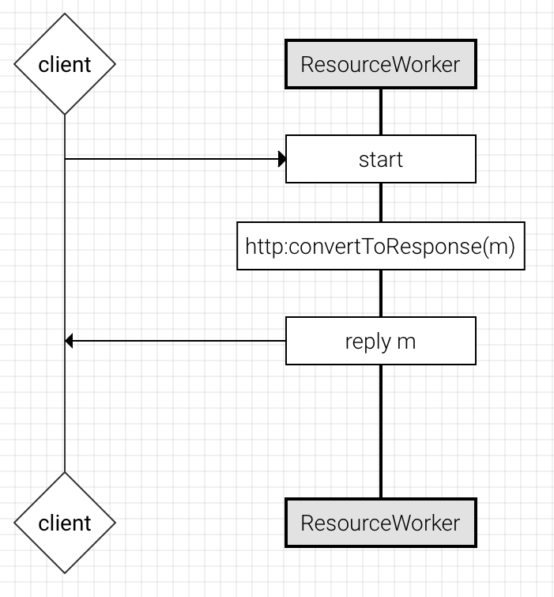

# Workers

A worker is a programmable actor in Ballerina. It is represented on a sequence diagram as a vertical "lifeline" of logic to be executed. 



The default worker is just a worker that is defined without declaring it as such. For example, the following syntax:

```
function foo (int x) {
  statement1;
  statement2;
}

```

is equivalent to:

```
function foo (int x) {
  worker {
    statement1;
    statement2;
  }
}
```
The default worker does not result in a thread of its own: it inherits a thread from the caller. Note that the same applies for resources as well.
 
If there were additional workers in the function, then it is as follows:

```
function foo (int x) {
  worker {
    statement1;
    statement2;
  }
  worker OtherWorker1 {
    s1;
    s2;
    s3;
  }
  worker OtherWorker2 {
    s1;
  }
}
```
For syntactic convenience, you can adopt the following approach:

```
function foo (int x) {
  statement1;
  statement2;
  worker OtherWorker1 {
    s1;
    s2;
    s3;
  }
  worker OtherWorker2 {
    s1;
  }
}
```

Workers do not share any state with each other. Upon invocation, the “parent” worker can pass a message to the new worker. Resource workers can also access the service's state.

## Adding a worker

To add a worker in Design View in the Composer, drag the Worker icon from the tool palette to your sequence diagram:


To add a worker when working directly with the source code of your program, a worker is defined and declared as follows:

```
worker WorkerName {
    Statement*
    workerDeclaration*
}
```

You then define the logic that you want the worker to reply. The worker can invoke any functions that are defined in the same package. 

If the [Reply](statements.md#reply) statement is present, it must be at the end of the worker definition. The reply indicates what message will be returned to the initiator if the initiator requires a response from the worker (see "Receiving a reply from a worker" below). If no Reply statement is present, it has the same effect as having sent a null message.

## Invoking the worker

Workers initially come into existence when the enclosing entity-- a [resource](resources.md), [function](functions.md), or [action](actions.md)--becomes active. However, similar to a resource, the worker does not execute until it has been sent a message.

A worker is triggered when a message is sent to the worker. You can configure the enclosing entity to send a message to the worker by dragging the Worker Invoke icon to the enclosing entity and typing the message name:


Or type the following code in the Source View:

```
<MessageName> -> <WorkerName>;
```

For example, if the message is named `msg` and the worker is named `sampleWorker`, you would type:

```
msg -> sampleWorker;
```

## Receiving a reply from a worker

The worker can reply to the enclosing entity using a [Reply](statements.md#reply) statement at the end of the worker defintion. You can configure the enclosing entity to receive the reply by dragging the Worker Receive icon to the point where you want the enclosing entity to receive the reply:


Or type the following code in the Source View:

```
<MessageName> <- <WorkerName>;
```

For example, to receive a reply from `sampleWorker` as a message named `msg`:
```
msg <- sampleWorker;
```

If the worker does not reply, the enclosing entity will wait until the named worker completes and will return a null value for the message.

If there is no wait for completion of a particular worker, and if the enclosing entity finishes execution, all active workers are immediately killed prior to returning from the enclosing context. 

## How workers work

Workers are new actors that are running on separate threads that can be programmed using Ballerina. Every Ballerina program runs on a thread and there is a default thread that executes the given function/resource/action within your Ballerina program. When some program needs to delegate a portion of its workload to another actor (thread), a worker can be used and programmed accordingly.

Here is a sample syntax of a worker that prints "hello world" in a new thread when this main function is executed.

```
import ballerina.lang.system;

function main (string[] args) {
    system:println("Hello from main");
    worker W1 {
        system:println("Hello from worker");
    }
}
```

By running the above program, you will get one of the following 2 outputs.

```
Hello from main
Hello from worker 
```

OR

```
Hello from worker
Hello from main
```

There are two outputs from the same program because the workers start at the same time that the main program starts. The underlying operating system decides which thread to run first and which thread to run second. All the workers defined in a function/resource/action will start at the beginning of the enclosing component.

One important thing to notice in the above program is that worker definition must always come at the bottom of the program. 
 
With the above simple program running, let’s move on to a comparatively complex program that shares data across workers. One worker can share data to another worker through worker interaction statements. Every worker interaction consists of two statements that must reside in the corresponding two workers. Let’s consider a scenario where worker W1 is sending a message to worker W2.

```
worker W1 {
  message m = {};
  m -> W2;
}

worker W2 {
  message n;
  n <- W1;
}
```

In the above program, message m is sent to W2 and it will receive that message in variable n. When sending data across: 

- the primitve type variables like int, float, string and boolean will be passed as copies of the original data. 
- the variables of type message will be passed as a clone of the original message.
- the reference type variables like array, map, and struct will be passed as references.

Let’s write a simple meaningful worker interaction program.

```
import ballerina.lang.system;
import ballerina.lang.messages;

function main (string[] args) {
    message result;
    message msg = {};
    int x = 100;
    float y;
    msg, x -> sampleWorker;
    system:println("Inside default worker after invoking the sampleWorker");
    result, y <- sampleWorker;
    string s = messages:getStringPayload(result);
    system:println("Message received from sampleWorker is " + s);
    system:println("Float received from sampleWorker is " + y);

    worker sampleWorker {
        message m;
        int a;
        float b = 12.34;
        m, a <- default;
        system:println("Passed in integer value is " + a);
        json j;
        j = {"name":"tom"};
        messages:setJsonPayload(m, j);
        m, b -> default;
    }
}

```

In this program, you can observe that there are four variables defined within the main function and two of them are used to share data with “sampleWorker” and the other two are for receiving data from the same.

First, we send the msg and x variables to sampleWorker and then we have a println statement. After that, there is a data receiving statement that will receive data of type message (result) and float (y) from the sampleWorker. Then we print the results we receive from the sampleWorker.

Within the sampleWorker, we can find three variables defined and, after that, the data receiving statement that exactly matches the data sending statement of default worker (main function). Following this, we have the println statement to print out the received integer value and then we set some data to the message and finally pass the float variable and the message to the default worker.

Once you execute the above program, you will receive the following output (or similar) in your console.

```
Inside default worker after invoking the sampleWorker
Passed in integer value is 100
Message received from sampleWorker is {"name":"tom"}
Float received from sampleWorker is 12.34
```

Let’s move on to the next program that will demonstrate the capability of accessing scope variables within a worker. Workers can access:  

- Input parameters defined at the function/resource/action level
- Service level variables or Connector level variables
- Global constants

All of these variables are accessed in a shared manner. This means that all the workers (including default worker) access the same variable reference. This shared memory feature is not yet implemented. 

What is supported at the moment is that any primitive (value) type variables are visible to the workers, but the values are passed in as copies of the original variable. This means that if you change the value of a parent scope variable within a worker, it will not get reflected in the parent's variable. 

However, reference type variables of array, map, struct, message, json, and xml are shared as references and hence the changes done within the workers are visible to the parent scope.

Let’s write a sample program and see how this functionality works.

```
import ballerina.lang.system;

function main (string[] args) {
    system:println("Variable access within the default worker " + args[0]);
    worker W1 {
        system:println("Variable access within the W1 worker " + args[0]);
    }
}
```

When you run the above program with input argument 200 at the command line, you can get the following output in the console.

```
Variable access within the default worker 200
Variable access within the W1 worker 200
```

In the above program, we have only accessed the variable and printed the value of it. Let’s write a comparatively complex program by editing the variables within workers and seeing them within different workers.

```
import ballerina.lang.system;

function main (string[] args) {
    map m = {"name":"Abhaya", "era":"Anuradhapura"};
    system:println(m["name"]);
    testWorker(m);
    system:println("After the function call that invoked the workers");
    system:println(m["name"]);
}

function testWorker (map x) {
    worker W1 {
        system:println(x["name"]);
        x["name"] = "WSO2";
    }
    worker W2 {
        system:println(x["name"]);
        x["name"] = "Ballerina";
    }
}

```

In the above program, we are accessing the variable of type map (x) within different workers. Once you run the above program, you will see different results for different runs, due to the invariant nature of the worker execution. Here are few sample outputs.

```
Abhaya
Abhaya
After the function call that invoked the workers
WSO2
WSO2

Abhaya
Abhaya
Abhaya
After the function call that invoked the workers
Ballerina

Abhaya
Abhaya
After the function call that invoked the workers
WSO2
Abhaya
```

## Examples

These examples show how to define, invoke, and receive a reply from a worker. 

### Inside the main() function

```
import ballerina.lang.system;
import ballerina.lang.messages;

const int INDEX = 12;

function main (string[] args) {
    message result;
    message msg = {};
    msg -> sampleWorker;
    system:println("After worker");
    result <- sampleWorker;
    string s = messages:getStringPayload(result);
    system:println(s);
    
    worker sampleWorker {
        message m;
        json j;
        j = {"name":"chanaka"};
        m <- default;
        messages:setJsonPayload(m, j);
        // Global constants are visible to worker
        system:println("constant value is " + INDEX);
        m -> default;
    }
}
```

When you run the above Ballerina program, the following output is printed to the console:

```
After worker
constant value is 12
{"name":"chanaka"}
```

### Inside a resource

```
import ballerina.lang.messages;
import ballerina.lang.system;
import ballerina.net.http;

const int INDEX = 12;

@http:BasePath {value:"/passthrough"}
service passthrough {

    @http:POST {}
    resource passthrough (message m) {
        message result;
        m -> sampleWorker;
        system:println("After worker");
        result <- sampleWorker;
        string s = messages:getStringPayload(result);
        system:println(s);
        reply result;

        worker sampleWorker {
            message msg;
            json j;
            msg <- default;
            j = {"name":"chanaka"};
            messages:setJsonPayload(msg, j);
            // Global constants are visible to worker
            system:println("constant value is " + INDEX);
            msg -> default;
        }
    }
}
```

When the above service is running and is sent a message, it will return the following response from the worker back to the client:

```
{
  "name": "chanaka"
}
```

### Calling a function from the worker

This example shows how a worker can call a function that's defined in the same package:

```
import ballerina.lang.system;
import ballerina.lang.messages;

const int INDEX = 12;

function main (string[] args) {
    message result;
    message msg = {};
    msg -> sampleWorker;
    system:println("After worker");
    printHello("I'm main function");
    result <- sampleWorker;
    string s = messages:getStringPayload(result);
    system:println(s);

    worker sampleWorker {
        message m;
        json j;
        m <- default;
        j = {"name":"chanaka"};
        messages:setJsonPayload(m, j);
        // Global constants are visible to worker
        system:println("constant value is " + INDEX);
        printHello("I'm worker");
        m -> default;
    }
}

function printHello (string str) {
    system:println(str);
}
```

When you run this program, the following output is printed to the console:

```
After worker
I'm main function
constant value is 12
I'm worker
{"name":"chanaka"}
```
