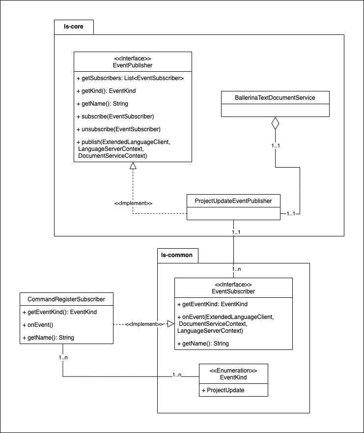

# Document Event Sync Publisher Subscriber

## Overview

This document contains information about the implementation of a notification system inside the language server using the 
PubSub architecture. Goal is to allow communication between language server and extensions asynchronously.

In contrast to the current request/response (and polling) based approach, interested parties(completion/code action 
extensions, extended services) can now asynchronously receive events related to project updates, etc. This will let 
language server to decide when deciding when to publish events (implement debouncing logic, etc) optimally.

Following diagram shows how this has been implemented. 



- Event Subscribers and Event Publishers are loaded using JavaSPI and subscribed to an EventKind. A subscriber is 
notified when a publisher publishes an event (document update, open, close, etc) under that EventKind.
- EventKind acts as the topic. A subscriber can be notified on only one EventKind.
- When an Event Publisher publishes events to an EventKind, the `onEvent()` method is getting triggered for each 
subscriber that has been subscribed to the specific EventKind. 

## How to Use

- `EventPublisher` is an internal interface which is not exported from the module. The server 
decides which events to be delegated to a particular publisher. In the `publish()` method a debouncing mechanism has 
implemented for the `ProjectUpdateEventPublisher`.
- `EventSubscriber` is an interface which can be accessed publicly by extension developers and get notified when 
subscribed to a publisher.
- If the extension uses different file schemes, users have to handle that from extension itself.
- `DocumentServiceContext` and the `fileUri` can be used to determine scheme specific events. Currently, LS supports 
file and expr schemes.

## Example

### 1. Implementing a Subscriber

We can implement `EventSubscriber` interface as follows.

```java
@JavaSPIService("org.ballerinalang.langserver.commons.eventsync.spi.EventSubscriber")
public class CommandRegisterSubscriber implements EventSubscriber {
    
    public static final String NAME = "Command register subscriber";

    @Override
    public EventKind eventKind() {
        return EventKind.PROJECT_UPDATE;
    }
    
    @Override
    public void onEvent(ExtendedLanguageClient client, DocumentServiceContext context,
                        LanguageServerContext languageServerContext) {
        // Your implementation here
    }

    @Override
    public String getName() {
        return NAME;
    }
}
```
See [`CommandRegisterSubscriber`](../../language-server/modules/langserver-core/src/main/java/org/ballerinalang/langserver/eventsync/subscribers/CommandRegisterSubscriber.java)
for an example.

### 2. Implementing a Publisher

`EventPublishers` can be implemented extending `AbstractEventPublisher`.

```java
@JavaSPIService("org.ballerinalang.langserver.eventsync.EventPublisher")
public class ProjectUpdateEventPublisher extends AbstractEventPublisher {
    
    public static final String NAME = "Project update event publisher";
    
    @Override
    public EventKind getKind() {
        return EventKind.PROJECT_UPDATE;
    }

    @Override
    public String getName() {
        return NAME;
    }

    @Override
    public void publish(ExtendedLanguageClient client, LanguageServerContext serverContext,
                        DocumentServiceContext context) {
        // your implementation here
    }
}
```
See [`ProjectUpdateEventPublisher`](../../language-server/modules/langserver-core/src/main/java/org/ballerinalang/langserver/eventsync/publishers/ProjectUpdateEventPublisher.java)
for an example.