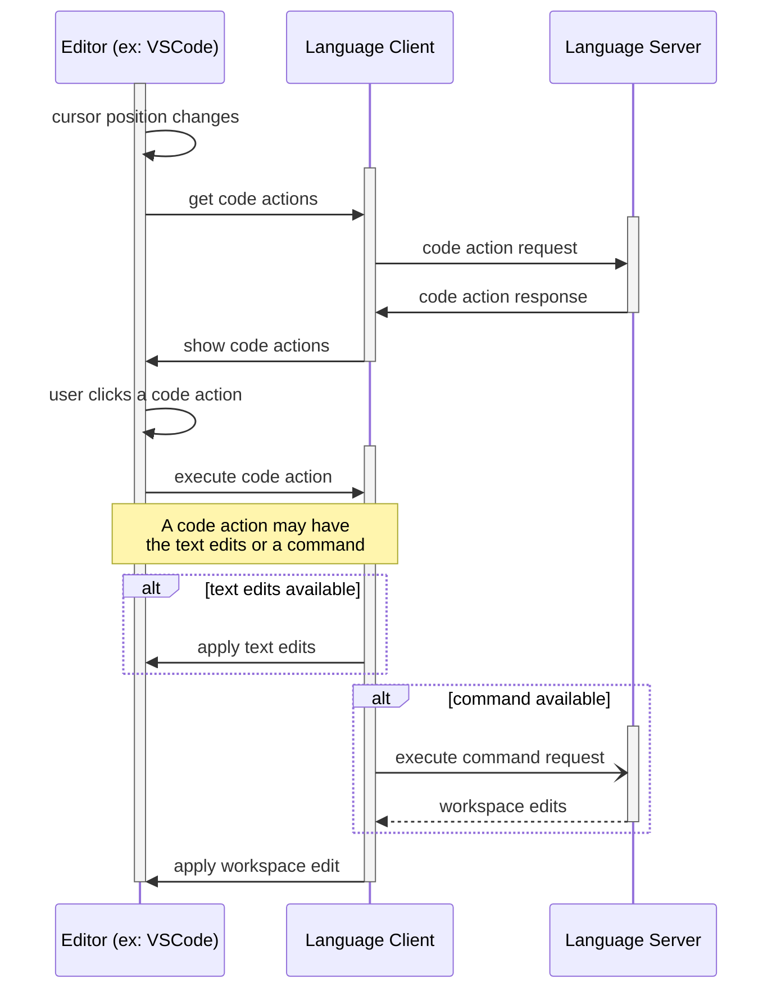

# Ballerina Language Server Features

Ballerina Language Server provides the following editor features.

* [1. Completions](#completions)
* [2. Code Actions](#code-actions)
    * [2.1. Editor-Language Server Communication](#editor-language-server-communication)
    * [2.2. Code Action Types](#code-action-types)
      * [2.2.1. Diagnostics based Code Actions](#21-diagnostic-based-code-actions) 
      * [2.2.2. Range based Code Actions](#22-range-based-code-actions) 
      * [2.2.3. Compiler Plugin Code Actions](#23-compiler-plugin-based-code-actions) 
    * [2.3. Command Executors](#command-executors)
* Rename
* Goto Definition
* Signature Help
* Formatting
* Hover
* Text Synchronization
* Semantic Tokens

## Completions

Suggestions and Auto-Completions are triggered while you are typing and also allows you to request suggestions
explicitly for a given context with the <kbd>Ctrl</kbd> + <kbd>Space</kbd>. (<kbd>&#8984; Command</kbd> + <kbd>i</kbd> or <kbd>&#8997; option</kbd> + <kbd>esc</kbd> in Mac)

## Code Actions

Code Action is triggered when you change your cursor position and also allows you to request code-actions explicitly for
a given context with the <kbd>Ctrl</kbd> + <kbd>.</kbd> (or <kbd>&#8984; Command</kbd> + <kbd>.</kbd> in Mac)

### Editor-Language Server Communication

Communication related to the code-actions.



### Code Action Types

There are 3 types of code actions in the Ballerina Language Server.

1. [Diagnostics based Code Actions](#21-diagnostic-based-code-actions)
2. [Range based Code Actions](#22-range-based-code-actions)
3. [Compiler plugin Code Actions](#23-compiler-plugin-based-code-actions)

#### 2.1. Diagnostic Based Code Actions

* Whenever there's a diagnostics message in the current cursor position(or within the highlighted range) these type of code-actions are getting
  triggered.

* Can be implemented using [interface](https://github.com/ballerina-platform/ballerina-lang/blob/master/language-server/modules/langserver-commons/src/main/java/org/ballerinalang/langserver/commons/codeaction/spi/DiagnosticBasedCodeActionProvider.java) `DiagnosticBasedCodeActionProvider`
  and loaded using Java Service loader [interface]((https://github.com/ballerina-platform/ballerina-lang/blob/master/language-server/modules/langserver-commons/src/main/java/org/ballerinalang/langserver/commons/codeaction/spi/LSCodeActionProvider.java)) `LSCodeActionProvider`.

An example:

```java
@JavaSPIService("org.ballerinalang.langserver.commons.codeaction.spi.LSCodeActionProvider")
public class CreateVariableCodeAction implements DiagnosticBasedCodeActionProvider {
    @Override
    public List<CodeAction> getCodeActions(Diagnostic diagnostic, DiagBasedPositionDetails positionDetails,
                                           CodeActionContext context) {
        // return list of code-actions
    }
}
```

#### 2.2. Range Based Code Action
* Whenever the syntaxKind of the selected range(highlighted code range) matches pre-declared set of syntax kinds, these type of code-actions are getting triggered.

* Can be implemented using [interface](https://github.com/ballerina-platform/ballerina-lang/blob/master/language-server/modules/langserver-commons/src/main/java/org/ballerinalang/langserver/commons/codeaction/spi/RangeBasedCodeActionProvider.java) `RangeBasedCodeActionProvider`
  and loaded using Java Service loader [interface]((https://github.com/ballerina-platform/ballerina-lang/blob/master/language-server/modules/langserver-commons/src/main/java/org/ballerinalang/langserver/commons/codeaction/spi/LSCodeActionProvider.java)) `LSCodeActionProvider`.

An example:

```java
@JavaSPIService("org.ballerinalang.langserver.commons.codeaction.spi.LSCodeActionProvider")
public class AddDocumentationCodeAction extends RangeBasedCodeActionProvider {
    public getSyntaxKinds() {
        return List.of(SyntaxKind.FUNCTION_DEFINITION, SyntaxKind.OBJECT_TYPE_DESC);
    }

    public List<CodeAction> getCodeActions(CodeActionContext context, RangeBasedPositionDetails posDetails) {
        // return list of code-actions
    }
}
```

#### 2.3. Compiler Plugin Based Code Actions

The compiler plugin based code actions allow the developers to write code actions as a compiler plugin, without any
prior requirement of the language server knowledge. The language server is going to load the plugins at the runtime and
convert them to code actions. Refer [this](CompilerPluginCodeActions.md) for detailed explanation.

### Command Executors

For long-running code-actions you can separate out the execution into a command executor and Ballerina LanguageServer
provides SPIs to plug in Command Executors with the `LSCommandExecutor`
interface [here](https://github.com/ballerina-platform/ballerina-lang/blob/master/language-server/modules/langserver-commons/src/main/java/org/ballerinalang/langserver/commons/command/spi/LSCommandExecutor.java)
.

An Example:

```java
public interface LSCommandExecutor {
    Object execute(ExecuteCommandContext context) throws LSCommandExecutorException {
        return new ApplyWorkspaceEditParams();
    }

    String getCommand() {
        return "ballerina.execute.add-docs";
    }
}
```
