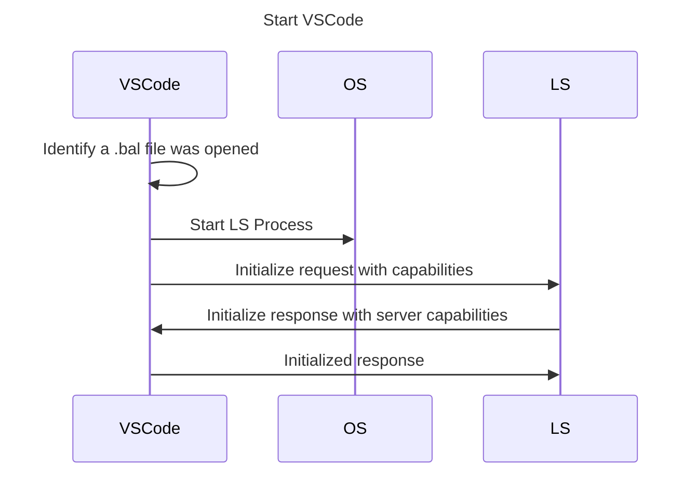
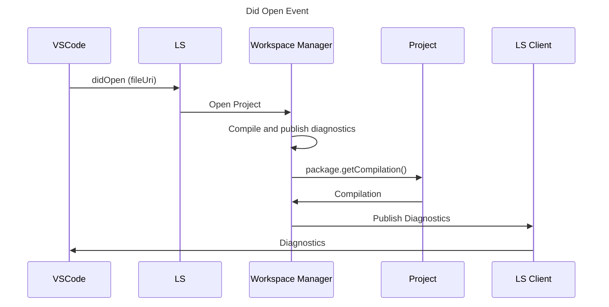

# Overview of the Language Server

## Language Server Initialization

```mermaid
sequenceDiagram
    title Start VSCode
    
    VSCode ->> VSCode: Identify a .bal file was opened
    VSCode ->> OS: Start LS Process
    VSCode ->> LS: Initialize request with capabilities
    LS ->> VSCode: Initialize response with server capabilities
    VSCode ->> LS: Initialized response
```

## didOpen Event and Diagnostic Publishing

```mermaid
sequenceDiagram
    title Did Open Event
    
    VSCode ->> LS: didOpen (fileUri)
    LS ->> Workspace Manager: Open Project
    Workspace Manager ->> Workspace Manager: Compile and publish diagnostics
    
    Workspace Manager ->> Project: package.getCompilation()
    
    Project ->> Workspace Manager: Compilation
    Workspace Manager ->> LS Client: Publish Diagnostics
    LS Client ->> VSCode: Diagnostics
```
