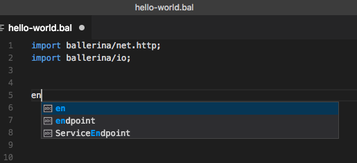
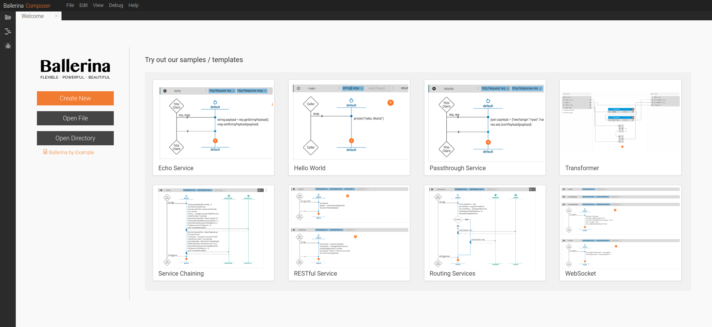

# Quick Tour

Now that you know a little bit [about Ballerina](https://ballerinalang.org/), let's take it for a spin! 

These are the available sections in this tour.

- [Install Ballerina](#install-ballerina)
- [Run HelloWorld](#run-helloworld)
- [Set up the Editor](#set-up-the-editor)
- [Write and Call an Integration Service](#write-and-call-an-integration-service)
- [Deploying on Kubernetes](#deploying-on-kubernetes)
- [Run the Composer](#run-the-composer)

## Install Ballerina

1. Go to [http://www.ballerinalang.org](http://www.ballerinalang.org) and click **Download**. 
1. Download Ballerina for your OS and follow the instructions given to set it up. 

> NOTE: Throughout this documentation, `<ballerina_home>` refers to the Ballerina directory you just installed. 

## Run HelloWorld

Let's get started with a simple Hello World program in Ballerina. Create a file called `hello-world.bal` and copy the following code into it.

```Ballerina
import ballerina.io;
function main (string[] args) {
    io:println("Hello, World!");
}
``` 

At the command line, navigate to the directory that contains the hello-world.bal file and enter the following command.

```
$ ballerina run hello-world.bal
```

You will see the following response:

```
Hello, World!
```

You just started Ballerina, ran a simple code, and got a response within seconds.

## Set up the Editor

To run this, copy the above code into a hello-world.bal file. Let's try this on VS Code.

```
code hello-world.bal
```

Now your file is created and you can add your code inside it. You can find a plugin for Ballerina in the VS Code marketplace. This helps read the `.bal` file using an ideal theme.  

Check if annotations work by entering some text and seeing proposed suggestions.



You can use your [favourite editor to work on Ballerina code](tools-ides-ballerina-composer.md).

Now, let's look at running the same Hello World program you created earlier as a service.

## Write and Call an Integration Service

Let's change the Hello World program to a service. Open the `hello-world.bal` file you created and replace the existing code with the following.

```Ballerina
import ballerina/http;
import ballerina/io;

// A service endpoint listens to HTTP request on port 9090
endpoint http:ServiceEndpoint listener {
    port:9090
};

// A service is a network-accessible API
// Advertised on '/hello', the port comes from the listener endpoint
service<http:Service> hello bind listener {

    // A resource is an invokable API method
    // Accessible on '/hello/sayHello
    // 'caller' is the client invoking this resource 
    sayHello (endpoint caller, http:Request request) {
        http:Response response = {};
        // A response is what you receive back from the service
        // Set the response payload
        response.setStringPayload("Hello Ballerina!\n");
        // Send a response back to caller
        // Errors that could occur are ignored using '_'
        _ = caller -> respond(response);
    }
}
```

You can run the service by using the same run command you used to run the program earlier.

```
$ ballerina run hello-world.bal
```

You will see the following response.

```
ballerina: deploying service(s) in 'hello-world.bal'
ballerina: started HTTP/WS server connector 0.0.0.0:9090
```

This means your service is up and running. You can call the service by opening a new command line window and using the following cURL command.

```
curl http://localhost:9090/hello/sayHello
```

You get the following response.

```
Hello Ballerina!
```

## Deploying on Kubernetes

Now that your service is created, you can deploy this on Kubernetes. 

> TIP: This was tested on the community edition version of Docker Edge with Kubernetes enabled and running in the background. Docker Edge comes with the option of enabling Kubernetes under Docker preferences.

First, as usual add the corresponding package:

```
import ballerinax/kubernetes;
```

Now, let’s add the code you need to run the service in Kubernetes.

```
// Kubernetes configurations
// This is the Kubernetes service annotation added to our listener 
// This tells us that we want to expose it from Kubernetes 
// The type is NodePort under the name of hello-world:

@kubernetes:SVC{
   serviceType:"NodePort",
   name:"hello-world"
}
endpoint http:ServiceEndpoint listener {
  port:9090
};


// This creates a docker image and a deployment into which it puts it.

@kubernetes:Deployment {
   image: "hello/hello-world",
   name: "hello-world"
}
```

That's it - let’s go ahead and build it.

```
$ ballerina build hello-world.bal
```

Once you build it, you get the following response. This means the service is successfully deployed in Kubernetes.

```
@docker                                  - complete 3/3
@kubernetes:Deployment                   - complete 1/1
@kubernetes:Service                      - complete 1/1
```

Run the following command to deploy Kubernetes artifacts:

```
kubectl apply -f /Users/Sam/Documents/Micropatch/Ballerina/QuickTour/KubTest/kubernetes/
```

This creates a folder called kubernetes and puts the deployment artifacts and the docker image inside it.

```
$ docker images |grep demo
```

```
demo/ballerina-demo                            latest     7bb8a49ef708        38 seconds ago      120MB
```

You can now deploy it to Kubernetes using the following command.

```
$ kubectl apply -f kubernetes
```

You see the following on your console.

```
deployment "ballerina-demo" created
service "ballerina-demo" created
```

Let’s see if it is running:

```
$ kubectl get svc
```
This results in output similar to the following. Make note of the port number that Kubernetes provides (31977 in this case).

```
NAME             TYPE        CLUSTER-IP    EXTERNAL-IP   PORT(S)  AGE
ballerina-demo   NodePort    10.98.238.0   <none>        9090:31977/TCP  24s
kubernetes       ClusterIP   10.96.0.1     <none>        443/TCP  2d
```

We can now invoke the service. This example is done using local Kubernetes but the same behavior would happen in the cloud. Using the port number that Kubernetes gave us, run the following cURL command.

```
$ curl -X POST  http://localhost:31977/demo
```

You get the output from Kubernetes itself.

```
Hello World!
```

## Run the Composer

1. In the command line, type `composer`.

1. Access the Composer from the following URL in your browser: http://localhost:9091

    The welcome page of Ballerina Composer appears. 
    
    
