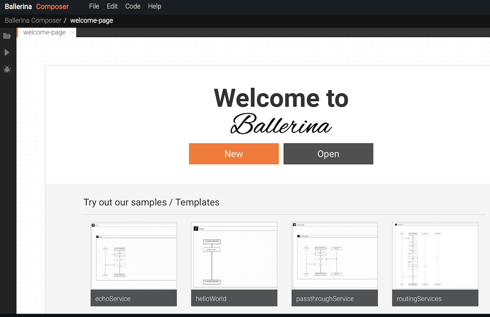

# Quick Tour

Now that you know [a little bit about Ballerina](index.md), let's take it for a spin! 

## Install Ballerina

1. Go to [http://www.ballerinalang.org](http://www.ballerinalang.org) and click **Download**. 
1. Download the Ballerina Tools distribution and unzip it on your computer. Ballerina Tools includes the Ballerina runtime plus the visual editor (Composer) and other tools. 
1. Add the `<ballerina_home>/bin` directory to your $PATH environment variable so that you can run the Ballerina commands from anywhere. 

>NOTE: Throughout this documentation, `<ballerina_home>` refers to the Ballerina directory you just installed. 

## Run HelloWorld

The HelloWorld sample will show you how easy it is to run Ballerina, send it a request, and get a response. 

Let's take a look at what the sample looks like in the Ballerina programming language:

```
import ballerina.lang.system;
function main (string[] args) {
  system:println("Hello, World!");
}
``` 

The HelloWorld sample doesn't take any specific input, so simply running it will cause it to print "Hello, World!" at the command line.

At the command prompt, navigate to the `<ballerina_home>/samples/helloWorld` directory and enter the following line:

```
ballerina run main helloworld.bal
```

You will see the following response:

```
Hello, World!
```

You just started Ballerina, ran the HelloWorld sample, and got a response within seconds. 

Pretty simple and straightforward, right? Now, let's look at something a little more interesting: the Composer.

## Run the Composer

1. At the command prompt, type `composer`.

1. Access the Composer from the following URL in your browser: http://localhost:9091

    The welcome page of Ballerina Composer appears. 
    
    
    
    Let's open a sample and take a look around. 

1. Click **echoService**.

    The Echo Service program displays in the Composer.
    
    

Notice that on the left you have a tool palette containing the various constructs that you'll use to build your integration. On the right, you have a visual editor with a canvas onto which you drag those constructs. This is where you build your sequence diagrams that define your integration logic. 

Also notice the **Source View** and **Swagger View** buttons in the lower right corner. 
   
1. Click **Source View**. 

    

    You'll see the source code editor that represents the sequence diagram as code in the Ballerina language. You can go back and forth between the visual editor and the source code and make your edits in either place. 

1. Click **Swagger View**. 

    

    This editor allows you to write Swagger definitions to create services. 

1. Click **Design View** to return to the visual editor. 

1. Click the "x" to the right of "untitled" in the tab title to close this sample, and click **Don't Save** when prompted.

Now that you've had a look around, it's time to take the leap and [write your first Ballerina program](tutorials/first-program.md).
