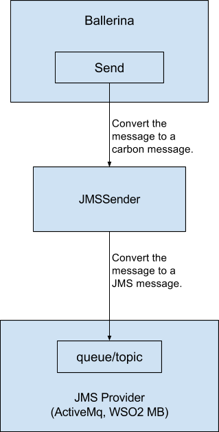

#JMS Client Connector
The JMS client connector can be used to send/publish JMS messages to a JMS broker. Given below is a diagram that represents a high-level view of the connector.



## Defining a JMS service

### Step 1
Create a Ballerina resource or a function and import the `ballerina.net.jms` package.

### Step 2
Initialize a JMS connector instance by passing the following parameters. This can be done inside either a Ballerina function or a Ballerina resource.

### Expected values

Parameter Name | Parameter Type | Description | Expected Values
---------- | ------------- | ----- | --------
FactoryInitial | string | The JNDI initial context factory class. The class must implement the `java.naming.spi.InitialContextFactory` interface. | A valid class name depending on the JMS provider
ProviderURL | string | The URL/file path of the JNDI provider. | A valid URL/path for the JNDI provider

Example:

```
jms:ClientConnector jmsConnector = create jms:ClientConnector("org.wso2.andes.jndi.PropertiesFileInitialContextFactory", "jndi.properties");
```
### Step 3
Invoke the send action of the JMS client connector and pass the relevant parameters as mentioned below.

Parameter Name | Parameter type | Description | Expected Values
------------ | ------------- | ----------- | -------------
JMSConnector | JMSConnector | A JMSConnector instance | A JMSConnector instance that has been initialized
ConnectionFactoryName | string | The JNDI name of the connection factory | -
DestinationName | string | The JNDI name of the destination | The JNDI name of the destination
DestinationType | string | The type of the destinaiton | The queue or topic. If not given, taken as queue.
MessageType | string | The message type needed to be sent | Message, TextMessage, BytesMessage, ObjectMessage, or MapMessage
Message | message | The message conaining the payload to be sent | A Ballerina message
PropertyMap | map | A map of optional Ballerina properties | A valid Ballerina map

Optional parameters that can be defined in PropertyMap:

Parameter Name | Parameter type | Description | Expected Values
------------- | ------------------- | ---------------- | ---------------
ConnectionUsername | string | A valid connection username to connect to the JMS provider | Valid string username
ConnectionPassword | string | A valid connection password to connect to the JMS provider | Valid string password
MapData | map | Map of data to send in a JMS map message | Map of data to send in a JMS map message, only if message type is MapMessage
ConnectionCacheLevel | int | Caching level required when sending messages | 0 - No caching (default), 1 - Cache Connection, 2 - Cache Session, 3 - Cache Consumer, or 4 - Cache Producer


Example:

```
message queueMessage = {};
map dataMap;
dataMap = {};
messages:setStringPayload(queueMessage, "Hello from ballerina");
jms:JMSConnector.send(jmsEP, "QueueConnectionFactory", "MyQueue", "queue", "TextMessage", queueMessage, dataMap);
```

Given below is a sample Ballerina function depicting the creation of a JMS client connector:

```
jms:JMSConnector jmsEP = create jms:JMSConnector("org.wso2.andes.jndi.PropertiesFileInitialContextFactory", "jndi.properties");
message queueMessage = {};
map dataMap;
dataMap = { "country" : "US", "currency" : "Dollar" , "states" : "50"};
map propertyMap;
propertyMap = { "MapData" : dataMap};
jms:JMSConnector.send(jmsEP, "QueueConnectionFactory", "MyQueue", "queue", "MapMessage", queueMessage, propertyMap);
```
