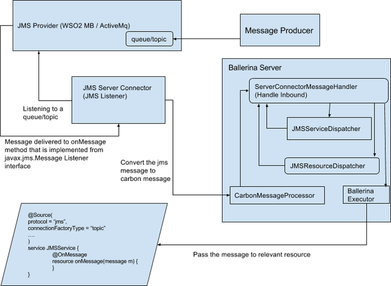

# JMS Server Connector
The JMS Server connector can be used to listen to a topic/queue in a JNDI-based JMS provider. Following is a high-level view on how the JMS Server connector works:



## How to write a JMS service

### Step 1: Create the service
Create a service with unique name.

Example: 
```
service jmsService {
}
```
### Step 2: Specify the topic or queue

Add a service-level annotation named “Source”, and add the key-value pairs to specify the particular topic/queue that you want to listen to. The following table describes each key that can be used with the JMS service.

Key | Description | Required | Expected Values | Default Value
------------ | ------------- | ---------- | ----------- | ----------
protocol | The protocol this particular service belongs to | Yes | jms | -
factoryInitial | The JNDI initial context factory class. The class must implement the java.naming.spi.InitialContextFactory interface. | Yes | A valid class name depending on the JMS provider | -
providerUrl | The URL/ file path of the JNDI provider | Yes | A valid URL/ path for the JNDI provider | -
connectionFactoryJNDIName | The JNDI name of the connection factory | Yes | A valid JNDI name of the connection factory. | -
connectionFactoryType | The type of the connection factory | no | queue, topic | queue
destination | The JNDI name of the destination | no | A valid JNDI name of the destination | service name
sessionAcknowledgement | The JMS session acknowledgment mode | no | AUTO_ACKNOWLEDGE, CLIENT_ACKNOWLEDGE, DUPS_OK_ACKNOWLEDGE, SESSION_TRANSACTED | AUTO_ACKNOWLEDGE
connectionUsername | The JMS connection username | no | - | -
connectionPassword | The JMS connection password | no | - | -
subscriptionDurable | Whether subscription is durable | no | true, false | false (subscription is not durable)
durableSubscriberClientID | The ClientId parameter when using durable subscriptions | Required if subscriptionDurable is specified as "true" | - | -
durableSubscriberName | The name of the durable subscriber | Required if subscriptionDurable is specified as "true" | - | -
retryInterval | The retry interval (in milliseconds) if the JMS connection cannot be established at the beginning or is lost in the middle | no | A valid long value | 10000
maxRetryCount | Maximum retry count if the JMS connection cannot be established at the beginning or is lost in the middle | no | A valid integer value | 5

Example: 

```
@Source (
protocol = "jms",
destination = "ballerina",
connectionFactoryJNDIName = "QpidConnectionFactory",
factoryInitial = "org.wso2.andes.jndi.PropertiesFileInitialContextFactory",
providerUrl = "jndi.properties",
connectionFactoryType = "queue",
sessionAcknowledgement = "CLIENT_ACKNOWLEDGE")
service jmsMBService {
}
```

### Step 3: Add the resource
Add a resource to the JMS service. This is required, because whenever a message comes from the JMS provider to a specific JMS service, it will be delivered to this particular resource. You must have only one resource in a JMS service.

Example:

```
@Source (
protocol = "jms",
destination = "ballerina",
connectionFactoryJNDIName = "QpidConnectionFactory",
factoryInitial = "org.wso2.andes.jndi.PropertiesFileInitialContextFactory",
providerUrl = "jndi.properties",
connectionFactoryType = "queue",
sessionAcknowledgement = "CLIENT_ACKNOWLEDGE")
service jmsService {
    resource onMessage (message m) {
        // ProcessMessage
    }
```

Now you will have a JMS service that can be deployed to the Ballerina server. 

>NOTE: Before deploying the JMS service, you must copy the client-libs provided by the JMS provider to `{Ballerina_HOME}/bre/lib` 

Following is a sample JMS service.

```
import ballerina.net.jms;

@Source (
protocol = "jms",
destination = "ballerina",
connectionFactoryJNDIName = "QpidConnectionFactory",
factoryInitial = "org.wso2.andes.jndi.PropertiesFileInitialContextFactory",
providerUrl = "jndi.properties",
connectionFactoryType = "queue",
sessionAcknowledgement = "CLIENT_ACKNOWLEDGE")
service jmsService {
    resource onMessage (message m) {
        //Process the message
        jms:acknowledge(m, "SUCCESS");
    }
}
```

## Ballerina Native Functions
This section describes the native functions you can use to work with JMS messages.

### Package ballerina.lang.messages

**messages:getHeader**

This function can be used to get the value of the particular JMS header. It accepts the following parameters:    

* Relevant message to get the header from
* Header name

Example:
 
```
import ballerina.lang.messages
---
string jmsMessageId;
jmsMessageId = messages:getHeader(m, "JMS_MESSAGE_ID");
```

**messages:getStringPayload**

This function can be used to get the string payload of the JMS text message or bytes message. This function accepts the relevant Ballerina message as the parameter. It will return the string payload of the relevant message.

Example:
```
import ballerina.lang.messages
---
string stringPayload;
stringPayload = messages:getStringPayload(m);
```

**messages:getStringValue**

This function can be used to get the string value of a specific map key in a map type message. This function accepts the following:

* Relevant Ballerina message to get the string value from
* Relevant map key value

Example: 

```
import ballerina.lang.messages
---
string stringValue;
stringValue = messages:getStringValue(m, “count”);
```

### Package ballerina.net.jms

**jms:getMessageType**

This function can be used get the JMS message type of the relevant message. This function accepts the relevant message as the argument. Return values will be “TextMessage”, “BytesMessage”, “MapMessage” or “ObjectMessage”.

Example:

```
import ballerina.net.jms
---

string messageType;
messageType = jms:getMessageType(m);
```

**jms:acknowledge**

This function can be used to acknowledge the message delivery or success, which is particularly useful when using the client acknowledgement mode. This function accepts the following parameters:

* Ballerina message that needs to be acknowledged 
* Message delivery status - “SUCCESS” or  “ERROR”

Example:

```
import ballerina.net.jms
---
jms:acknowledge(m, "SUCCESS");
```

**jms:commit**

This function can be used to commit the JMS session when using the session acknowledgement mode. This function accepts one parameter: the relevant message that the user wants to acknowledge the session with.

Example: 

```
import ballerina.net.jms
---
jms:commit();
```

**jms:rollback**

This function can be used to commit the messages when using the session acknowledgement mode. This function accepts one parameter: the relevant Ballerina message that the user wants to roll back the session with.

Example:
```
import ballerina.net.jms
---
jms:rollback();
```
