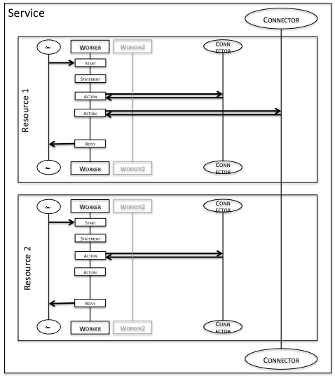
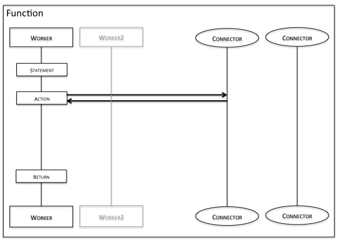

# Concepts

The key concepts of Ballerina are as follows:
- *Service*: A `service` is a collection of network accessible entry points. A service must be bound (via annotations) to a network protocol for it to become exposed over that protocol. Several of these are included in the standard library.
- *Resource*: A `resource` is a single network accessible entry point within a service.
- *Connector*: A `connector` represents a network service that is used by a program. Ballerina comes with a set of built-in connectors for several protocols and other network services as part of the standard library.
- *Action*: An `action` is an operation one can execute against a connector, i.e., a single interaction with a network service.
- *Worker*: A `worker` is a thread of execution that can be programmed independently.
- *Function*: A `function` is an sequential block of code that is executed by a worker. A function named `main` that takes an array of strings and (optionally) returns int is the entry point for command line execution of a Ballerina program.

The following figure shows the graphical representation of services, resources, connectors and actions:

This example shows a service with 2 resources. Each of these resources has a default worker (the thread of execution that is handed to the resource when it is invoked) and a few connectors it is interacting with. Within the worker there are some sample statements being executed sequentially as well as a few sample actions that are interacting with the connectors. There may also be any number of other workers. The client line is a representation of the invoker of the resource.

The following figure shows the graphical representation of a function:

Thus functions are very similar to resources - except they are invoked from either other functions or from a resource instead of over the network. The default worker in the function (the first one graphically) runs in the calling worker's thread; that is, the caller is blocked until the function returns.
