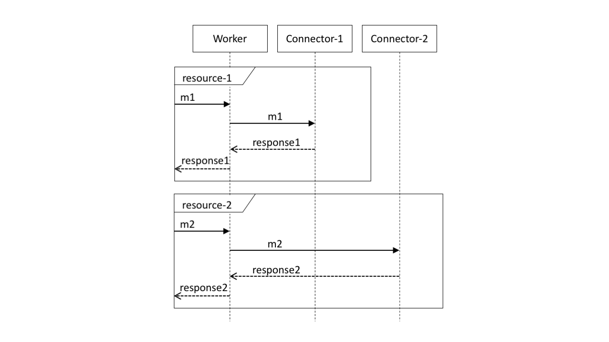

# Services & Resources

A `service` is defined as follows:
```
[ServiceAnnotations]
service ServiceName {
    ConnectorDeclaration;*
    VariableDeclaration;*
    ResourceDefinition;+
}
```
Services are singletons. As such all variables defined within a service scope are shared across all `resource` invocations.

Services may have the following annotations:
- TBD - someone will go thru the Swagger spec and propose a detailed list of annotations to be included at each level.

The structure of a `ResourceDefinition` used to define a `resource` is as follows:
```
[ResourceAnnotations]
resource ResourceName (Message VariableName[, ([ResourceParamAnnotations] TypeName VariableName)+]) {
    ConnectorDeclaration;*
    VariableDeclaration;*
    WorkerDeclaration;*
    Statement;+
}*
```

The visual representation of this (without the annotations) in a sequence diagram is as follows:



m1 and m2 are messages that are passed by a client as input to the resource named resource-1 and resource-2, respectively. resource-1 will produce the message response1 as a result, and resource-2 will produce response2. To compute the response message, resource-1 relays message m1 to connector Connector-1 and will receive response1; similarly, resource-2 relays message m2 to connector Connector-2 and will receive response2.
