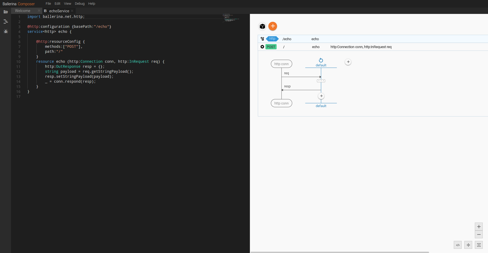
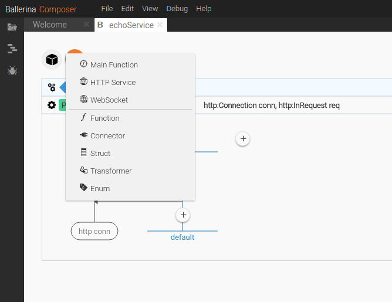
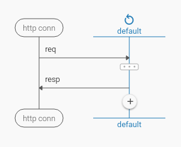
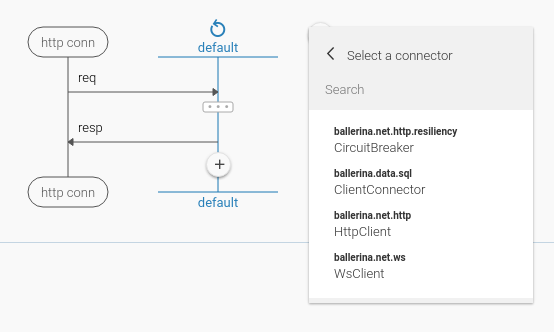
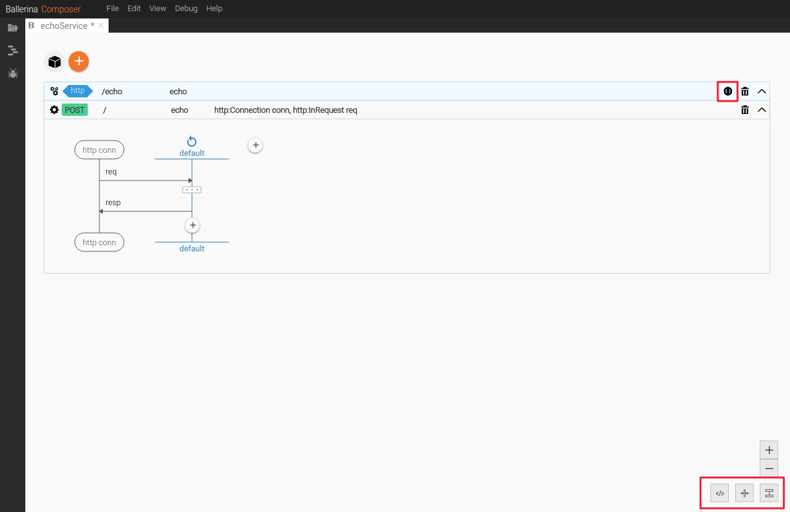
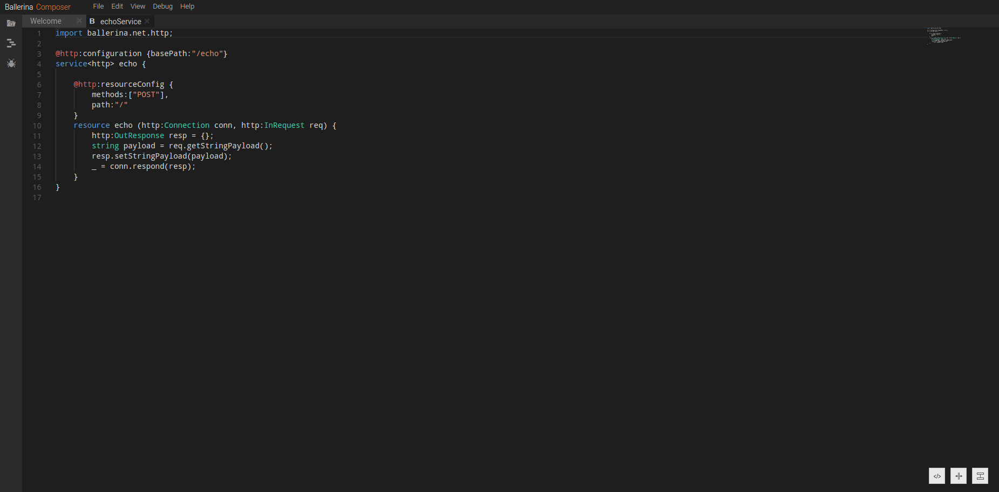
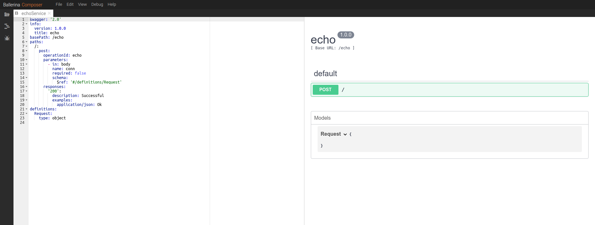
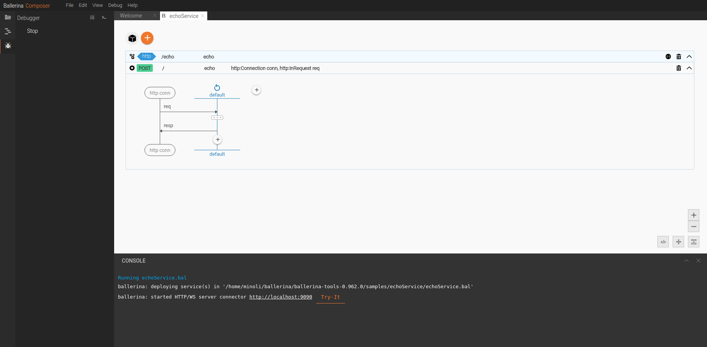

# Tools, IDEs and the Ballerina Composer

Ballerina provides several tools to help you create, document, and test your code. These tools can be various editors, IDEs, and a graphical visualization tool for your code called the Ballerina Composer.

These tools include the following.

- [IDE plug-ins](#ide-plug-ins)
- [Swagger to Ballerina code generator](#swagger-to-ballerina-code-generator)
- [API documentation generator](#api-documentation-generator)
- [Test framework](#test-framework)
- [Flexible composer](#flexible-composer)

## IDE plug-ins

You can use plug-ins to write Ballerina code in your favorite IDE. There are several plug-ins available in Github. Click one of the following links to learn how to use that IDE's plug-in. 

* [Atom](https://github.com/ballerinalang/plugin-atom)
* [IntelliJ IDEA](https://github.com/ballerinalang/plugin-intellij)
* [Sublime Text 3](https://github.com/ballerinalang/plugin-sublimetext3)
* [Vim](https://github.com/ballerinalang/plugin-vim)
* [Visual Studio Code (VS Code)](https://github.com/ballerinalang/plugin-vscode)

## Swagger to Ballerina code generator

You can use existing Swagger files to generate connectors and services in Ballerina code. For details, see the [Swagger to Ballerina Code Generator](https://github.com/ballerinalang/tool-swagger-ballerina/tree/master/modules/swagger-ballerina-generator).

## API documentation generator

As you develop new connectors, actions, and functions that you want to share with others, it's important to add API documentation that describes each entity and how it's used. Ballerina provides a framework called **Docerina** that generates API documentation from your annotations in your Ballerina files. You can check it out at https://github.com/ballerinalang/docerina. 

## Test framework

When you write your code in Ballerina Composer, the syntax is checked for you as you write it, and you can use the Debug button to step through your program. You can also manually test a Ballerina file using the following command:

```
./ballerina test <package_name>
```

Ballerina provides a testing framework called **Testerina** that you can use for your programs. You can check it out at https://github.com/ballerinalang/testerina. 

## Flexible composer

The Ballerina Composer provides a flexible and powerful browser-based tool for creating and viewing your Ballerina programs. This is a revolutionary way of doing programming for integration due to its use of sequence diagrams, enabling you to architecturally view your code while designing your solution. The Ballerina Composer sets Ballerina apart from other integration paradigms due to its unique visual representation.

You can build your integrations by writing code and viewing the corresponding sequence diagrams using the Ballerina Composer. You can add elements from a tool palette onto a canvas. As you build the diagrams, the underlying code is written for you, which you can work with in the Source view. You can also use the Swagger view to define services by writing Swagger definitions. You can switch seamlessly between the Design view, Source view, and Swagger view and create your programs in the way that you like to work.

The Ballerina Composer provides three ways to create your integrations:

* Write Ballerina code in the Source view
* Draw sequence diagrams in the Design view

As you work in one view, the diagrams and code are updated in the other views, allowing you to switch between them seamlessly as needed. 

### Run the Composer

1. At the command prompt, type `composer`.

1. Access the Composer from the following URL in your browser: http://localhost:9091

    The welcome page of Ballerina Composer appears. 
    
    
    
Let's open a sample and take a look around. 

### Explore the Ballerina Composer

Once you have accessed the composer, you can have a look around using the available samples in the welcome page of the Ballerina Composer.

1. Click **Echo Service**.

    The Echo Service program displays in the Composer.
    
    

    Notice that on the top you have an add button containing the various constructs that you'll use to build your integration. When you select a construct it is drawn in the canvas. This is where you build your sequence diagrams that define your integration logic. These constructs are called `definitions`.
        
    
    
    Some constructs have a **life line** of execution where you program the statements to be executed. This defines the flow of execution. The life line is represented by a vertical line in the default program or any other construct of the **echoService**. The plus icon that can be seen on the lifeline enables you to add `statements`.
    
    
    
    There are packages called **Connectors** and **Libraries** that are available to be used by your Ballerina program. By default, the Composer imports few commonly used packages to this section. If you add an import to a different package, it is added to this section. Click on the plus icon on the right of the diagram and select Endpoint to see the list of connectors.
    
    

    Notice the **Source View** button and the **Split View** button in the lower right corner. Also note the **Swagger Source** button associated with the service.
    
    
   
2. Click **Source View**. 

    

    You'll see the source code editor that represents the sequence diagram as code in the Ballerina language. You can go back and forth between the visual editor and the source code and make your edits in either place. This can be done by clicking **Design View** in the lower right corner.

3. Click **Swagger View**. 

    

    If your Ballerina program contains services and resources, you can view the generated Swagger definition for your program by switching to the Swagger view. This editor allows you to write Swagger definitions to create services. All the changes made on the Swagger definition will reflect on the Ballerina program when you switch back to Source or Design view.

4. Click **Design View** to return to the visual editor. If you happen to write the source code completely in the source view, when you switch to Design view, the Visual representation is created.

5. You can run your program from the Composer itself. Click the **Run** button on the left of the Composer and choose whether you want to run your program as an **Application** or a **Service**. You can stop the application by clicking **Stop Application**.

    

6. Click the "x" to the right of "echoService.bal" in the tab title to close this sample, and click **Don't Save** when prompted.
