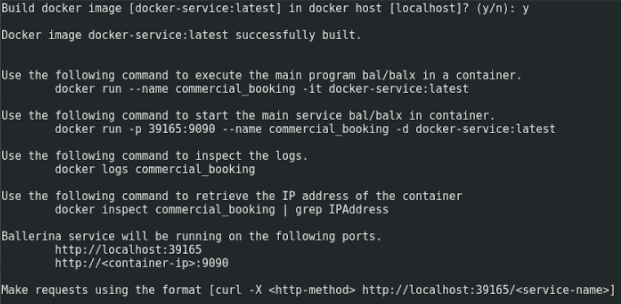

# Create a Docker Image with a Ballerina Program

Businesses and enterprises worldwide are now faced with the challenge of digital transformation. However, digital transformation has to be implemented under certain restrictions related to existing applications and infrastructure. Docker plays a key role in digital transformation by creating independance between applications and infrastructure and enabling them all to collaborate easily. A Docker container is a stand-alone piece of software that comes in a lightweight, runnable, executable package.

> This tutorial explores the methods used to create a docker container that has a Ballerina service embedded within. Ballerina supports dockerizing out-of-the-box.

This tutorial includes instructions of creating a Docker image using the following methods.

- [Create your own Docker image](create-your-own-docker-image)
- [Adding your services to an existing Docker container](adding-your-services-to-an-existing-docker-container)

> **Prerequisites**: You need to have Docker configured and running. Some expertise with cURL commands will also be useful. For more information on starting up and the Ballerina Composer, see [Quick Tour](../quick-tour.md).

## Create your own Docker image

1. First download the Ballerina tools distribution. The latest Ballerina pack can be found at: https://ballerinalang.org/downloads/
1. Extract the downloaded .zip file, set up the Ballerina runtime, and run Ballerina. For more information on how to do this, see [Quick Tour](../quick-tour.md).
1. Create a Ballerina service to be added to the Docker container. Create the following service in the Ballerina Composer **Source View** (you can alternatively create a main function). Name the file: `docker-service.bal`.
    ```Ballerina
    import ballerina.net.http;

    @http:configuration {basePath:"/echo"}
    service<http> echo {

        @http:resourceConfig {
            methods:["POST"],
            path:"/"
        }
        resource echo (http:Request req, http:Response resp) {
            string payload = req.getStringPayload();
            resp.setStringPayload(payload);
            resp.send();
        }
    }
    ```
1. Create the Docker image using the following command.
    ```
    ballerina docker docker-service.bal
    ```
    If the above command succeeds you can see something similar to the following.
    
1. To verify image creation, execute the following command, which lists all the images in local docker registry.
    ```
    docker images
    ```
1. Start the container with the following command.
    ```
    docker run -p 39165:9090 --name docker-sample -d docker-service:latest	
    ```
1. The service should be up and running. You can verify this by listing all the docker processes.
    ```
    docker ps
    ```
1. Invoke the service with following command.
    ```
    curl -X POST http://localhost:39165/echo -d 'This is a sample message'
    ```
    If everything is successful, you can see the echoed response from the Ballerina server.

## Adding your services to an existing Docker container

The Docker distribution for Ballerina is available on Docker Hub as ballerinalang/ballerina. To run a Ballerina package using the Ballerina Docker image, simply mount the folder containing the file to /ballerina/files folder inside the container. The following steps have instructions on how you can do this.

1. Pull the ballerina docker image using the following command.
	  ```
    docker pull ballerinalang/ballerina
    ```
1. Create a directory and copy the packages needed to be run.
 	  ```
    mkdir -p ~/ballerina/service/
    ```
1. Add the following service to ~/ballerina/service
    ```Ballerina
    import ballerina.net.http;

    @http:configuration {basePath:"/echo"}
    service<http> echo {

        @http:resourceConfig {
            methods:["POST"],
            path:"/"
        }
        resource echo (http:Request req, http:Response resp) {
            string payload = req.getStringPayload();
            resp.setStringPayload(payload);
            resp.send();
        }
    }
    ```	
1. Mount the volume and start the Docker container.
    ```
    docker run -v ~/ballerina/service:/ballerina/files -p 9090:9090 -it ballerinalang/ballerina:0.95.0
    ```
1. Now invoke the service with following cURL command.
    ```
    curl -X POST http://localhost:9090/echo -d 'This is a sample message'
    ```
    If everything is successful, you can see the echoed response from the Ballerina server

