# Write a Main Program

Now that you have [written your first program](first-program.md), you can write some more programs to do various integration-related tasks. 

> This tutorial provides instructions on how to write a main program. This involves a simple integration scenario where you can call a public weather forecast API and do some customization to the data obtained. The weather forecast API provides the weather forecast for the next five days and provides new records every three hours. Using this data, you will learn how to use Ballerina to find the average temperature and convert the result from Kelvin to Celsius.

This tutorial consists of the following main sections.

- [Create a new main program](#create-a-new-main-program)
- [Add a connector](#add-a-connector)
- [Call the connector](#call-the-connector)
- [View the response](#view-the-response)
- [Extract content from JSON](#extract-content-from-json)
- [Calculate average temperature](#calculate-average-temperature)
- [Convert Kelvin to Celcius](#convert-kelvin-to-celcius)
- [Call the function and print the result](#call-the-function-and-print-the-result)
- [Get information from the weather forecast API](#get-information-from-the-weather-forecast-api)
- [Whats Next](#whats-next)

> **Prerequisites**: Download Ballerina and set it up. For instructions on how to do this, see the [Quick Tour](../quick-tour.md). For more information on the weather forecast API, see [Get information from the weather forecast API](#get-information-from-the-weather-forecast-api).

## Create a new main program

There are main programs and services, but this tutorial focuses on main programs only. A service normally continues to run and can be invoked by a REST API when required. A main program, on the other hand, will just run once. Main programs can be executed just like a Java main program. 

It is time to create a main program to solve your integration problem.

1. If the Composer is not already running, run it as described in the [Quick Tour](../quick-tour.md).
1. On the Welcome page, click **File** and select **New** from the dropdown list.
1. On the tool palette that you see on the left of the Composer, click the **Main Function** icon and drag it to the canvas.


## Add a connector

Now that you have added a main program, you need a connector to connect to the external weather API. The connector ideal for this is the **HTTP Client Connector** since you are invoking an HTTP endpoint.

Connectors represents network services that are used by a Ballerina program. The term "network services" here is meant in the broadest possible sense - Ballerina is designed to connect with everything from a database to a JMS queue to an OAuth protected API to LDAP servers and more. Thus connectors are the representation of any such remote service in Ballerina.

Graphically, connectors are modeled as a separate lifeline to represent its independent and parallel execution. However, that lifeline is not a programmable thread of execution for the Ballerina developer - it only exists to represent the remote system.

Connectors may need to have usage specific parameters and hence must be instantiated prior to use. For example, an HTTP connector will need the URL to connect to in the minimum.

1. On the tool palette, click **More Connectors** to see a list of all available connectors.
1. From the list that appears, expand **ballerina.net.http** and drag the **Endpoint** of the connector onto the canvas.
    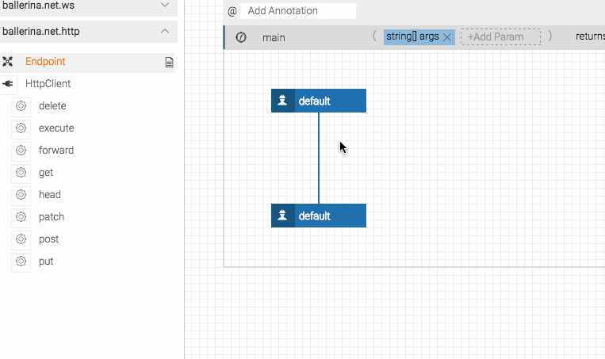
1. Add the endpoint URL (http://api.openweathermap.org/data/2.5/forecast?appid=f6f43202ba90c14ab13479aa2a2beefb&q=Washington,US). For more information on how to get this URL and call it to get the JSON content, see [Get information from the weather forecast API](#get-information-from-the-weather-forecast-api).
    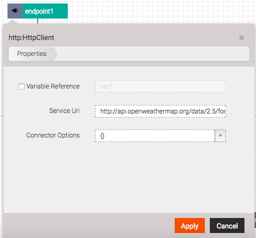
1. You can also change the name of the endpoint to something suitable. 
    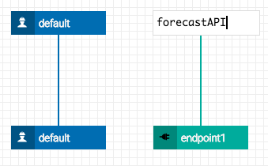

## Call the connector

When you add a connector, you need to have a way of calling a connector and those are called actions.

A connector comes with a set of actions that represent the interactions that one can have with the remote service. Actions can be one directional or bi-directional and represent blocking from the calling worker's perspective. That is, the calling thread is blocked until the action has completed its remote interaction.

In the case of the **HTTPClient** connector you are using in this tutorial, the actions are listed out under the connector in the tool palette.

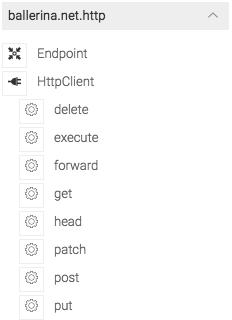

1. Add an action by dragging one of the actions from the tool palette onto the canvas. In this instance, you need to add a GET action as this is a GET request to the weather forecast API. Drag and drop the GET action under the main program you added.
    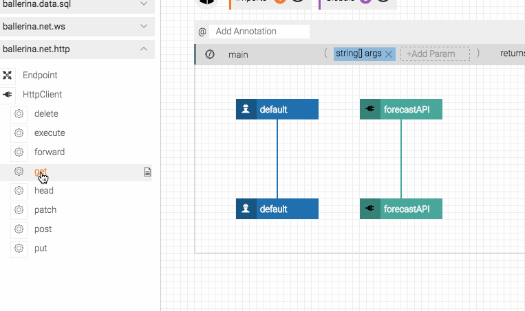    
   This calls the connector from the main program and can be visualized via an arrow to the connector from the action.
1. You also need to pass a message to the connector from the main program. To do this, you must first add a variable.

    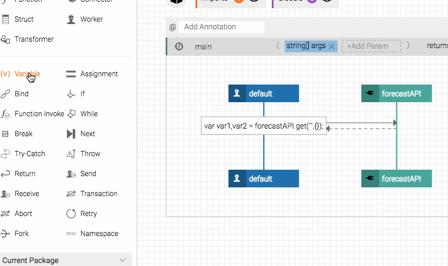
1. Define a message in the variable you just added. Curly brackets **{}** are used to denote an empty message. The default message is defined as the letter **m**.

    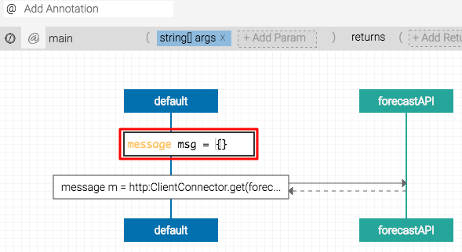
    
    The `message` type is an opaque type used to represent a request to a `resource`. This approach allows the `resource` to be network-protocol independent, even though a given `resource` is always tied to a particular protocol because a `service` can only be bound to one network protocol at a time.

1. The GET request action for the HTTP connector requires you to pass some parameters in the request. This includes the connector, the request path, and the message. In this tutorial, forecastAPI is the name of the connector that is passed. The request path is an additional string that can be passed in the request. You can set this up so that the request path includes the API key and country code. This will be portrayed in a different tutorial. In this instance, an empty string is passed **""**. Additionally, you can pass the message **m**.
    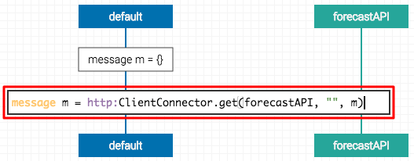

## View the response

Prior to doing further changes, you can view the output to see if the call to the API works.

1. You can print the message to see the output of what you have set up. To do this, you need to find a print function. You can use the search at the top of the tool palette for this, or you can click **More Libraries** and find it under the **ballerina.lang.system** library.

    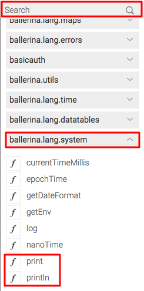
1. Drag and drop the print function onto the main program and print message **m**.
    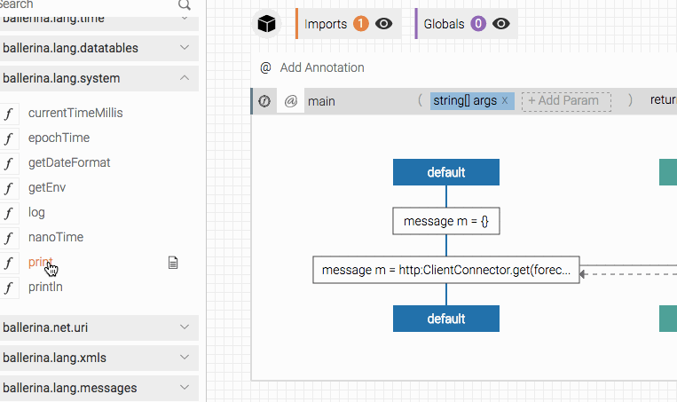
1. Save your file by clicking **File** and **Save As**. Provide an appropriate name for you **.bal** file.
1. Click the **Run** button and click **Application** to run this file. You can see the output in the console of the Ballerina Composer.

The output contains a JSON payload. This tutorial aims to access the JSON payload and extract the contents under **list**. This enables you to obtain the temperature forecast in Kelvin for the next five days. For more information, see [Call the API using the URL](#call-the-api-using-the-url).

Once you have viewed this, you can remove the `print` function by hovering over it and clicking the trash can icon.

## Extract content from JSON

The next step is to obtain the JSON payload content. 

JSON is a textual format for representing a collection of values: a simple value (string, number, “true”, “false”, “null”), an array of values or an object. Ballerina also understands the JSON Schema and allows one to declare that a JSON document must conform to a particular schema.

Ballerina has a variable type named “json” that can represent any JSON value. Thus it is a built-in union type in Ballerina whose value can be any one of a string, a float, a boolean, an array of any or a map of any. We provide utility functions to read a JSON document to create a JSON typed value. The lexical representation of a value of that type is JSON, thus simply printing a JSON typed variable results in a JSON string.

JSON variables are declared in the following way:

```
json VariableName;
```

This is a variable that may hold any JSON document.

1. Use the search, or navigate to a function called **getJsonPayload**, which is in the **ballerina.lang.messages** library. This library contains functions that enable you to modify and use messages in various ways.
1. Drag and drop this onto the main program in the canvas. This automatically applies this function on message **m** since that is the default message.
    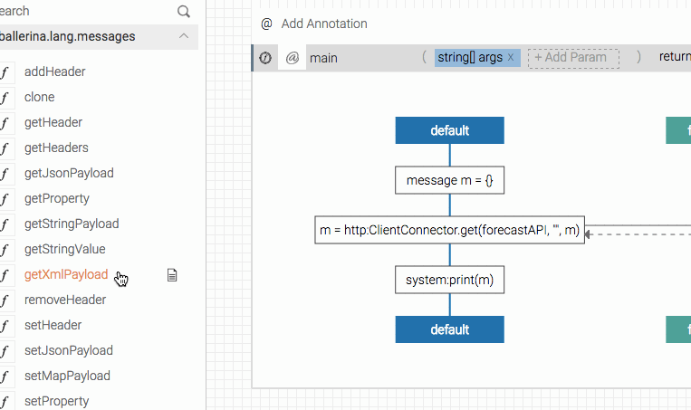
1. Modify the name of the JSON function you added to something meaningful.
    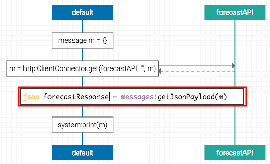
1. To get the data under list, you need to add a variable from the tool palette to the main function in the canvas.
    
1. Modify the variable so that you can get the data under list. In this example, **.list** is a JSON path. 
    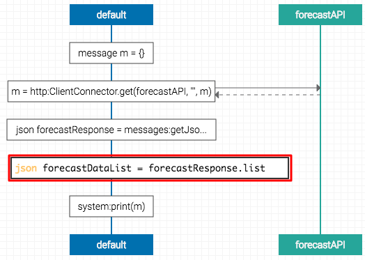
    > The dot notation (**.**) enables you to invoke any of the attributes available in the JSON. These JSON paths can be used to access the contents of an attribute. For example, if `json j = {a:"hello"}` you can access `hello` using `j.a`. When considering the example used in this tutorial, if `json j = {list:[1,2,3]}` you can access the list using `j.list`. This is done because all the content that you need resides within the list attribute in the JSON file.

## Calculate average temperature

Now that you have extracted the content from the JSON, Ballerina needs to do the calculations. This involves using a conditional statement like `while`.

A `while` statement provides a way to execute a series of statements as long as a Boolean expression is met. In the Composer, you can drag the **While** icon from the tool palette to the canvas to add the statement to your program. 

A `while` statement is defined as follows:

```
while (BooleanExpression) {
    Statement;+
}
```

1. Add a `variable` and define an integer that gets the number of instances of the data. Set this as `int dataCount = jsons:getInt(forcastDataList,"$.length()")`. The weather API lists multiple instances of the temperature and this variable ensures that you find the number of instances of the temperature in the data sets and assigns it to `dataCount`.

    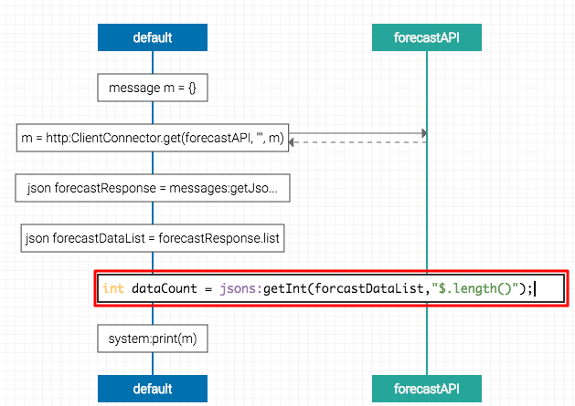
    > You use a **.length** JSON path here to access an inbuilt function of the JSON. In this case, length is an inbuilt function of JSON.
    
1. Add another `variable` called `int i = 0` by dragging a variable from the tool palette to the canvas. You can use this integer to get the exact number of instances of the data you need to do the calculation.
1. Drag and drop a `while` statement from the tool palette to the canvas.
    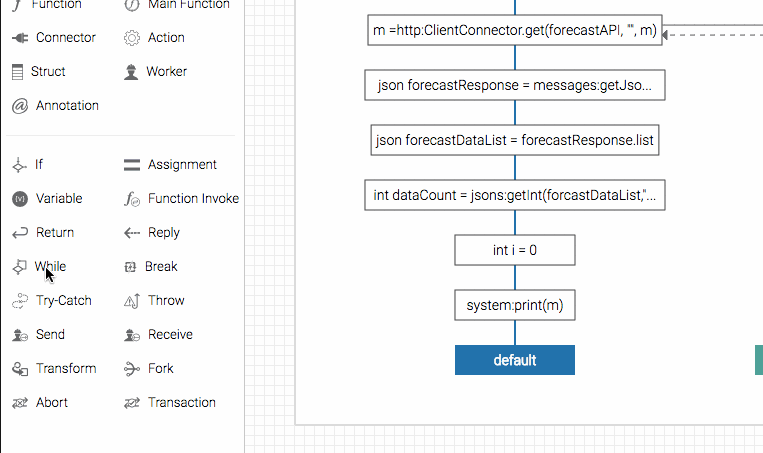
1. Set the `while` condition to `i < dataCount` to make this condition loop until it reaches the `dataCount` value.

    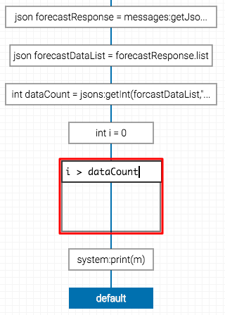
1. Add an `assignment` to the `while` loop by dragging it from the tool palette to the canvas.
    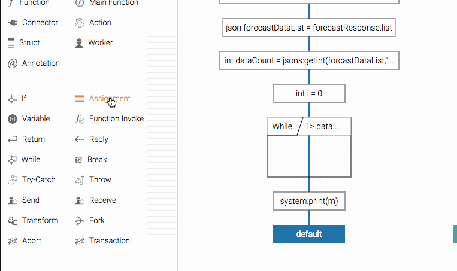
1. Specify the assignment value as `i = i + 1`. This increments `i` until it is equal to the `dataCount`. So if there are 5 data sets, `i` will be 5 when it comes out of the `while` loop.

    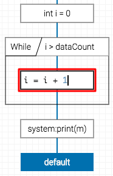
1. Add a `variable` and declare it as a `float`. A `float` supports 64-bit IEEE754 arithmetic. The sum of all the temperatures can be assigned to this value type.

    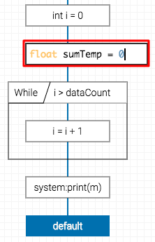
1. Add another `variable` and declare the value calculated as a `float`. This must be inside the `while` condition. This is used to calculate the temperature for each data set. In this case, `forecastDataList[i].main.temp` is basically used to get the temperature from the JSON for each data set. This is then assigned to the `float` using the `<float>` statement. The whole thing is assigned to the variable `temp`.

    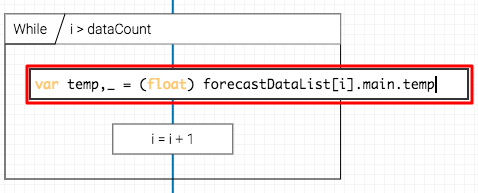
1. Add another assignment to add each temperature value the `sumTemp` float that was declared earlier.
    
1. Add an assignment to calculate the average temperature. This is done by dividing the sum of all the temperatures by the number of temperatures or the `dataCount`.
    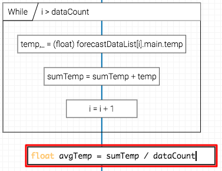

## Convert Kelvin to Celcius

The next aspect of this tutorial is to convert the average temperature from Kelvin to Celcius.

1. Add a `function` by dragging it from the tool palette to the canvas. A function is a single operation that is intended to be a unit of reusable functionality. You can define additional functions within your Ballerina programs. All library functions are found in `ballerina.*` packages under the `src` directory in your Ballerina distribution. If the function is in another package and is marked public, you can import that package using the Imports box in the upper left corner of the canvas, and then drag the Function Invocation icon to the canvas. All functions are private to the package unless explicitly declared to be public with the `public` keyword. You can invoke functions from a resource or a function within the same package without importing.
    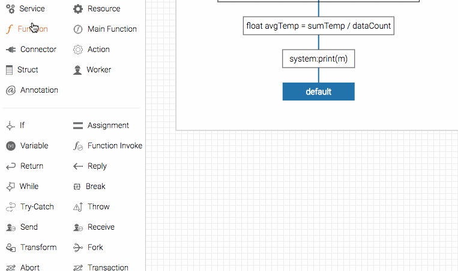
1. Provide a name for the `function` and also add a parameter called `float KelvinTemp` that returns a `float` value. 
    
1. Add a `return` statement by dragging it from the tool palette to the canvas. The `return` statement evaluates the expression, stops the current function, and returns the result of the expression to the caller.
    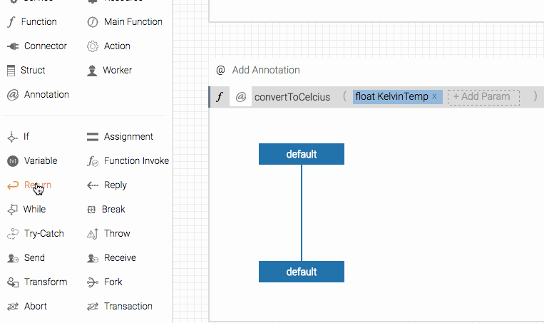
1. In the `return` statement, do the calculation to convert Kelvin to Celcius by subtracting 273.15 from the Kelvin temperature.

    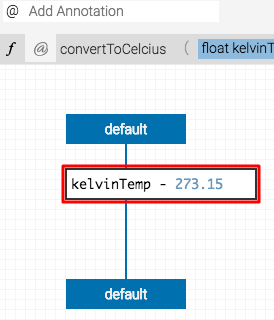

## Call the function and print the result

Once the function is added, it is available on the tool palette and can be dragged onto the canvas when you need to call it.

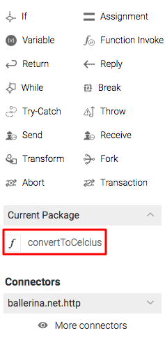

1. Drag the function you created onto the canvas, assign a float value, and apply the function on the average Celcius temperature.

    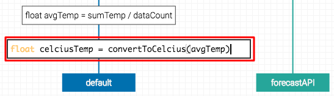
1. Drag two `println` functions to the canvas and assign `avgTemp` to one to display the average temperature in Kelvin and assign `celciusTemp` to the other to display the average temperature in Celcius.
    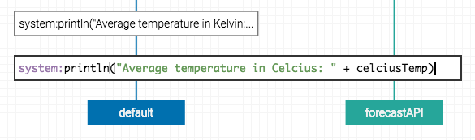
1. Run the main program as an application. You will see the following output in the console.
    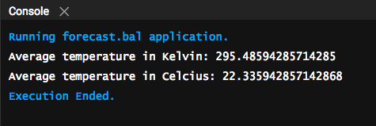

## Get information from the weather forecast API

In order to get this tutorial to work, you need to obtain some information from the public API for use in Ballerina. This section showcases how to get the URL and how to call it.

### Get the API key

You can access the weather forecast API and obtain the API key from it using the following steps. The key is used as part of the URL that is called by Ballerina.

1. Go to https://openweathermap.org/ and click **Sign Up** to register your account.
1. Once you have signed up for an account, log in using your credentials.
1. In the home page that appears, click **API keys**. You can copy the **Key** that is already generated for you.

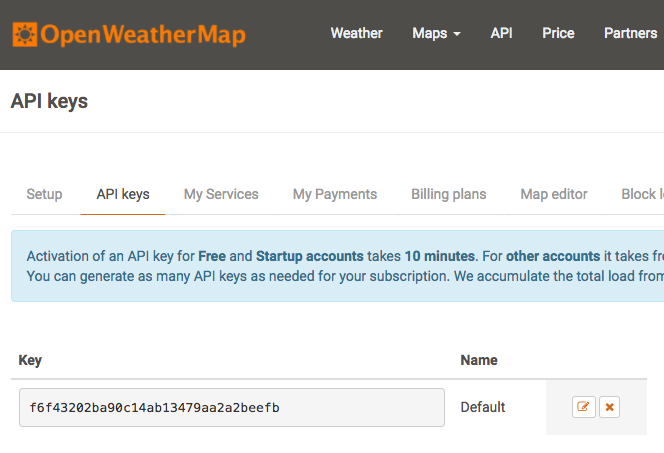

### Identify the country code

The weather forecast API can be done for any country. Washington (USA) is used in our example. You need to identify the exact code to use to pass this parameter in the URL.

1. Click **API** in the top level menu and click the **API doc** button under **5 day / 3 hour forecast**.
    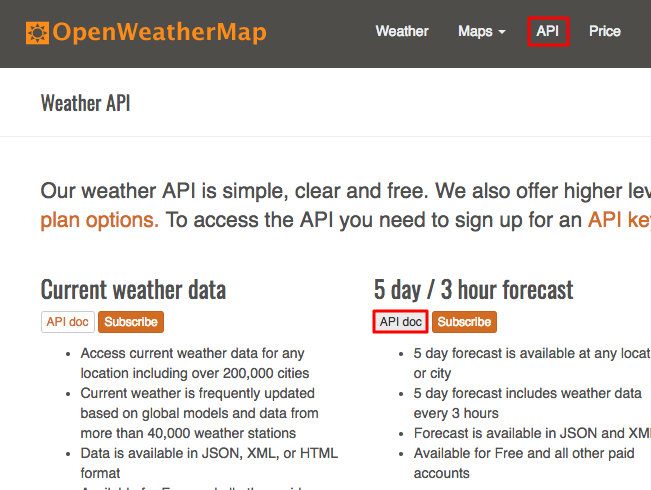
1. The page that appears provides details about the API and provides sample calls for different types of requirements. Under the **By city ID** section, you can access a JSON file from http://bulk.openweathermap.org/sample/. This includes all the country codes available.
    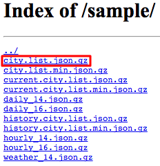

### Call the API using the URL

Now that you have got the API key and the country code, you can identify the URL that you need to call from Ballerina. The URL is something similar to the following: http://api.openweathermap.org/data/2.5/forecast?appid=f6f43202ba90c14ab13479aa2a2beefb&q=Washington,US.

> Here the `appid` is the API key and the country code is `Washington,US`.

Use a tool that can interact with HTTP APIs. In this instance we use Postman, which is a Google Chrome app. Paste the URL above in the **Enter request URL** text box and change the request type to **GET**. In the JSON response you can see the **list** part of the response contans the temperature (**temp**) in Kelvin.

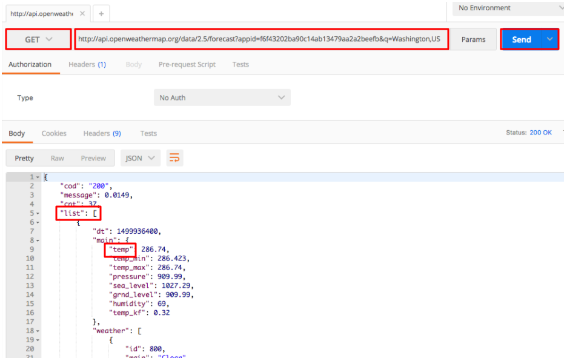

## Whats Next

Now that you have learnt how to write a main program, it is time to learn how to [work with services](passthrough-service.md).
