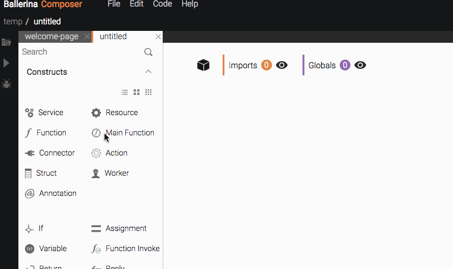
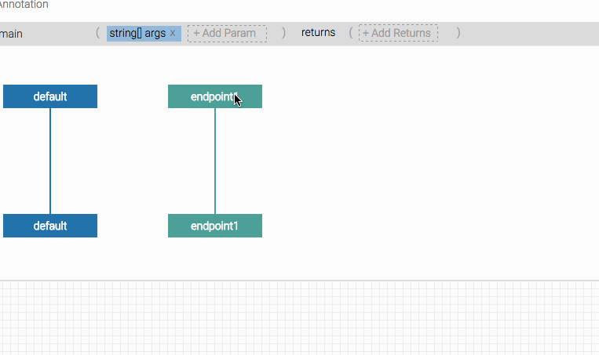

# Write a Main Program

Now that you have [written your first program](../first-program.md), you can write some more programs to do various integration-related tasks. 

> This tutorial provides instructions on how to write a main program. This involves a simple integration scenario where you can call a public weather forecast API and do some customization to the data obtained. The weather forecast API provides the weather forecast for the next five days and provides new records every three hours. Using this data, you will learn how to use Ballerina to find the average temperature and convert the result from kelvin to celsius.

> **Prerequisites**: Download Ballerina and set it up. For instructions on how to do this, see the [Quick Tour](../quick-tour.md).

## Get information from the weather forecast API

In order to get this tutorial to work, you need to obtain some information from the public API for use in Ballerina.

### Get the API key

You can access the weather forecast API and obtain the API key from it using the following steps. The key is used as part of the URL that is called by Ballerina.

1. Go to https://openweathermap.org/ and click **Sign Up** to register your account.
1. Once you have signed up for an account, log in using your credentials.
1. In the home page that appears, click **API keys**. You can copy the **Key** that is already generated for you.

### Identify the country code

The weather forecast API can be done for any country. Washington (USA) is used in our example. You need to identify the exact code to use to pass this parameter in the URL.

1. Click **API** in the top level menu and click the **API doc** button under **5 day / 3 hour forecast**.
    
1. The page that appears provides details about the API and provides sample calls for different types of requirements. Under the **By city ID** section, you can access a JSON file from http://bulk.openweathermap.org/sample/. This includes all the country codes available.
    

### The URL to call

Now that you have got the API key and the country code, you can identify the URL that you need to call from Ballerina. The URL is something similar to the following: http://api.openweathermap.org/data/2.5/forecast?appid=f6f43202ba90c14ab13479aa2a2beefb&q=Washington,US.

Here the `appid` is the API key and the country code is `Washington,US`.

## Set up Ballerina for integration

Now it's time to set things up in Ballerina.

### Create a new main program

There are main programs and services, but this tutorial focuses on main programs only. A service normally continues to run and can be invoked by a REST API when required. A main program, on the other hand, will just run once. Main programs can be executed just like a Java main program. 

It is time to create a main program to solve your integration problem.

1. If the Composer is not already running, run it as described in the [Quick Tour](../quick-tour.md).
1. On the Welcome page, click **File** and select **New** from the dropdown list.
1. On the tool palette that you see on the left of the Composer, click the **Main Function** icon and drag it to the canvas.

### Add a connector

Now that you have added a main program, you need a connector to connect to the external weather API. The connector ideal for this is the **HTTP Client Connector** since you are invoking an HTTP endpoint.

Connectors represents network services that are used by a Ballerina program. The term "network services" here is meant in the broadest possible sense - Ballerina is designed to connect with everything from a database to a JMS queue to an OAuth protected API to LDAP servers and more. Thus connectors are the representation of any such remote service in Ballerina.

Graphically, connectors are modeled as a separate lifeline to represent its independent and parallel execution. However, that lifeline is not a programmable thread of execution for the Ballerina developer - it only exists to represent the remote system.

Connectors may need to have usage specific parameters and hence must be instantiated prior to use. For example, an HTTP connector will need the URL to connect to in the minimum.

1. On the tool palette, click **More Connectors** to see a list of all available connectors.
    
1. From the list that appears, expand **ballerina.net.http** and drag a **ClientConnector** onto the canvas.
    
1. Add the endpoint URL (http://api.openweathermap.org/data/2.5/forecast?appid=f6f43202ba90c14ab13479aa2a2beefb&q=Washington,US) as the connector endpoint.
    
