# Write a Passthrough Service

Now that you have [written a main program](../tutorials/main-program.md) for an integration scenario, it is time to work with services.

> This tutorial provides instructions on how to write a REST service that uses the Google Books API to get books about a given topic. This scenario is demonstrated by querying books on WSO2.

This tutorial consists of the following main sections.

- [About service URLs](about-service-urls)
- [Add a service](add-a-service)
- [Add integration logic to your service](add-integration-logic-to-your-service)
- [View the OpenAPI definition for your service](view-the-swagger-definition-for-your-service)
- [Add a client connector](add-a-client-connector)
- [Call the client connector](call-the-client-connector)
- [Extract content from the JSON](extract-content-from-the-json)

> **Prerequisites**: Download Ballerina and set it up. For instructions on how to do this, see the [Quick Tour](../quick-tour.md). it is also recommended to try to [write a main program](../tutorials/main-program.md) as some concepts are explored in detail in that tutorial. It may also be useful to read and understand the section [about service URLs](about-service-urls).

When defining a Ballerina program as a service instead of an executable program, the `service` construct acts as the top-level container that holds all the integration logic and can interact with the rest of the world. Its base path is the context part of the URL that clients use when sending requests to the service. You create one service per Ballerina program file.

A service is a container of `resources`, each of which defines the logic for handling one type of request. Services are singletons, so all variables defined within a service scope are shared across all resource invocations. A service can have state for as long as it's active.

## About service URLs

In this tutorial, the service and the resource are also represented by the URL that you are calling. For example, the basepath for a resource can be as follows: 

> http://localhost:9090/

The following is the URL for the `books` service:

> http://localhost:9090/books

If you are accessing a different service, like `magazines` for example, you can have magazines instead of books in the above URL.

If you are accessing a resource within this service, like book titles for example, the URL is as follows:

> http://localhost:9090/books/title

This is how resources and services can equate to the URL that you are calling.

In addition to this, there can be a query parameter added to the title. In this scenario, you are querying books that have "WSO2" in the title, so the URL is as follows.

> http://localhost:9090/books/title?title=wso2

## Add a service

To get started, add a service in the Ballerina Composer.

1. To define a service in the Composer, drag the service from the tool palette to the canvas. You can then set the base path annotation using the `Annotations` button in the upper right corner of the service, and define any variables the service needs by clicking the `Variables` button in the upper left corner. 

    
    A new resource is added automatically with the service. This happens because a resource is required if you need to invoke something or get something back from the service. 
1. You can rename the service by providing an appropriate name.
    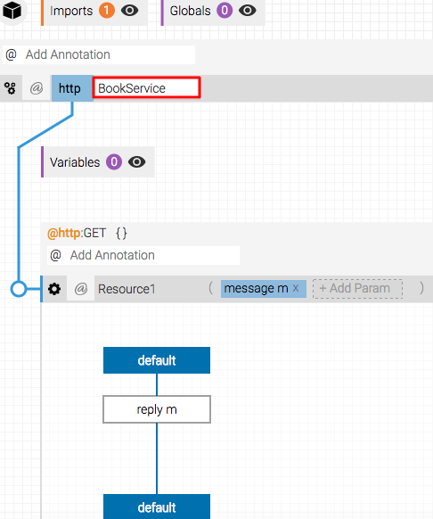
1. You can also rename the resourse to something appropriate.
    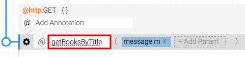
    
    You can start adding your integration logic.

## Add integration logic to your service

Now that you have added a service, you must set up this service so that it can be used in your integration scenario.

1. Select an HTTP identifier from the dropdown available. In this case, you can use GET as the HTTP verb, since you are aiming to get the information using a URL. If you use both a GET and a POST, you need to add a new resource. You can add more resources by dragging them from the tool palette and adding them to the service.
    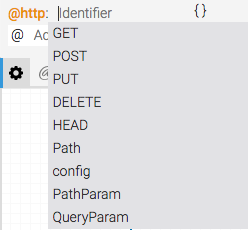
1. As mentioned in [About service URLs](#about-service-URLs), the path for the books service is `http://localhost:9090/books`. Add an annotation by clicking on the label in the service and selecting `ballerina.net.http` from the dropdown.
    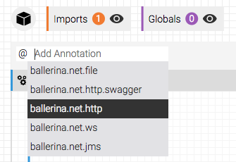
1. Once you add the annotation, you are asked to add an identifier. Select `config` as the identifier from the dropdown.

    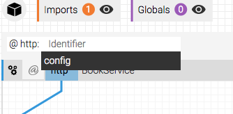
1. Click the `+` sign and select `basePath` from the dropdown to select the basepath.
    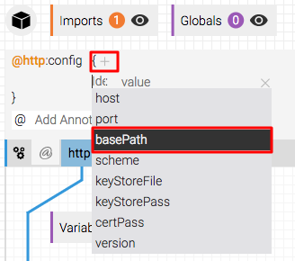
1. Enter the base path as `/books` to define `http://localhost:9090/books` as the service.
    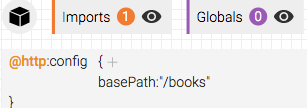
1. Add an annotation to the service itself by clicking the label in the service and selecting `ballerina.net.http` from the dropdown.

    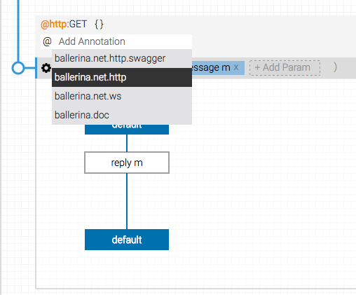
1. Add a HTTP Path from the dropdown that appears.
    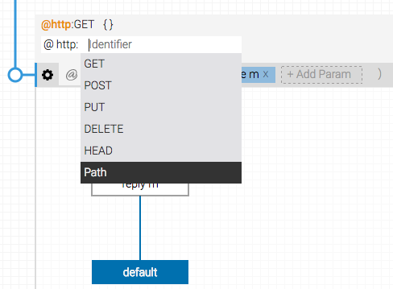
1. Click the `+` sign next to `@Http:Path` and select value in the dropdown that appears. Define the value as `/title` and assign it to the HTTP Path variable. This enables the Ballerina service and the resource to be mapped properly to the title of the book. This is linked to the URL to be called: `http://localhost:9090/books/title`.
    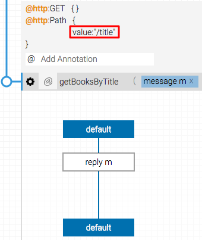

## View the OpenAPI definition for your service

If your Ballerina program contains services and resources, you can view the generated OpenAPI definition for your program by switching to the OpenAPI view. All the changes made on the OpenAPI definition will reflect on the Ballerina program when you switch back to Source or Design view.

You can also import OpenAPI files by clicking **File** in the top menu and selecting **Import Swagger**.

1. Click the OpenAPI definition icon on the right of your service to view the OpenAPI definition. You can switch back to the **Design View** or **Source View** by clicking the buttons at the bottom right of your screen.

    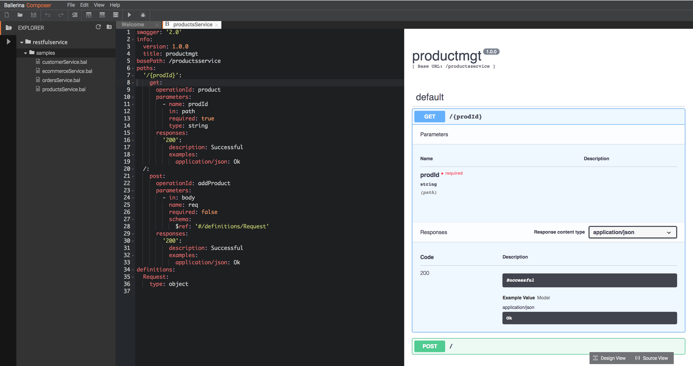
    
    The OpenAPI UI Editor provides numerous usage options to easily interact with APIs.
    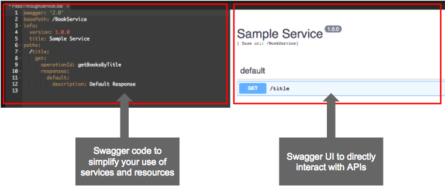
1. Click `GET` to see the details in the OpenAPI UI.
    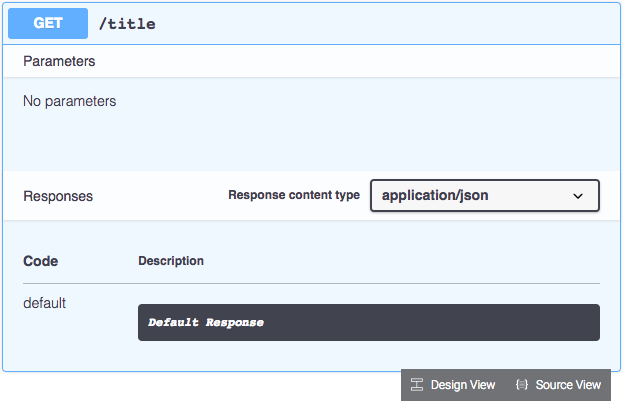

## Add a client connector

Now that you have added a service, you need a connector to connect to the external books API.

1. On the tool palette, click **More Connectors** to see a list of all available connectors.
    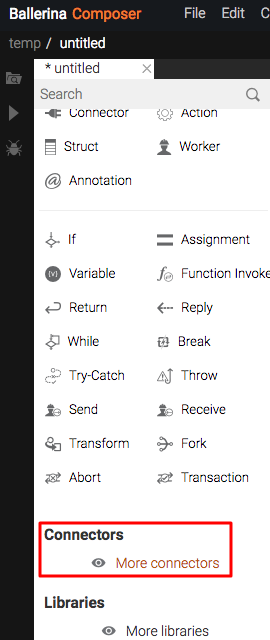
1. From the list that appears, expand **ballerina.net.http** and drag a **ClientConnector** onto the canvas.
    
1. Add the endpoint URL (https://www.googleapis.com/books/v1/) within quotation marks "" as the connector endpoint. You can also change the name of the endpoint to something suitable.
    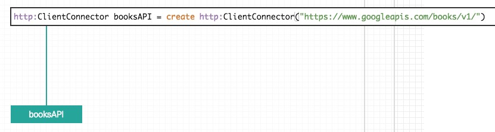
    > The endpoint URL, in this instance, is not the complete URL and does not include the title or the book and other details. You can directly add the complete URL here if you wish. This is not done in this scenario for the purposes of the tutorial and to highlight a different means of achieving the same outcome, i.e., the title will be appended in the request.

## Call the client connector

1. Add a HTTP GET request by dragging it from the tool palette to the canvas.
    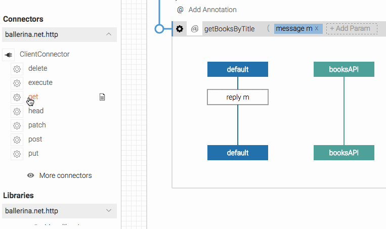
1. To call the connector from the main program, draw an arrow to the connector from the GET remote function.
    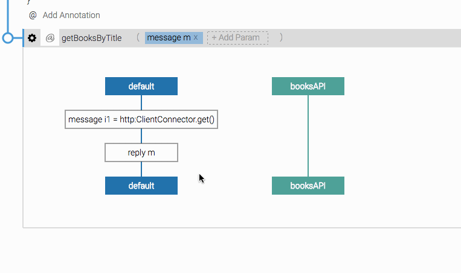
1. Pass a message from the main program to the connector by specifying the remaining part of the endpoint URL (volumes?q=intitle:wso2) and message `m`. Also rename the HTTP GET message name to `m`.
    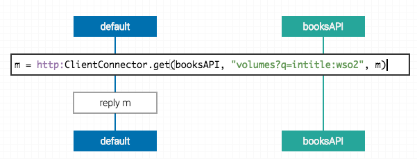
    > Note that a message is passed by default in a service. This will not be the case in a main program application. In this case, it is message `m` that is passed. The full endpoint URL is https://www.googleapis.com/books/v1/volumes?q=intitle:wso2.
1. Add the query parameter to the resource by going to the source view and modifying the resource to the following.
    ```
    resource getBooksByTitle (message m, @http:QueryParam {value:"title"} string title)
    ```
1. Now that you have specified a query parameter, you can use the value of the query parameter in your connector call. Change the message passed to the following.
    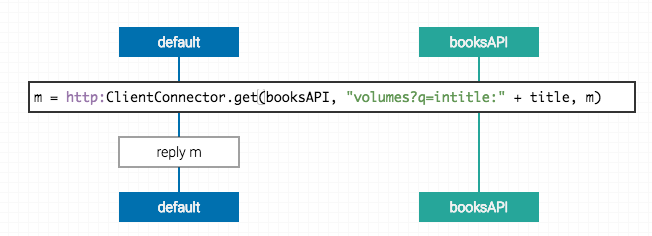

## Extract content from the JSON

1. Use the search, or navigate to a function called `getJsonPayload`, which is in the `ballerina.lang.messages` library. This library contains functions that enable you to modify and use messages in various ways.
1. Drag and drop this onto the main program in the canvas. This automatically applies this function on message m since that is the default message.
    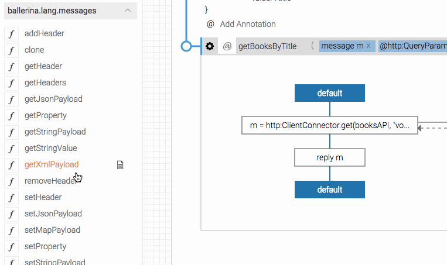
1. Rename the JSON as `j`.

    
1. Add a variable from the tool palette to the main function in the canvas.
    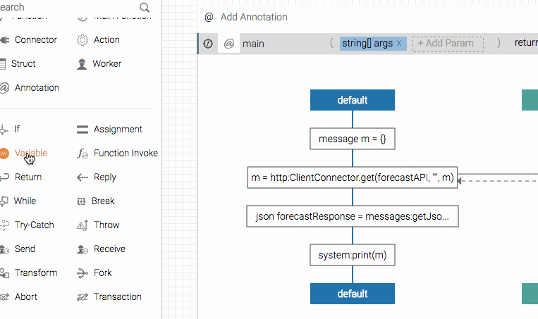
1. Modify the variable so that you can get the data under list. In this example, `.list` is a JSON path. 
     ```
     json bookList = j.items
     ```

