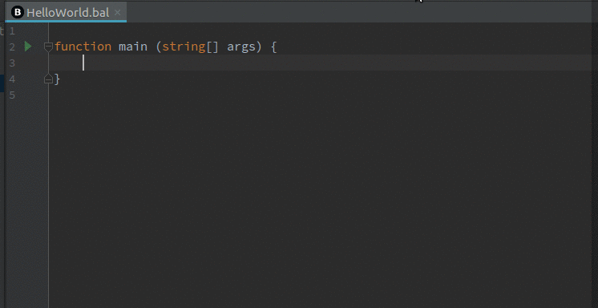
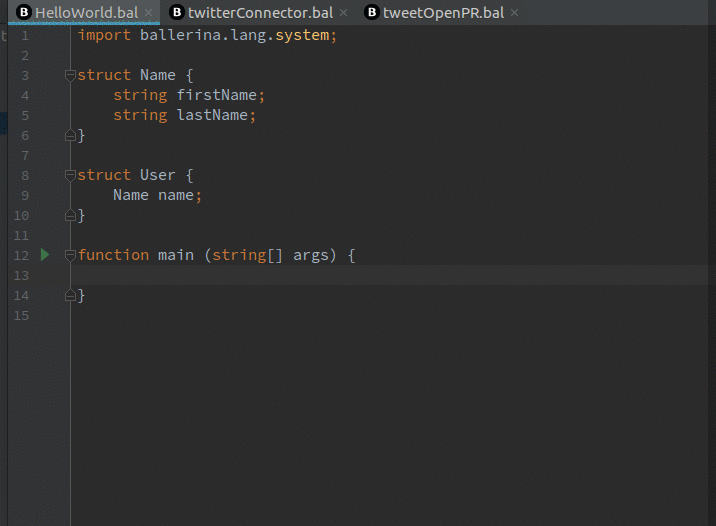
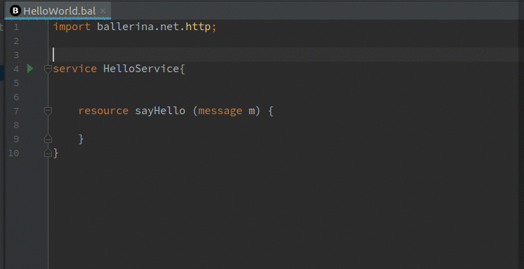
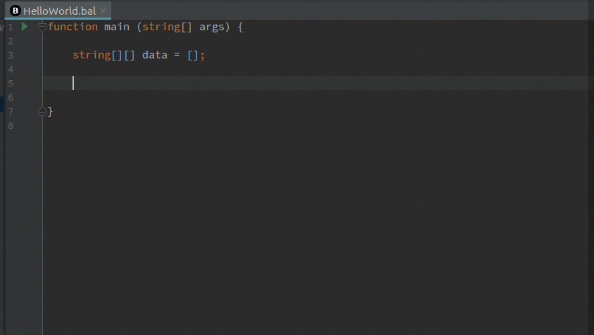
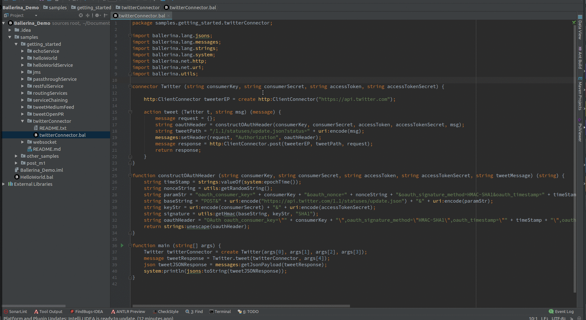
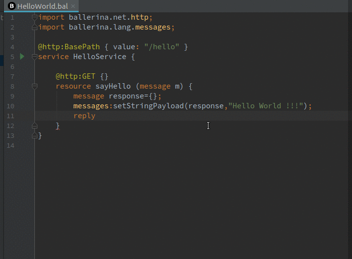
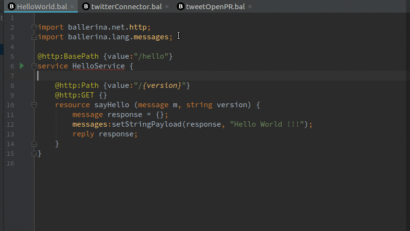
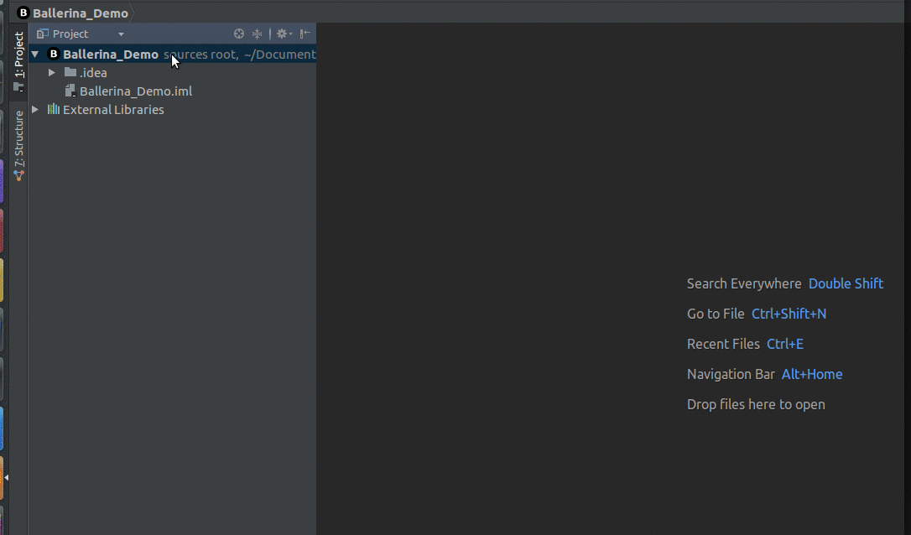
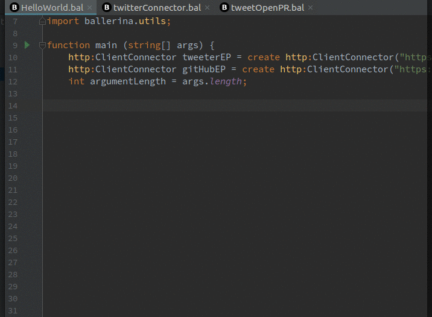

# Features

## Auto Imports

Auto import feature adds import declarations on the fly. All you have to do is selecting the package name from the lookup list and the package declaration will be automatically added.

## Parameter Info

You can view the required parameters of a functions, actions, etc by pressing `Ctrl`+`P`.

## Quick Documentation

You can view the documentation of a functions, actions, etc by pressing `Ctrl`+`Q`.

## Struct Fields suggestions

Struct fields are suggested inside struct initializing braces and after the dot operator. Multi level struct field access is available.

## Annotation Fields completion

Annotation field names will be suggested inside annotation attachments.

## Array length

Array length property is now available. This is an array dimension aware suggestion.

## Find Usage

You can find usage of variables, functions, structs, connectors, etc.

## Go To Definition

You can go to definition of variables, function invocations, etc by `Ctrl`+`Click` on the reference.

## Formatting

You can reformat the Ballerina codes by pressing `Ctrl`+`Alt`+`L`.

## Running Ballerina applications 

You can run Ballerina main without adding/changing any run configurations.

## Path/Query Parameter validation

Path/Query parameter validation is available to improve usability.

## Package Inspection

Package inspection is available to improve usability. This will suggest to add the package name if no package name is present. If an incorrect package name is present, it will suggest to change the package name. You can view these suggestions using `Alt`+`Enter`.

## File Templates

Three types of Ballerina file templates are available.
1) Ballerina Main - Contains a sample main program
2) Ballerina Service - Contains a sample service
3) Empty File

## Live Templates

Live templates contains boilerplate codes and lets the user to enter them easily. All available live templates can be viewed/changed at **Settings -> Editor -> Live Templates -> Ballerina**.

## Hidden Templates

Hidden templates are associated with most of the keywords. Hidden templates can be invoked by pressing `Ctrl`+`Space` after typing the keyword. Hidden template will be inserted when you select the keyword from the lookup element list as well.

## Spell Checking

Spell checking is enabled for all identifiers. You can rename all of the definitions and references as well.

