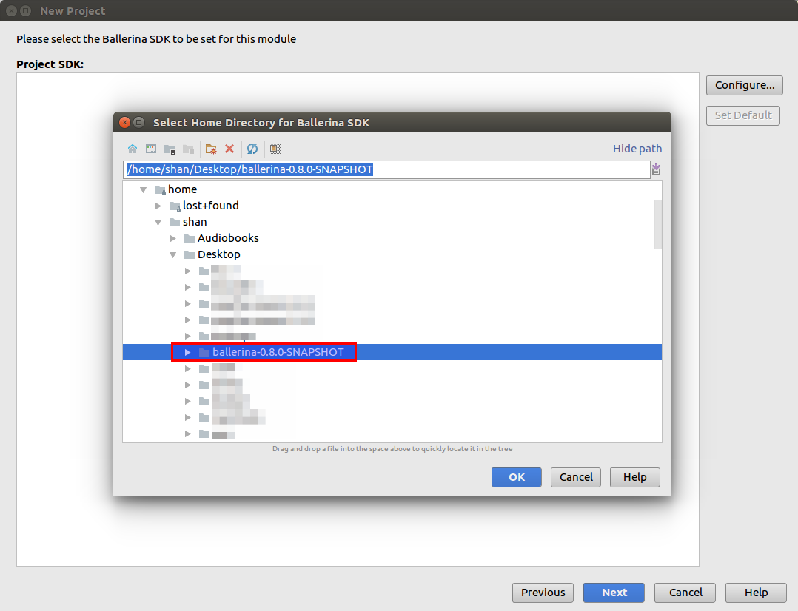
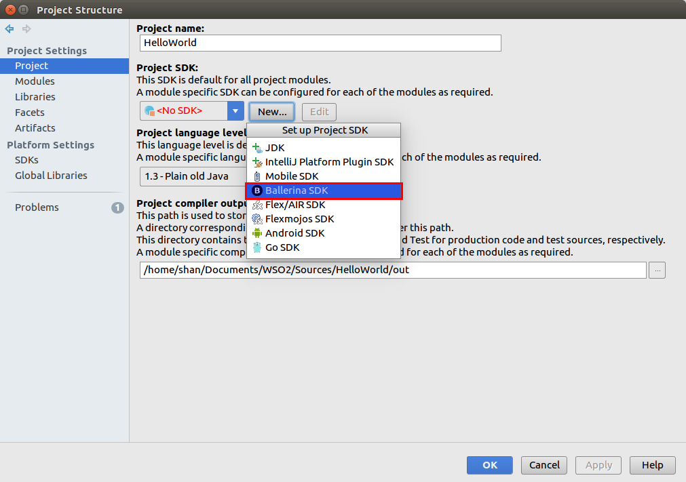
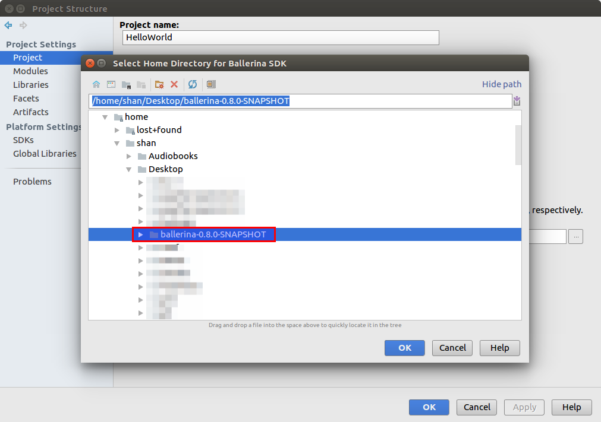

## Setting up Ballerina SDK

### 1) When creating a new Ballerina project

1) Go to **File -> New -> Project** and select **Ballerina** project and select **Next**.

2) If you have previously configured the Ballerina SDKs, they will appear in the next window. You can select a SDK and continue with project creation by selecting **Next**.

If the Ballerina SDK was not configured previously, you can add a new Ballerina SDK by selecting **Configure**.

3) Select the Ballerina distribution location.

4) Now you have successfully added the Ballerina SDK. You can select **Next** and continue with project creation.

### 2) After creating a Ballerina project

1) Go to **File -> Project Structure** and select **Project** tab. If you have previously added the Ballerina SDK, you can select the SDK from the drop down menu.

If a Ballerina SDK is not added previously, you can add a new SDK by selecting the **New** button under the **Project SDK** and selecting **Ballerina SDK**.

2) Select the Ballerina distribution location.

3) Now you have successfully added the Ballerina SDK to the project.

4) Select **OK** or **Apply** to save changes.
