# Language Server User Guide
Ballerina Language Server provides code intelligence for ballerina file editing. It supports editor features such as diagnostics, auto-completion, go-to-definition, code refactoring and more. A list of currently supported features  can be found below. 

Currently the Ballerina Language Server has been integrated to Ballerina [VSCode plugin](https://marketplace.visualstudio.com/items?itemName=ballerina.ballerina) and Ballerina Composer. All the examples are given below using VSCode if you are using a different editor the trigger keys can be different.

- <a href="#CodeDiagnostics">Code Diagnostics</a>
- <a href="#SuggestionsAndAutoCompletion">Suggestions and Auto Completion</a>
    - <a href="#TriggeringKeyCombinations">Triggering Key Combinations</a>
    - <a href="#TemplateSuggestions">Template Suggestions</a>
    - <a href="#ContextawareSuggestionsAndCompletions">Context Aware Suggestions and Completions</a>
    - <a href="#ImportsSuggestions">Imports Suggestions</a>
    - <a href="#AnnotationsSuggestion">Annotations Suggestion</a>
    - <a href="#IterableOperationsSuggestion">Iterable Operations Suggestion</a>
    - <a href="#MatchPatternClauseSuggestions">Match Signature Completion</a>
    - <a href="#TypeguardDestructure">Typeguard Destructure a Variable</a>
- <a href="#FindAllReferences">Find All References</a>
- <a href="#GotoDefinition">Go to Definition</a>
- <a href="#HoverSupport">Hover Support</a>
- <a href="#SignatureHelp">Signature  Help</a>
- <a href="#CodeAction">Code Action</a>
    - <a href="#ImportModule">Import Module</a>
    - <a href="#CreateFunctions">Create Functions</a>
    - <a href="#CreateVariables">Create Variables</a>
    - <a href="#AddDocumentationAndDocumentAll">Add Documentation and Document All</a>
    - <a href="#IgnoreReturnValue">Ignore Return Value</a>
    - <a href="#CreateTestsForFunctionsAndServices">Create Tests</a>
    - <a href="#CreateInitializer">Create Object Initializer</a>
    - <a href="#ChangeReturnType">Change Function Return Type</a>
    - <a href="#ConvertObjectToAbstract">Convert an Object to an Abstract Object</a>
    - <a href="#ConvertObjectToNonAbstract">Convert an Abstract Object to a non Abstract Object</a>
    - <a href="#TypeGuardInvocation">Typeguard a function</a>
- <a href="#Tips">Tips</a>
- <a href="#KnownIssues">Known Issues</a>
    
<a name="CodeDiagnostics" />

## Code Diagnostics
Language Server Diagnostics provides syntax & semantic errors/diagnostics in a ballerina source.

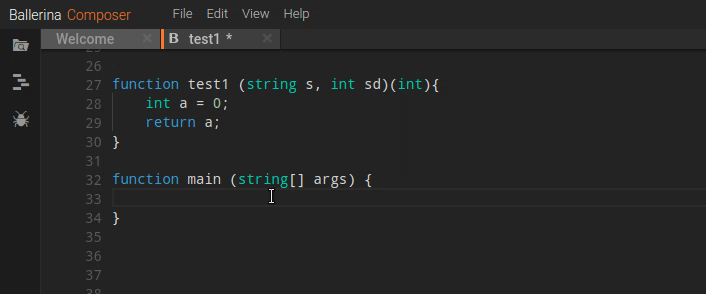  

<a name="SuggestionsAndAutoCompletion" />

## Suggestions and Auto-Completion
Suggestion and Auto-Completion is triggered while you are typing and also allows you to request suggestions explicitly for a given context with the <kbd>Ctrl</kbd> + <kbd>Space</kbd>.

<a name="TriggeringKeyCombinations" />

#### Triggering Key Combinations
- Alphabetic Characters will automatically trigger the completion
- Ballerina Language specific non alphabetical characters such as _**":", ".", "->", "@"**_ will also trigger the completions and suggestions automatically
<kbd>Ctrl</kbd> + <kbd>Space</kbd> can be used for forced completion by the user
Following are types of suggestions available with the language server.

<a name="TemplateSuggestions" />

#### Template Suggestions
You can use the template suggestions to add top level construct templates. Following construct templates are supported
- Services
- Functions
- Objects
- Records
- Annontations
- Error

As well as the top level constructs, you can get the templates for following statements and definitions.
- Resource Definition
- Fork Join
- Worker
- Conditional Statements (Eg: If, While, etc.)
- For Each Statement
- Transaction

<a name="ContextawareSuggestionsAndCompletions" />

#### Context aware Suggestions and Completions
Language server provides context aware suggestions and completions for a wide range of language attributes and features. As an example, if you have defined a client, remote functions defined against the client will be suggested as shown below.

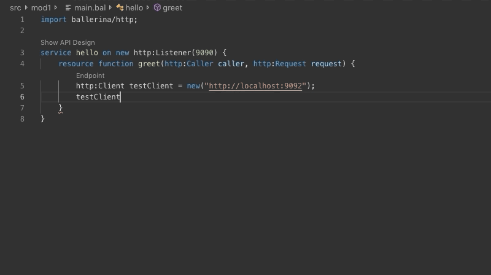

Other than that, you can get the suggestions for following language attributes as well.
- Visible Functions
- Defined Variables
- Fields and Functions of Objects and Records
- Match Pattern clause Destructure
- Typeguard a given variable

Following are some special cases of code completions and suggestions.

<a name="ImportsSuggestions" />

#### Imports Suggestions
For importing packages you can choose from the suggested list of package names. Currently, Package suggestion for the import statements are supported for the packages defined under the ballerina organization name.

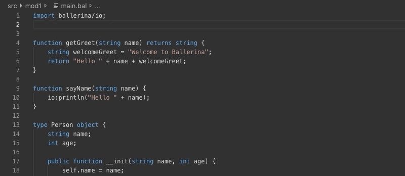

<a name="AnnotationsSuggestion" />

#### Annotations Suggestion
For the Services, Resources, Functions and Listeners you can add annotations through language server annotation suggestions. Annotations for particular definitions will be suggested and you can select the required annotations from the list.
Within the annotation attachment's body annotation fields and expression suggestions will be provided according to the context.

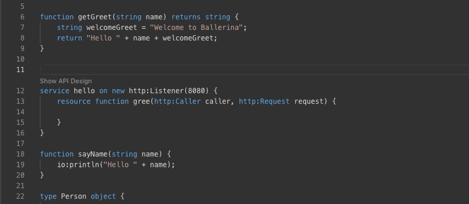

<a name="IterableOperationsSuggestion" />

#### Iterable Operations Suggestion
For the variables which are allowed to use iterable operations suggestions for iterable operations templates will be provided and you can choose a pre defined template among them.
- Arrays
- Maps
- Json
- Table
- XML

<a name="MatchPatternClauseSuggestions" />

#### Match Pattern Clause Destructure
Against an expression you can use a match statement and Language Server suggests context aware snippets as shown below. You can trigger the suggestions with key combination  <kbd>Ctrl</kbd> + <kbd>Space</kbd>.

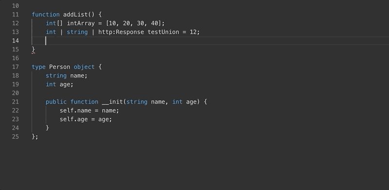

<a name="TypeguardDestructure" />

#### Typeguard Destructure for Variables
For a given variable (eg: Union Vaiable) you will be provided with the snippets for typeguard.

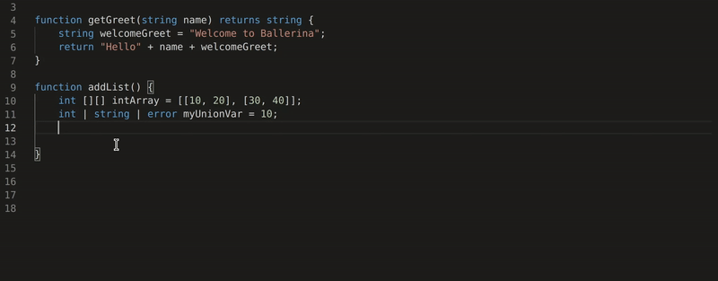

<a name="FindAllReferences" />

## Find All References
Find all references will be triggered for IDE defined key combinations. You can find all the references for a given function as follows. You will be provided with the references within the same source file, references within the current modules as well as references within the given project as well.

<a name="GotoDefinition" />

## Goto Definition
You can jump to the definition of an item by triggering the IDE defined key combinations.

Eg: For [VSCode](https://code.visualstudio.com/docs/editor/editingevolved#_go-to-definition)
Trigger the action for a item defined and you will jump to the definition of the particular Item. Goto Definition also cover a single source file, single module as well as the current project. Bellow capture shows got to definition trigger for a function.

<a name="HoverSupport" />

## Hover Support
In order to get an overview of a certain item you can hover over the particular item and Language Server will show an overview of the item based on the documentation for the particular Item.
- Functions
- Records
- Variables
- Objects

<a name="SignatureHelp" />

## Signature Help
You can get an overview of a function signature with the signature help feature. Signature help will be triggered when you type Open Bracket <kbd>(</kbd> after the function name and also <kbd>,</kbd> within the function arguments.

<a name="CodeAction" />

## Code Action and Quick Fixes

<a name="ImportModule" />

#### Import Module
When you need to add the import statement for a package which is not imported and where there is a usage, you can use the code action to add the particular import. These Identified imports will only be packages under ballerina and ballerinax organization name.

<a name="CreateFunctions" />

#### Create Functions
When you need to generate a function which is not still implemented, you can use the code action to generate new function matching the function signature.

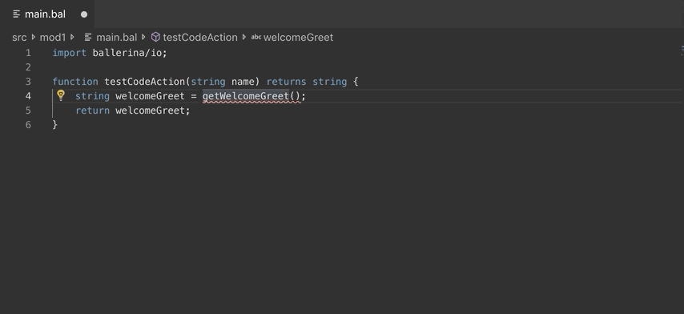

<a name="CreateVariables" />

#### Create Local Variable
Whenever your function has a return value, you can use the code action to assign it into a new variable matching the return type of the function.

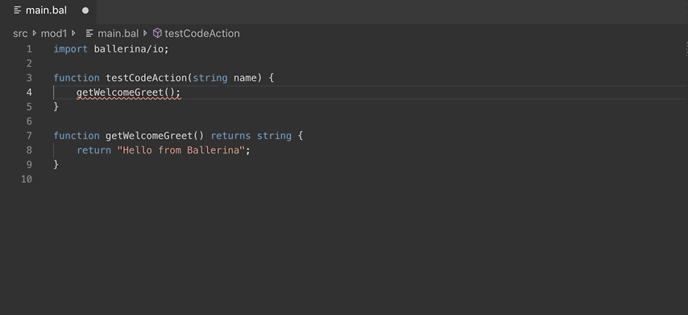

<a name="AddDocumentationAndDocumentAll" />

#### Add Documentation and Document All
When you to add the documentation for the top level items, Language Server will prompt a code action and you can select the action and the documentation will be added to the particular top level item.

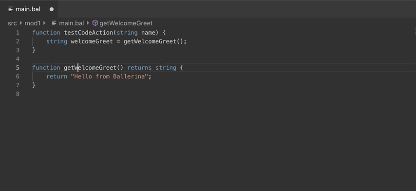

If you wish to document all the top level nodes then you can select the Document All option and all the functions, services and the resources in the particular file will be documented.

Following top level node types are supported for documentation.
- Function
- Service

<a name="CreateTestsForFunctionsAndServices" />

#### Create Tests for Functions and Services
With the create tests code action, you can create tests for the public functions and the services.

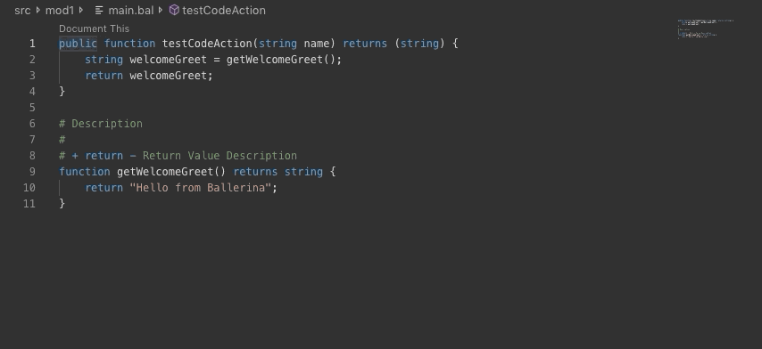

<a name="CreateInitializer" />

#### Create Object Initializer
Create Object Initializer Code action allows you to generate the object initializer with the arguments

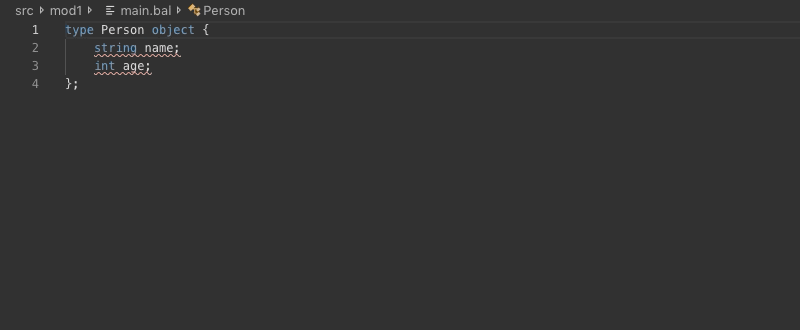

<a name="ChangeReturnType" />

#### Change Return Type
This particular code action allows you to create the return signature of a function definition

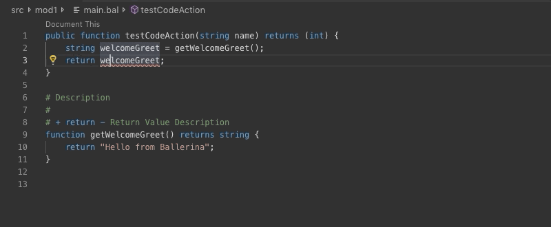

<a name="ConvertObjectToAbstract" />

#### Convert Object to an Abstract Object
You can convert an Object definition to an abstract object definition, with this code action

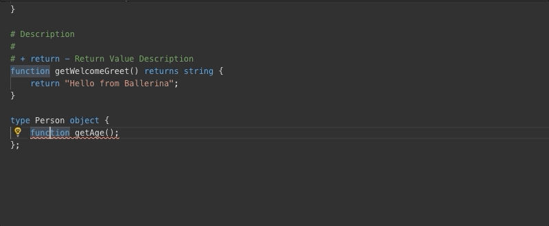

<a name="ConvertObjectToNonAbstract" />

#### Convert Object to a non Abstract Object
You can convert an abstract Object definition to a non object definition, with this code action

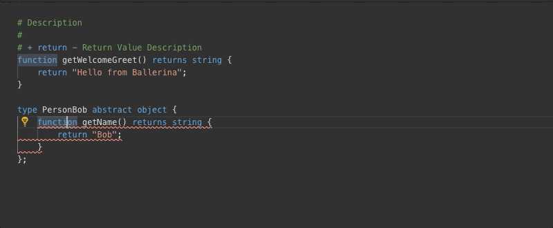

<a name="Tips" />

## Tips
- For better performance during hover operation increase the hover delay in your editor settings. 1000ms is recommended.
- In your ballerina module, if there are syntax errors in other files rather than the one you are editing, there may be inconsistencies while providing auto completions and suggestions.
- Language server operations' behavior may unpredictable if there are multiple errors in the source. For an instance, for the auto-completions there can only be one syntax error which should be at cursor position, in order to provide better experience

**Note:** These will be addressed in later releases for better user experience

<a name="KnownIssues" />

## Known Issues
Below you can find a list of known issues and possible workarounds to get over the particular issues.

- [Issue Tracker](https://github.com/ballerina-platform/ballerina-lang/issues?q=is%3Aopen+is%3Aissue+label%3AComponent%2FLanguageServer)
