# Language Server User Guide
Ballerina Language Server provides code intelligence for ballerina file editing. It supports editor features such as diagnostics, auto-completion, go-to-definition, code refactoring and more. A list of currently supported features  can be found below. 

Currently the Ballerina Language Server has been integrated to Ballerina VSCode plugin and Ballerina Composer. All the examples are given below using VSCode if you are using a different editor the trigger keys can be different.

- <a href="#CodeDiagnostics">Code Diagnostics</a>
- <a href="#SuggestionsAndAutoCompletion">Suggestions and Auto Completion</a>
    - <a href="#TriggeringKeyCombinations">Triggering Key Combinations</a>
    - <a href="#TemplateSuggestions">Template Suggestions</a>
    - <a href="#ContextawareSuggestionsAndCompletions">Context Aware Suggestions and Completions</a>
    - <a href="#EndpointFieldsSuggestion">Endpoint Fields Suggestion</a>
    - <a href="#ImportsSuggestions">Imports Suggestions</a>
    - <a href="#IterableOperationsSuggestion">Iterable Operations Suggestion</a>
    - <a href="#MatchSignatureCompletion">Match Signature Completion</a>
    - <a href="#AnnotationsSuggestion">Annotations Suggestion</a>
- <a href="#FindAllReferences">Find All References</a>
- <a href="#GotoDefinition">Go to Definition</a>
- <a href="#HoverSupport">Hover Support</a>
- <a href="#SignatureHelp">Signature  Help</a>
- <a href="#CodeAction">Code Action</a>
    - <a href="#AddImports">Add Imports</a>
    - <a href="#AddDocumentationAndDocumentAll">Add Documentation and Document All</a>
- <a href="#KnownIssues">Known Issues</a>
    
<a name="CodeDiagnostics" />

## Code Diagnostics
Language Server Diagnostics feature will automatically highlight syntax & semantic errors in a bal file.

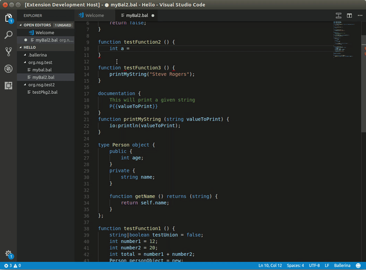  

<a name="SuggestionsAndAutoCompletion" />

## Suggestions and Auto-Completion
Suggestion and Completion will be listed automatically when you edit or you can request suggestions explicitly for a given context.

<a name="TriggeringKeyCombinations" />

#### Triggering Key Combinations
- Alphabetic Characters will automatically trigger the completion
- Language specific non alphabetical characters such as ":", ".", "->", "@" will also trigger the completions and suggestions automatically
- Ctrl + Space can be used for forced completion by the user
Following are types of suggestions available with the language server.

<a name="TemplateSuggestions" />

#### Template Suggestions
You can use the template suggestions to add top level construct templates. Following construct templates are supported
- Services
- Functions
- Objects
- Records
- Endpoints

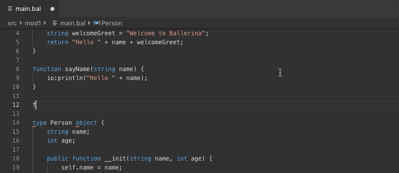

As well as the top level constructs, you can get the templates for following statements and definitions.
- Resource Definition
- Fork Join
- Worker
- Conditional Statements (Eg: If, While, etc.)
- For Each Statement
- Try Catch
- Transaction

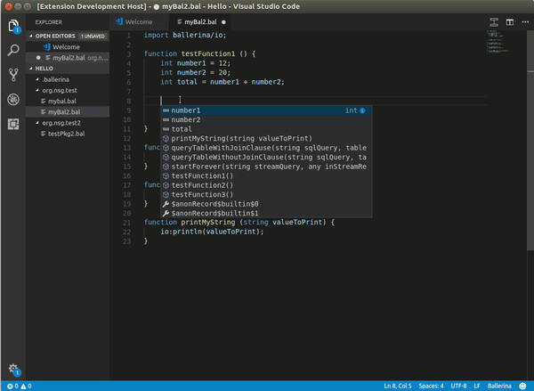

<a name="ContextawareSuggestionsAndCompletions" />

#### Context aware Suggestions and Completions
Language server provides context aware suggestions and completions for a wide range of language attributes. As an example, if you have defined endpoint variable, actions defined against the endpoint will be suggested as shown below.

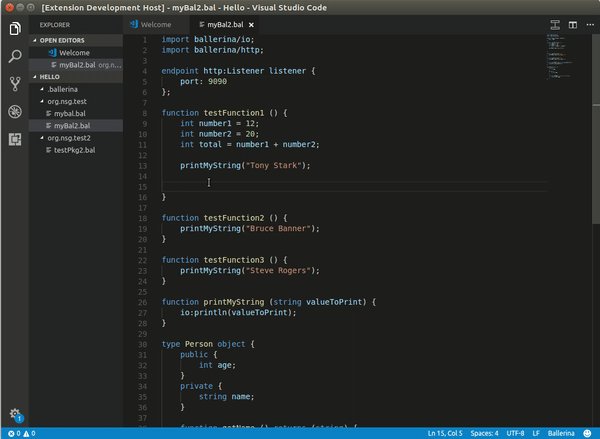

Other than that, you can get the suggestions for following language attributes as well.
- Visible Functions
- Defined Variables
- Fields and Functions of Objects and Records

Following are some special cases of code completions and suggestions.

<a name="EndpointFieldsSuggestion" />

#### Endpoint Fields Suggestion
You can get the Endpoint fields suggestions as follows.

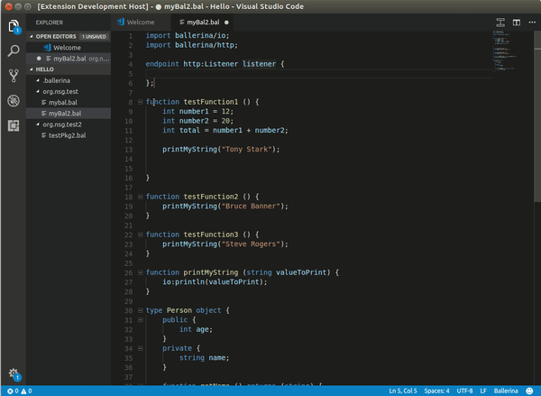

<a name="ImportsSuggestions" />

#### Imports Suggestions
For importing packages you can choose from the suggested list of package names. Currently, Package suggestion for the import statements are supported for the packages defined under the ballerina organization name.

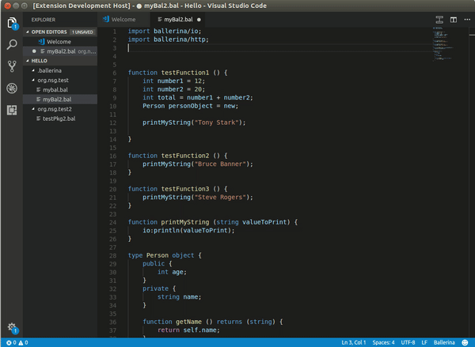

<a name="IterableOperationsSuggestion" />

#### Iterable Operations Suggestion
For the variables which are allowed to use iterable operations suggestions for iterable operations templates will be provided and you can choose a pre defined template among them.
- Arrays
- Maps
- Json
- Table
- XML

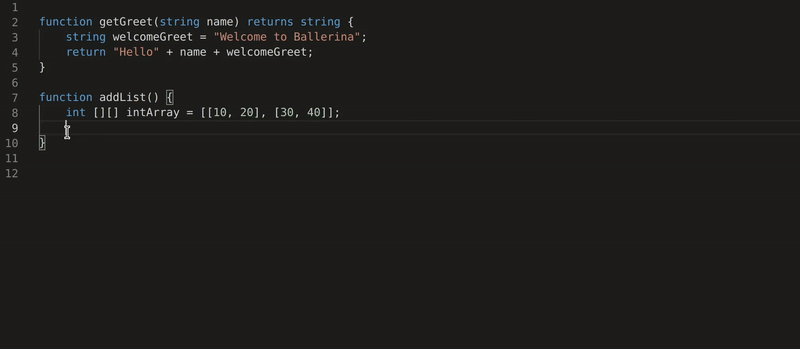

<a name="MatchSignatureCompletion" />

#### Match Signature Completion
Against an expression you can use a match statement and Language Server suggests context aware snippets as shown below. You can trigger the suggestions with key combination  Ctrl + Space.

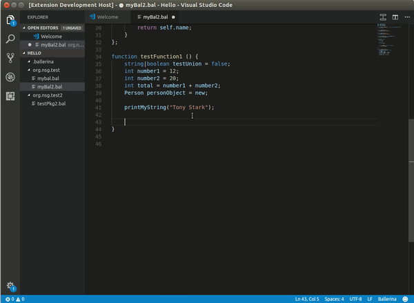

<a name="AnnotationsSuggestion" />

#### Annotations Suggestion
For the Services and Resources you can add annotations through language server annotation suggestions. Annotations for particular definitions will be suggested and you can select the required annotations from the list.
Within annotations you can trigger Ctrl + Space and annotation fields will be suggested.

<a name="FindAllReferences" />

## Find All References
Find all references will be triggered for IDE defined key combinations [VSCode: Shift + F12]
You can find all the references for a given function as follows. You will see the references in the same package and different packages as well as in different files.

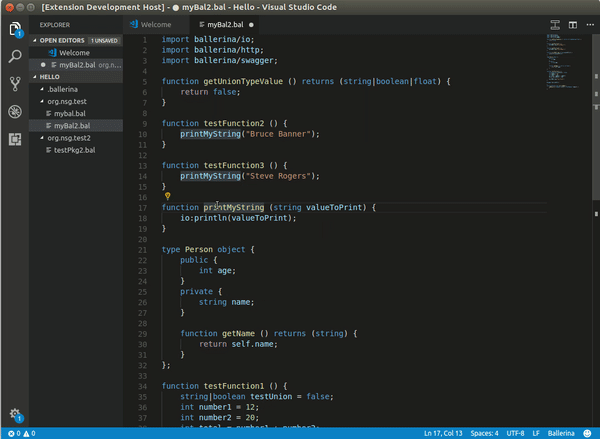

Other than Functions, following are supported for find all references
- Records
- Variables
- Endpoints
- Objects

<a name="GotoDefinition" />

## Goto Definition
You can jump to the definition of an item by triggering the IDE defined key combinations [VSCode: F12 and Ctrl + Click]
Trigger the action for a item defined and you will jump to the definition of the particular Item. Bellow capture shows got to definition trigger for a function.

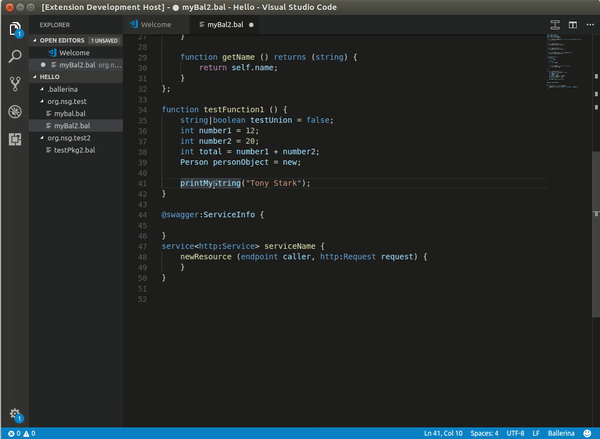

Other than functions, following are supported for got to definition
- Records
- Variables
- Endpoints
- Objects

<a name="HoverSupport" />

## Hover Support
In order to get an overview of a certain item you can hover over the particular item and Language Server will show an overview of the item based on the documentation for the particular Item.
- Functions
- Records
- Variables
- Endpoints
- Objects

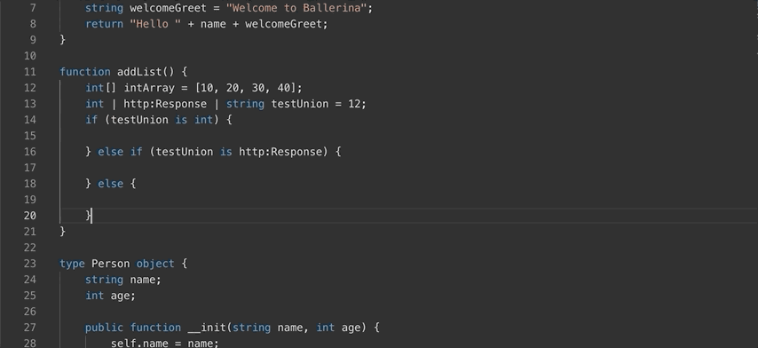

<a name="SignatureHelp" />

## Signature Help
You can get an overview of a function signature with the signature help feature. Signature help will be triggered when you type Open Bracket “(” after the function name.

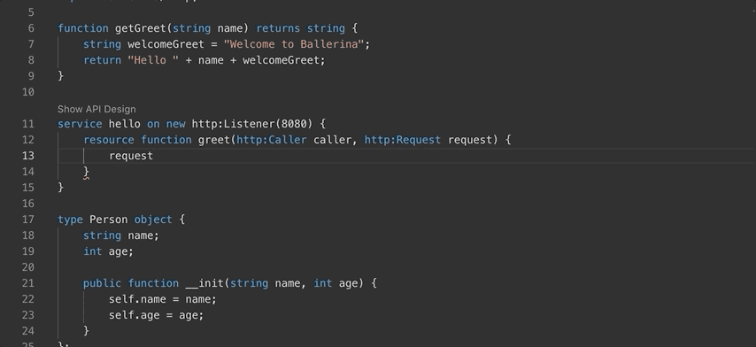

<a name="CodeAction" />

## Code Action

<a name="AddImports" />

#### Add Imports
When you need to add the import statement for a package which is not imported and where there is a usage, you can use the code action to add the particular import. These Identified imports will only be packages under ballerina organization name.

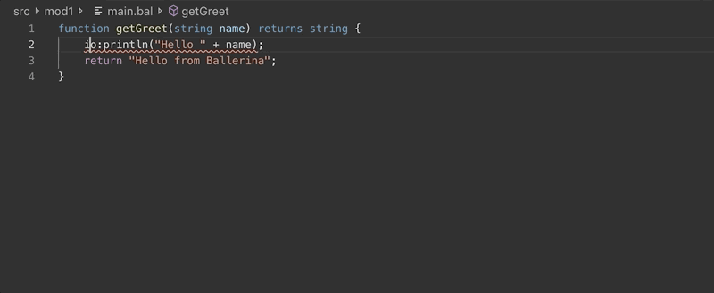

<a name="AddDocumentationAndDocumentAll" />

#### Add Documentation and Document All
When you to add the documentation for the top level items, Language Server will prompt a code action and you can select the action and the documentation will be added to the particular top level item.

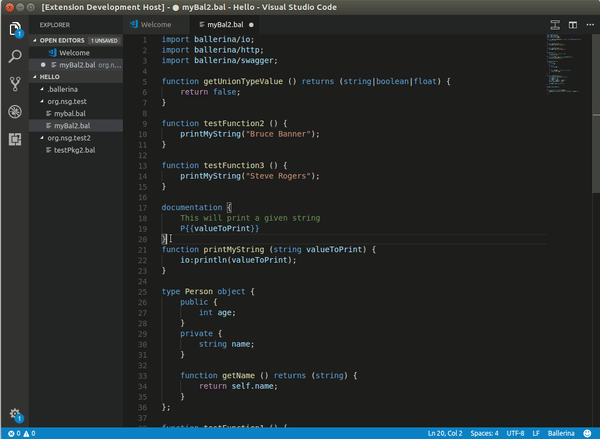

If you wish to document all the top level nodes then you can select the Document All option and all the functions, services and the resources in the particular file will be documented.

Following top level node types are supported for documentation.
- Function
- Service

<a name="Known Issues" />

## Known Issues
Below you can find a list of known issues and possible workarounds to get over the particular issues.