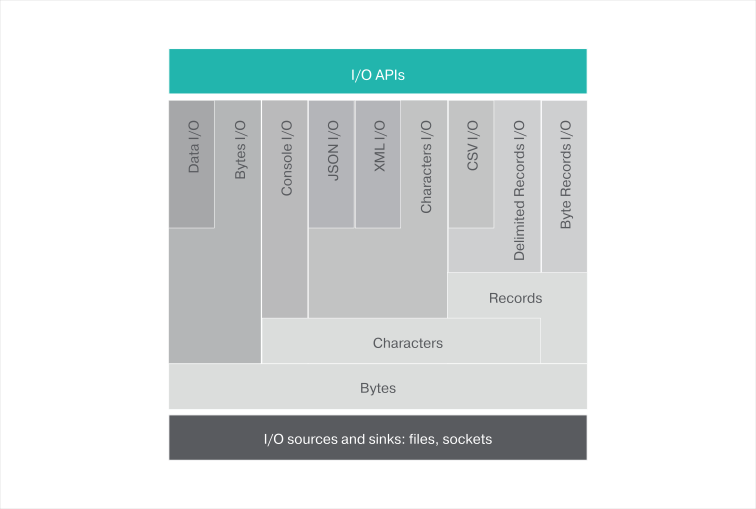

## Module Overview

This module is designed to support input and output operations via channels in a canonical way, either in a blocking,
or non-blocking manner.



### Channels
A channel represents an I/O source or sink of some bytes, characters, or records that are opened for reading, or
writing, respectively.
### Byte channels
The most primitive channel is the `ByteChannel` which reads and writes 8-bit bytes.

```ballerina
// Open a file in read mode.
io:ReadableByteChannel readableByteChannel = io:openReadableFile("some/file.txt");

// Here is how 100 bytes are read from the channel.
var readResult = readableByteChannel.read(100);
    match readResult {
        (byte[], int) content => {
            return content; // Return the read content.
        }
    error err => {
        return err; // An IO error occurred when reading the bytes.
    }
}

// Open a file in write mode.
io:WritableByteChannel writableByteChannel = io:openWritableFile("some/file.txt");

// Write some content to the beginning of the file.
string someContent = "some content";
byte[] content = someContent.toByteArray("UTF-8");
var writeResult = writableByteChannel.write(content, 0);
match writeResult {
    int numberOfBytesWritten => {
        return numberOfBytesWritten; // Return the count of written bytes.
    }
    error err => {
        return err; // An IO error occurred when writing the bytes.
    }
}
```
### Character channels
The `CharacterChannel` is used to read and write characters. The charset encoding is specified when creating the
`CharacterChannel`.

 ```ballerina
// Create a `ReadableCharacterChannel` from the `ReadableByteChannel`.
var readableCharChannel = new io:ReadableCharacterChannel(readableByteChannel, "UTF-8");
```

If a `ReadableCharacterChannel` points to a JSON or XML source, it can be read and then written, directly into a variable of
the respective type.

```ballerina
// Reading a JSON.
var readResult = readableCharChannel.readJson();
match readResult {
    json value => {
        return value; // Return the read JSON value.;
    }
    error err => {
        return err; // An IO error occurred when reading the JSON.
    }
}
```
```ballerina
// Reading an XML.
var result = readableCharChannel.readXml();
```

```ballerina
// Create a `WritableCharacterChannel` from the `WritableByteChannel`.
var writableCharChannel = new io:WritableCharacterChannel(writableByteChannel, "UTF-8");
```

```ballerina
// Writing a JSON.
json content = {fname:"Jhon", lname:"Doe", age:40};
var writeResult = writableCharChannel.writeJson(content);
match writeResult {
    error err => {
        return err; // An IO error occurred when writing the JSON.
    }
    () => {
        io:println("JSON content written successfully.");
    }
}
```

### Record channels
Ballerina also supports I/O for delimited records.

```ballerina
// Creating a `ReadableTextRecordChannel` from the `ReadableCharacterChannel`.
// Records are separated using a new line, and
// fields of a record are separated using a comma.
var readableRecordsChannel = new io:ReadableTextRecordChannel(readableCharChannel, fs = ",", rs = "\n");

// Reading a few records.
while (readableRecordsChannel.hasNext()) {
    var result = readableRecordsChannel.getNext();
    match result {
        string[] record => {
            println(record); // Retrieved a record.
        }
        error err => {
            return err; // An IO error occurred when reading the records.
        }
    }
}
```

A `.CSV` file can be read and written directly into a `CSVChannel`, as shown in this code snippet.

```ballerina
// Creating a `ReadableCSVChannel` from the `ReadableCharacterChannel`.
var readableCSVChannel = new io:ReadableCSVChannel(readableCharChannel);
```

Records of the `.CSV` file can read directly into a table of a matching type.

 ```ballerina
// First let’s define a type that matches a record in the CSV file.
type Employee record {
    string id;
    string name;
    float salary;
};

// Now read the CSV file as a table of Employees and compute total salary.
float totalSalary = 0;
match readableCSVChannel.getTable(Employee) {
    table<Employee> employees => {
        foreach employee in employees {
            totalSalary += employee.salary;
        }
        return totalSalary; // Return total of salaries of all employees.
    }
    error err => {
        return err; // An IO error occurred when reading the records.
    }
}
```

### Data Channels
Ballerina supports performing data i/o operations

Person object could be serialized into a file or a network socket in the following manner.

```ballerina
public type Person record {
    string name;
    int age;
    float income;
    boolean isMarried;
};

//Serialize record into binary
function serialize(Person p, io:WritableByteChannel byteChannel) {
    io:WritableDataChannel dc = new io:WritableDataChannel(byteChannel);
    var length = lengthof p.name.toByteArray("UTF-8");
    var lengthResult = dc.writeInt32(length);
    var nameResult = dc.writeString(p.name, "UTF-8");
    var ageResult = dc.writeInt16(p.age);
    var incomeResult = dc.writeFloat64(p.income);
    var maritalStatusResult = dc.writeBool(p.isMarried);
    var closeResult = dc.close();
}

//Deserialize record into binary
function deserialize(io:ReadableByteChannel byteChannel) returns Person {
    Person person;
    int nameLength;
    string nameValue;
    io:ReadableDataChannel dc = new io:ReadableDataChannel(byteChannel);
    //Read 32 bit singed integer
    match dc.readInt32() {
        int namel => nameLength = namel;
        error e => log:printError("Error occurred while reading name length",err = e);
    }
    //Read UTF-8 encoded string represented through specified amount of bytes
    match dc.readString(nameLength, "UTF-8") {
        string name => person.name = name;
        error e =>log:printError("Error occurred while reading name",err = e);
    }
    //Read 16 bit signed integer
    match dc.readInt16() {
        int age => person.age = age;
        error e =>log:printError("Error occurred while reading age",err = e);
    }
    //Read 64 bit signed float
    match dc.readFloat64() {
        float income => person.income = income;
        error e =>log:printError("Error occurred while reading income",err = e);
    }
    //Read boolean
    match dc.readBool() {
        boolean isMarried => person.isMarried = isMarried;
        error e =>log:printError("Error occurred while reading marital status",err = e);
    }
    //Finally close the data channel
    var closeResult = dc.close();
    return person;
}
```

