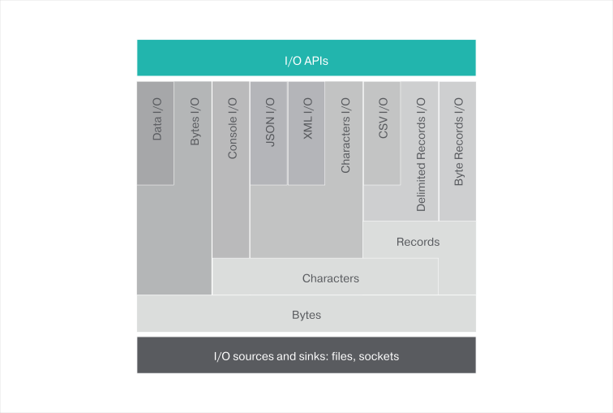

## Module Overview

This module is designed to support input and output operations via channels in a canonical way, either in a blocking,
or non-blocking manner.



### Channels
A channel represents an I/O source or sink of some bytes, characters, or records that are opened for reading, or
writing, respectively.
### Byte channels
The most primitive channel is the `ByteChannel` which reads and writes 8-bit bytes.

```ballerina
// Open a file in read mode.
io:ReadableByteChannel | io:Error readableChannel = io:openReadableFile("file.txt");

// Here is how 100 bytes are read from the channel.
if (readableChannel is io:ReadableByteChannel) {
    byte[] | io:Error result = readableChannel.read(100);
}

// Open a file in write mode.
io:WritableByteChannel | io:Error writableByteChannel = io:openWritableFile("file.txt");

// Write some content to the beginning of the file.
if (writableByteChannel is io:WritableByteChannel) {
    string someContent = "some cont";
    byte[] content = someContent.toBytes();
    int | io:Error writeResult = writableByteChannel.write(content, 0);
}

```
### Character channels
The `CharacterChannel` is used to read and write characters. The charset encoding is specified when creating the
`CharacterChannel`.

 ```ballerina
// Create a `ReadableCharacterChannel` from the `ReadableByteChannel`.
io:ReadableCharacterChannel | io:Error readableCharChannel = 
        new io:ReadableCharacterChannel(readableChannel, "UTF-8");
```

If a `ReadableCharacterChannel` points to a JSON or XML source, it can be read and then written, directly into a variable of
the respective type.

```ballerina
// Reading a JSON.
json | io:Error result = readableCharChannel.readJson();
```
```ballerina
// Reading an XML.
xml | io:Error result = readableCharChannel.readXml();
```

```ballerina
// Create a `WritableCharacterChannel` from the `WritableByteChannel`.
io:WritableCharacterChannel | io:Error writableCharChannel = 
            new io:WritableCharacterChannel(writableByteChannel, "UTF-8");
```

```ballerina
// Writing a JSON.
json content = {fname: "Jhon", lname: "Doe", age: 40};
var writeResult = writableCharChannel.writeJson(content);
if (writeResult is io:Error) {
    return writeResult;
} else {
    io:println("JSON content written successfully.");
}
```

### Record channels
Ballerina also supports I/O for delimited records.

```ballerina
// Create a `ReadableTextRecordChannel` from the `ReadableCharacterChannel`.
// Records are separated using a new line.
// Fields of a record are separated using a comma.
var readableRecordsChannel = 
        new io:ReadableTextRecordChannel(readableCharChannel, fs = ",", rs = "\n");

// Read few records.
while (readableRecordsChannel.hasNext()) {
    var result = readableRecordsChannel.getNext();
    if (result is string[]) {
        io:println(result); // Retrieved a record.
    } else {
        return result; // An IO error occurred when reading the records.
    }
}
```

A `.CSV` file can be read and written directly into a `CSVChannel`, as shown in this code snippet.

```ballerina
// Create a `ReadableCSVChannel` from the `ReadableCharacterChannel`.
var readableCSVChannel = new io:ReadableCSVChannel(readableCharChannel);
```

Records of the `.CSV` file can read directly into a table of a matching type.

 ```ballerina
// First let’s define a type that matches a record in the CSV file.
type Employee record {
    string id;
    string name;
    float salary;
};

// Now read the CSV file as a table of Employees and compute total salary.
float total = 0.0;
var tableResult = readableCSVChannel.getTable(Employee);
if (tableResult is table<Employee>) {
     foreach var x in tableResult {
       total = total + x.salary;
     }
     return total;
} else {
     return tableResult; //Return the error back to the caller
}
```

### Data Channels
Ballerina supports performing data i/o operations

Person object could be serialized into a file or a network socket in the following manner.

```ballerina
public type Person record {|
    string name;
    int age;
    float income;
    boolean isMarried;
|};

// Serialize record into binary.
function serialize(Person p, io:WritableByteChannel byteChannel) {
    io:WritableDataChannel dc = new io:WritableDataChannel(byteChannel);
    var length = p.name.toBytes().length();
    var lengthResult = dc.writeInt32(length);
    var nameResult = dc.writeString(p.name, "UTF-8");
    var ageResult = dc.writeInt16(p.age);
    var incomeResult = dc.writeFloat64(p.income);
    var maritalStatusResult = dc.writeBool(p.isMarried);
    var closeResult = dc.close();
}

// Deserialize record into binary.
function deserialize(io:ReadableByteChannel byteChannel) returns Person {
    Person person = {name: "", age: 0, income: 0.0, isMarried: false};
    int nameLength = 0;
    string nameValue;
    io:ReadableDataChannel dc = new io:ReadableDataChannel(byteChannel);
    // Read 32 bit signed integer.
    var int32Result = dc.readInt32();
    if (int32Result is int) {
        nameLength = int32Result;
    } else {
        log:printError("Error occurred while reading name length", int32Result);
    }
    // Read UTF-8 encoded string represented through specified amount of bytes.
    var strResult = dc.readString(nameLength, "UTF-8");
    if (strResult is string) {
        person.name = strResult;
    } else {
        log:printError("Error occurred while reading name", strResult);
    }
    // Read 16 bit signed integer.
    var int16Result = dc.readInt16();
    if (int16Result is int) {
        person.age = int16Result;
    } else {
        log:printError("Error occurred while reading age", int16Result);
    }
    // Read 64 bit signed float.
    var float64Result = dc.readFloat64();
    if (float64Result is float) {
        person.income = float64Result;
    } else {
        log:printError("Error occurred while reading income", float64Result);
    }
    // Read boolean.
    var boolResult = dc.readBool();
    if (boolResult is boolean) {
        person.isMarried = boolResult;
    } else {
        log:printError("Error occurred while reading marital status", boolResult);
    }
    // Finally close the data channel.
    var closeResult = dc.close();
    return person;
}
```
