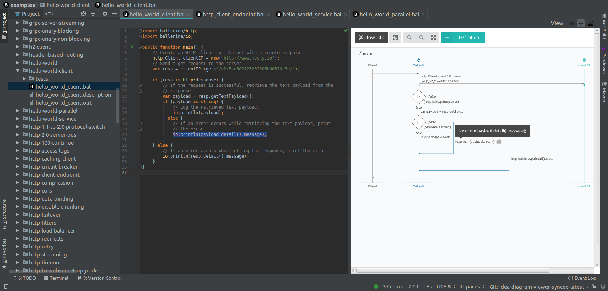

# Ballerina plugin for IntelliJ IDEA

[Ballerina](https://ballerina.io/) is a simple programming language whose syntax and runtime address the hard 
problems of integration. As a Turing complete language, Ballerina enables agility with edit, build, and run cycles. 
Ballerina code is compiled into services that include transactions, embedded brokers, and gateway runtime.
Ballerina makes it easy to build resilient services for integration and orchestrate across distributed endpoints.

Ballerina plugin provides Ballerina Language support in IntelliJ IDEA.

## Table of Contents

- [**Getting Started**](getting-started/README.md)
    - [How To Install](#how-to-install)
    - [Setting Up Ballerina SDK](getting-started/setting-up-ballerina-sdk/README.md)
    - [Writing Hello World In Ballerina](getting-started/writing-hello-world/README.md)
    
- [**Plugin Features**](getting-started/plugin-features/README.md)
    - [Running Ballerina Programs](getting-started/plugin-features/README.md#running-ballerina-programs)
    - [Debugging Ballerina Programs](getting-started/plugin-features/README.md#debugging-ballerina-programs) 
    - [Diagram View](getting-started/plugin-features/README.md#diagram-view)
    - [Import Modules On-the-fly](getting-started/plugin-features/README.md#import-modules-on-the-fly)
    - [Auto Import Unambiguous Modules](getting-started/plugin-features/README.md#auto-import-unambiguous-modules)
    - [Find Usage](getting-started/plugin-features/README.md#find-usage)
    - [Go to Definition](getting-started/plugin-features/README.md#go-to-definition)
    - [Formatting](getting-started/plugin-features/README.md#formatting)
    - [Parameter Information](getting-started/plugin-features/README.md#parameter-information)
    - [Quick Documentation](getting-started/plugin-features/README.md#quick-documentation)
    - [Object/Record Fields suggestions](getting-started/plugin-features/README.md#objectrecord-fields-suggestions)
    - [Annotation fields suggestions](getting-started/plugin-features/README.md#annotation-fields-suggestions)
    - [File Templates](getting-started/plugin-features/README.md#file-templates)
    - [Live Templates and Code snippets](getting-started/plugin-features/README.md#live-templates-and-code-snippets)
    - [Spell Checking](getting-started/plugin-features/README.md#spell-checking)
    - [Semantic Analyzing](getting-started/plugin-features/README.md#semantic-analyzing) 

- [**Plugin Developer Guide**](getting-started/plugin-developer-guide/README.md#plugin-developer-guide)
    - [Testing/Debugging the plugin using IntelliJ](getting-started/plugin-developer-guide/README.md#testingdebugging-the-plugin-using-intellij-idea)
    
- [**Release Versions Schema**](#release-versions-schema)
- [**How To Contribute**](#how-to-contribute) 
- [**Licence**](#license)
- [**Copyright**](#copyright)
- [**Useful Links**](#useful-links)

## How To Install

### From Jetbrains Plugin Repository
1. Go to **Settings** (**Preferences** in **MacOS**)-> **Plugins**. 
2. Select **Browse Repositories** button at the bottom. 
3. Search for **Ballerina** using the search box. Ballerina plugin will show up. Then you can install the plugin using the Install button.
4. Restart IDEA.

### Installing the Plugin from Disk
If you have a plugin file available on your computer, you can install it from disk. A plugin file is an archive file (ZIP or a JAR) and you do not need to decompress it before installation
1. Navigate to the plugin source directory using terminal and run `./gradlew buildPlugin`. 
**ballerina-intellij-idea-plugin-[VERSION].zip** is created in the **build/distributions** directory.
  >**NOTE:** On Windows, you don’t need the leading `./` in front of the `gradlew` command
2. Open IntelliJ IDEA and go to **File -> Settings** (**IntelliJ IDEA -> Preferences** in **macOS**) and select 
**Plugins**.
3. Click **Install plugin from disc** button and select the **plugin ZIP** file. Please make sure to install 
the ZIP file, not the extracted JAR files. This ZIP contains an additional library as well. Without this library, the 
plugin will not work properly.
4. Restart IDEA.

  >**IMPORTANT:** After completing the above steps, please follow the instructions to [Set Up Ballerina SDK](getting-started/setting-up-ballerina-sdk/README.md)
  for your ballerina projects, in order to activate all the plugin capabilities. 

## Release Versions Schema

Below you can see the plugin versions that correspond to the versions of the IntelliJ Platform.

| Plugin Version | Platform Version Compatibility |
|--- | --- |
| 0.8.0 - 0.8.2 | IntelliJ IDEA 2016.3 - 2016.4 |
| 0.8.3 - 0.981.0 | IntelliJ IDEA 2016.3+ |
| 0.982.0+ | IntelliJ IDEA 2017.3+ |

## How to Contribute
Pull requests are highly encouraged and we recommend you to create a GitHub issue to discuss the issue or feature that you are contributing to.

## License
Ballerina IDEA plugin source is licensed under the [Apache 2.0 License](LICENSE).

## Copyright
Copyright (c) 2017, WSO2 Inc. (http://www.wso2.org) All Rights Reserved.

## Useful Links
* The ballerina-dev@googlegroups.com mailing list is for discussing code changes to the Ballerina project.
* Chat live with us on our [Slack channel](https://ballerina.io/open-source/slack/).