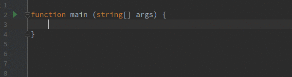
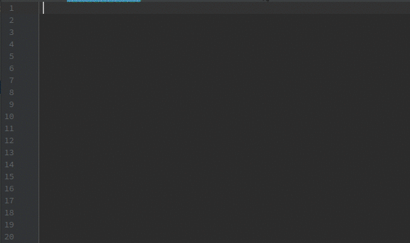

# Features

The following features are supported by the plugin, as listed below.

- [Running Ballerina Programs](#running-ballerina-programs)
- [Debugging Ballerina Programs](#debugging-ballerina-programs) 
- [Import modules On-the-fly](#import-modules-on-the-fly)
- [Auto Import Unambiguous Modules](#auto-import-unambiguous-modules)
- [Find Usage](#find-usage)
- [Go to Definition](#go-to-definition)
- [Formatting](#formatting)
- [Parameter Information](#parameter-information)
- [Quick Documentation](#quick-documentation)
- [Object/Record Fields suggestions](#object/record-fields-suggestions)
- [Annotation fields suggestions](#annotation-fields-suggestions)
- [File Templates](#file-templates)
- [Live Templates and Code snippets](#live-templates-and-code-snippets)
- [Spell Checking](#spell-checking)
- [Semantic Analyzing](#semantic-analyzing) 

## Running Ballerina programs 

You can run Ballerina main/service programs with only few clicks. You don't have to add or change any configurations.

## Debugging Ballerina programs 

You can debug Ballerina main/service programs with only few clicks as well.

## Import modules on the fly

This feature adds import declarations on the fly. All you need to do is selecting the module name from the lookup list and the module declaration will be added automatically.

## Auto import unambiguous modules

When we copy and paste some Ballerina codes, this feature will automatically import unambiguous imports. Then we can manually import any modules with ambiguity using clicking on the module name and pressing `Alt + Enter` keys.

**Note:** Please note that this feature is disabled by default since this might cause issues if the file contain grammar mistakes. You can enable it by selecting the **Add unambiguous imports on the fly** CheckBox in **Settings -> Languages and Frameworks -> Ballerina -> Auto Imports**.

## Find Usage

You can find usage of variables, functions etc.

## Go To Definition

You can go to definition of variables, function invocations, etc by `Ctrl`+`Click` on the reference.

## Formatting

You can reformat the Ballerina codes by pressing `Ctrl`+`Alt`+`L`.

## Parameter Information

You can view the required parameters of a functions, actions, etc by pressing `Ctrl`+`P`.

## Quick Documentation

You can view the documentation of a functions, actions, etc by pressing `Ctrl`+`Q` or hovering over the element while pressing `Ctrl`. 

## Object/Record fields suggestions

Fields are suggested inside the objects/records after initializing braces and the dot operator.

## Annotation fields suggestions

Annotation field names will be suggested inside annotation attachments.

## File Templates

Three types of Ballerina file templates are available.
1) Ballerina Main - Contains a sample main program
2) Ballerina Service - Contains a sample service
3) Empty File

## Live Templates and Code Snippets

Live templates / code snippets contain boilerplate codes and lets the user to enter them easily. All available live templates can be viewed/changed at **Settings -> Editor -> Live Templates -> Ballerina**.

## Spell Checking

Spell checking is enabled for all identifiers. You can rename all of the definitions and references as well.

## Semantic Analyzing

Ballerina IDEA plugin provides semantic analyzing and diagnostics capabilities through Ballerina Language Server.  
**Note:** This feature is disabled by default due to performance related reasons. You can enable this in `Settings ->
 Languages & Frameworks -> Ballerina -> Semantic Analyzer`.

