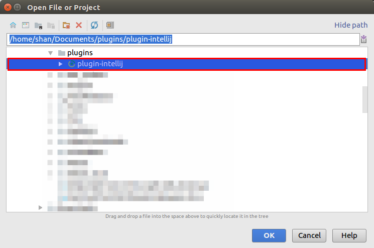
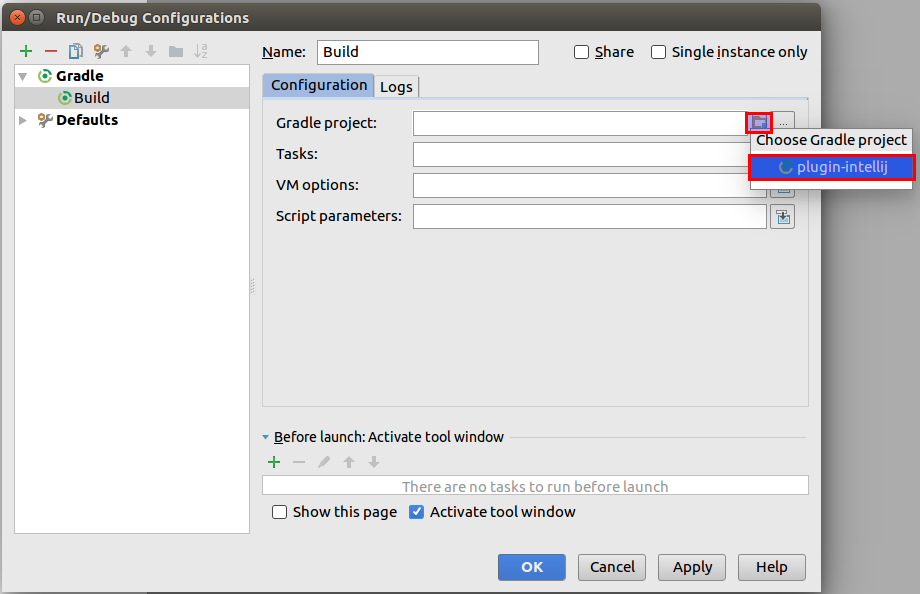
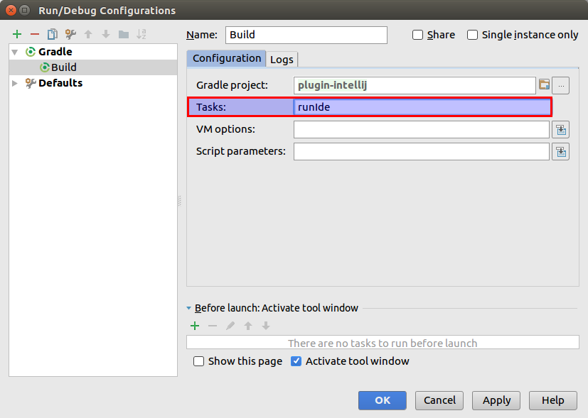

# Plugin Developer Guide

## Testing the plugin using IDEA

1. Go to **File -> Open** and open the cloned repository using IntelliJ IDEA.

2. **Import Project from Gradle** settings window will be shown. Select the **Gradle Home** path and select **OK**.

3. From the **Gradle projects** tool window, run `runIde` task. This will build the plugin and a new IDEA instance will be started with the plugin installed.

If the **Gradle projects** window is not visible, you can use **View -> Tool Windows -> Gradle** to go to the Gradle projects tool window.

4. In addition to the above method, you can also add a **Gradle configuration** to **Run** or **Debug** the plugin.

* Go to **Run -> Edit Configurations**.

* Add a new Gradle Configuration.

* Select the **plugin-intellij** project as the **Gradle project**.

* Add `runIde` to the **Tasks**.

* Now you can **Run** or **Debug** the plugin using the created Gradle configuration very easily.

