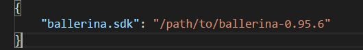

# Ballerina plugin for Visual Studio Code

## What is Ballerina

ballerina is a general purpose, concurrent and strongly typed
programming language with both textual and graphical syntaxes.

for more info: http://ballerinalang.org/

## Features

- Language Server Support
    - Completion support.
    - Hover Provider Support.
    - Signature Help Support.
    - Document Symbol Support.
    - Diagnostic Support.
- Syntax highlighting.

## Installing

Find the plugin in the visual studio [marketplace](https://marketplace.visualstudio.com/items?itemName=WSO2.Ballerina) and follow the instructions.

### Installing from `.vsix`

The visual studio marketplace only contains the latest build. If you want to work with an older version of Ballerina, or need to downgrade the plugin version you can install from the `.vsix` file.

Find `.vsix` files listed in [Releases](https://github.com/ballerinalang/plugin-vscode/releases). Download the file for the required version.

Install by 
~~~
code --install-extension Ballerina-[version].vsix
~~~
Find more info [here](https://code.visualstudio.com/docs/editor/extension-gallery#_install-from-a-vsix)

## Configuring the Ballerina SDK path

If you plan on using ballerina libraries other than the ones in the standard ballerina distribution you should set the `ballerina.sdk` setting to the path to the directory of extracted ballerina distribution.

To get to the settings in vscode use `Ctrl` + `,` in Windows and Linux and `⌘` + `,` in macOS. [More info](https://code.visualstudio.com/docs/getstarted/settings).

## Using the debugger

See the [wiki page](https://github.com/ballerina-lang/plugin-vscode/wiki/Debugging)

vscode need to be restarted for a new configuration to take effect.

## Running the plugin for development

1. Install [maven](https://maven.apache.org/install.html) and [nodejs](https://nodejs.org/en/)
2. Clone this repo
3. Run `npm install` and `mvn clean install`
4. Run vscode with `code --extensionDevelopmentPath=/path/to/ballerina/plugin-vscode`

## Debugging language server

To connect a remote debug client to the language server process, set `LSDEBUG` environment variable to "true".

`LSDEBUG=true code --extensionDevelopmentPath=/home/aruna/projects/ballerina/plugin-vscode`

Now connect the remote debug client to port 5005.

## Publishing a new release

See the [wiki page](https://github.com/ballerinalang/plugin-vscode/wiki/Drafting-a-new-release)

## How to contribute

Pull requests are highly encouraged and we recommend you to create a GitHub issue
to discuss the issue or feature that you are contributing to.

## License

Ballerina Visual Studio Code plugin source is available under the Apache 2.0 License.

## Copyright

Copyright (c) 2017, WSO2 Inc. (http://www.wso2.org) All Rights Reserved.
